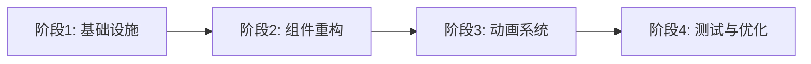

# 界面重构与优化 - 实现方案

**功能名称**: 界面重构与优化
**实现方案版本**: v1.0
**创建日期**: 2026-08-18
**需求总分支**: feat/ui-redesign
**关联 PR**: https://github.com/Deliay/minefield-online/pull/9

## 1. 实现概述

### 1.1 目标

基于产品需求文档和技朲提案，在 `feat/ui-redesign` 分支上实现界面重构与优化功能，包括：
- 整体视觉现代化（渐变背景、圆角卡片、阴影层次）
- 交互反馈增强（涟漪动画、分数浮动、按钮状态）
- 排行榜重设计（卡片式布局、排名徽章、分数进度条）
- 登录界面优化（品牌感、背景装饰）

### 1.2 技朲约束

- 无新 npm 依赖，纯 CSS + 现有 React 能力
- 不改变游戏核心逻辑（reveal、flag、chord）
- 不改变后端 API 和 WebSocket 事件
- 使用 CSS Modules + CSS Variables + CSS Animations

## 2. 实现阶段

### 阶段 1: 基础设施搭建（预计 2 小时）

**任务清单**:
1. 创建 CSS Variables 主题系统
   - 文件: `apps/game-web/src/styles/variables.css`
   - 内容: 颜色系统、间距系统、圆角系统、阴影系统
   
2. 创建全局样式
   - 文件: `apps/game-web/src/styles/global.css`
   - 内容: 字体引入（Inter + Noto Sans SC）、重置样式、全局动画 keyframes
   
3. 创建动画定义
   - 文件: `apps/game-web/src/styles/animations.css`
   - 内容: 涟漪动画、脉冲动画、过渡动画 keyframes
   
4. 更新入口样式
   - 文件: `apps/game-web/src/index.css`
   - 内容: 引入 variables.css、global.css、animations.css

**验收标准**:
- [ ] CSS Variables 可在组件中使用
- [ ] 字体正确加载
- [ ] 动画 keyframes 可用

### 阶段 2: 组件重构（预计 6 小时）

**任务清单**:

#### 2.1 新增 GameLayout 组件
- 文件: `apps/game-web/src/components/GameLayout.tsx` + `GameLayout.module.css`
- 职责: 整体布局容器、背景渐变、面板折叠状态管理
- Props: `user: User | null`, `children: React.ReactNode`

#### 2.2 新增 UserInfoCard 组件
- 文件: `apps/game-web/src/components/UserInfoCard.tsx` + `UserInfoCard.module.css`
- 职责: 用户信息展示、改名输入、登出按钮
- Props: `user: User`, `onSetName: (name: string) => void`, `onLogout: () => void`
- 特效: 分数变化脉冲动画

#### 2.3 重写 LeaderboardPanel 组件
- 文件: `apps/game-web/src/components/LeaderboardPanel.tsx` + `LeaderboardPanel.module.css`
- 职责: 排行榜面板容器、折叠/展开功能
- Props: `rankings: Ranking[]`, `currentUsername: string`
- 特效: 折叠过渡动画、排序 FLIP 动画

#### 2.4 新增 RankingCard 组件
- 文件: `apps/game-web/src/components/RankingCard.tsx` + `RankingCard.module.css`
- 职责: 单行排名展示、当前玩家高亮、前三名徽章
- Props: `rank: number`, `ranking: Ranking`, `isCurrentPlayer: boolean`

#### 2.5 新增 ScoreBar 组件
- 文件: `apps/game-web/src/components/ScoreBar.tsx` + `ScoreBar.module.css`
- 职责: 分数进度条、正负分颜色区分
- Props: `score: number`, `maxScore: number`, `delta?: number`
- 特效: 宽度过渡动画

#### 2.6 简化 App.tsx
- 移除内联样式，使用 GameLayout 替代
- 保留 Canvas 逻辑和 socket 服务调用

#### 2.7 重写 Login.tsx
- 添加背景渐变和装饰元素
- 表单卡片样式与游戏内一致
- 错误提示改为 toast 样式

**验收标准**:
- [ ] 所有组件使用 CSS Modules
- [ ] 所有颜色使用 CSS Variables
- [ ] 组件间数据流正确
- [ ] 现有功能不受影响

### 阶段 3: 动画系统集成（预计 3 小时）

**任务清单**:

#### 3.1 Canvas 涟漪效果
- 位置: `apps/game-web/src/App.tsx` 的 `handleClick` 函数
- 实现: 点击格子时创建 Konva.Ring 动画
- 参数: innerRadius 0 → CELL_SIZE, opacity 1 → 0, duration 0.4s

#### 3.2 分数浮动优化
- 位置: `apps/game-web/src/App.tsx` 的 `scorePopups` 逻辑
- 优化: 字体加大、颜色使用主题色、添加阴影

#### 3.3 面板过渡动画
- 位置: `LeaderboardPanel.module.css`
- 实现: CSS Transition 实现折叠/展开

#### 3.4 排名排序动画（FLIP）
- 位置: `LeaderboardPanel.tsx` 的 useEffect
- 实现: 记录旧位置 → 应用新排序 → 计算差值 → 触发 transition

#### 3.5 减弱动画支持
- 位置: `apps/game-web/src/styles/animations.css`
- 实现: `@media (prefers-reduced-motion: reduce)` 媒体查询

**验收标准**:
- [ ] 涟漪动画流畅（60fps）
- [ ] 面板过渡平滑
- [ ] 排序动画正确
- [ ] 弱化动画模式生效

### 阶段 4: 测试与优化（预计 3 小时）

**任务清单**:

#### 4.1 组件测试
- 框架: Vitest + Testing Library
- 覆盖: Login 校验、Leaderboard 展示、RankingCard 渲染
- 目标覆盖率: >= 70%

#### 4.2 视觉回归测试
- 框架: Playwright 截图对比
- 覆盖: 登录页、游戏主界面、排行榜面板

#### 4.3 E2E 测试
- 框架: Playwright
- 覆盖: 完整用户流程（登录→游戏→排行榜交互）

#### 4.4 性能优化
- 动画帧率测试
- 首屏加载时间优化
- CSS 文件大小控制

**验收标准**:
- [ ] 测试覆盖率 >= 70%
- [ ] 视觉回归测试通过
- [ ] E2E 测试通过
- [ ] 动画帧率 >= 60fps

## 3. 文件变更清单

### 新增文件

```
apps/game-web/src/
├── styles/
│   ├── variables.css          # CSS Variables 主题定义
│   ├── global.css             # 全局样式、字体引入
│   └── animations.css         # 通用动画 keyframes
├── components/
│   ├── GameLayout.tsx         # 布局容器
│   ├── GameLayout.module.css
│   ├── UserInfoCard.tsx       # 用户信息卡片
│   ├── UserInfoCard.module.css
│   ├── LeaderboardPanel.tsx   # 排行榜面板
│   ├── LeaderboardPanel.module.css
│   ├── RankingCard.tsx        # 排名卡片
│   ├── RankingCard.module.css
│   ├── ScoreBar.tsx           # 分数进度条
│   └── ScoreBar.module.css
```

### 修改文件

```
apps/game-web/src/
├── index.css                  # 重写：引入主题系统
├── App.tsx                    # 简化：提取布局到 GameLayout
├── pages/
│   └── Login.tsx              # 重写：登录页样式
```

### 删除文件

```
apps/game-web/src/components/
└── Leaderboard.tsx            # 被 LeaderboardPanel 替代
```

## 4. 实现顺序与依赖



**关键路径**:
1. CSS Variables 必须先完成，所有组件依赖
2. GameLayout 必须先完成，其他组件在其内部
3. 动画系统可在组件完成后并行集成
4. 测试在功能完成后进行

## 5. 风险与应对

| 风险 | 影响 | 应对措施 |
|------|------|---------|
| CSS Modules 配置问题 | 高 | 检查 Vite 配置，确保模块化正常 |
| 字体加载失败 | 中 | 提供系统字体降级方案 |
| 动画性能问题 | 中 | 使用 will-change、transform 优化 |
| FLIP 排序复杂度 | 中 | 简化为 CSS Transition 排序 |

## 6. 验收检查清单

### 功能验收

- [ ] 游戏背景不再是纯黑色，具有渐变效果
- [ ] 所有浮动面板视觉风格统一，有圆角和阴影
- [ ] 玩家点击格子时有涟漪动画
- [ ] 分数变更时有浮动数字提示
- [ ] 排行榜每行信息清晰独立，前三名有徽章
- [ ] 当前玩家排名有主色边框高亮
- [ ] 排行榜支持折叠/展开，有过渡动画
- [ ] 登录页有背景装饰和品牌标识
- [ ] 错误提示清晰易读

### 技朲验收

- [ ] 无新 npm 依赖
- [ ] 组件测试覆盖率 >= 70%
- [ ] 动画帧率 >= 60fps
- [ ] 首屏加载时间 <= 2s
- [ ] 支持 prefers-reduced-motion
- [ ] 键盘导航正常
- [ ] 色彩对比度符合 WCAG AA

### 代码质量

- [ ] TypeScript 类型正确
- [ ] 无 ESLint 错误
- [ ] 代码符合项目规范
- [ ] 提交信息清晰

## 7. 时间估算

| 阶段 | 预计时间 | 负责人 |
|------|---------|--------|
| 阶段 1: 基础设施 | 2 小时 | AI |
| 阶段 2: 组件重构 | 6 小时 | AI |
| 阶段 3: 动画系统 | 3 小时 | AI |
| 阶段 4: 测试优化 | 3 小时 | AI |
| **总计** | **14 小时** | - |

## 8. 相关文档

- [产品需求文档](../../product/draft/02-界面重构优化.md)
- [技术提案](../proposals/20260818-ui-redesign-proposal.md)
- [game-web AGENTS.md](../../../apps/game-web/AGENTS.md)
- [前端工程规范](../frontend-rules.md)
