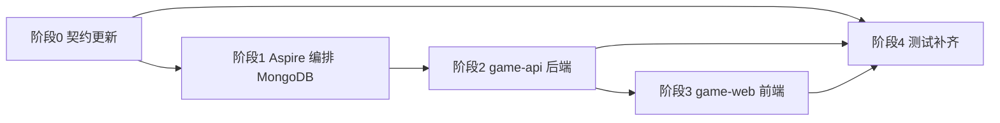

# 用户登录与账号体系 - 实现方案

**版本**: v1.0
**创建日期**: 2026-08-10
**需求总分支**: `feat/user-login`（需求总 PR: https://github.com/Deliay/minefield-online/pull/5）

## 1. 概述

### 1.1 依据文档

| 文档 | 路径 |
|------|------|
| 产品需求文档（PRD v1.0） | [docs/product/draft/01-用户登录.md](../../product/draft/01-用户登录.md) |
| 技术提案 | [docs/engineering/proposals/20260810-user-login-proposal.md](../proposals/20260810-user-login-proposal.md) |
| WebSocket 契约（本期更新） | [contracts/websocket.md](../../../contracts/websocket.md) |

### 1.2 目标

为游戏引入用户账号体系：注册/登录（MongoDB 持久化）、分数持久化、修改显示名称、单会话互踢。本地开发一律由 Aspire AppHost 编排 MongoDB，**禁止 docker 直接编排**。

### 1.3 范围

- **做**: REST 注册/登录/登出、Token 会话、WS 连接认证、分数持久化、改名持久化、单会话互踢、Aspire 编排 MongoDB、契约更新、三层测试
- **不做**: 第三方登录、找回密码、邮箱验证、游客模式（本期强制登录）

### 1.4 工程约束（来自 AGENTS.md 与工程规范）

- TDD 优先：先写测试再实现（common-rules.md）
- 分支命名 `feature/<feature-name>`，提交规范 `type(scope): message`
- 覆盖率：后端 >= 80%，前端组件 >= 70%
- 前端：React 18 + Vite + TS，组件 PascalCase、服务 camelCase，状态用 Context/useState
- 后端：Node.js + Express + Socket.IO + tsx，新增依赖 mongoose、bcryptjs
- 测试：tests/api（Vitest）、tests/e2e（Playwright），服务通过 `aspire start` 启动

## 2. 实施总览

- 阶段 0（契约）先行，作为前后端并行开发的依据
- 阶段 1 与阶段 0 可并行；后端依赖 MongoDB 编排就绪
- 每个阶段一个 `feature/` 子分支，PR 合入需求总分支 `feat/user-login`

## 3. 阶段任务分解

### 阶段 0：契约更新（feature/user-login-contract）

| # | 任务 | 产出 |
|---|------|------|
| 0.1 | 更新 `contracts/websocket.md`：连接认证（auth.token）、`init` 增加 `user`、`forceLogout` 事件、Ranking 标识改为 `username`/`displayName`、`setName` 事件（持久化改名）、sessionId 语义变更 | 更新后的 WS 契约 |
| 0.2 | 新增 `contracts/auth-api.md`：`POST /api/auth/register\|login\|logout` 的请求/响应、错误码（401/409）、校验规则（username 3-20、password >= 6） | REST 认证契约 |

**验收**: 契约与技术提案 §3 完全一致，评审通过。

### 阶段 1：Aspire 编排 MongoDB（feature/user-login-infra）

| # | 任务 | 产出 |
|---|------|------|
| 1.1 | `infra/local-dev/aspire.config.json` 的 `packages` 增加 `Aspire.Hosting.MongoDB: 13.2.2`（与 SDK 同版本） | 配置更新 |
| 1.2 | `infra/local-dev/apphost.ts` 增加 `addMongoDB('mongo').addDatabase('minefield')`，game-api `.withReference(mongoDb)` 注入连接串 | 编排更新 |
| 1.3 | `aspire start` 验证：Dashboard 中 mongo / game-api / game-web 三资源正常，game-api 进程可见连接串环境变量 | 验证记录 |

**验收**: 无 docker-compose 文件；game-api 缺少连接串环境变量时启动失败并报明确错误（不静默降级）。

### 阶段 2：game-api 后端（feature/user-login-server）

按 TDD：先写 `src/__tests__/` 下单元测试，再实现。

| # | 任务 | 涉及文件 |
|---|------|---------|
| 2.1 | 新增依赖 `mongoose`、`bcryptjs`；`db.ts`：从环境变量读连接串建立 Mongoose 连接，定义 User Model（username 唯一索引 collation strength 2、displayName、passwordHash、score、时间戳） | `src/db.ts`（新增） |
| 2.2 | `auth.ts`：Auth Manager — 注册/登录校验、bcrypt(10) 哈希、`crypto.randomBytes(32)` 签发 token、`tokens: Map<token, username>`、每账号单 token、互踢逻辑（吊销旧 token + 通知旧 socket） | `src/auth.ts`（新增） |
| 2.3 | REST 路由：`POST /api/auth/register`（409 用户名占用）、`POST /api/auth/login`（401 统一错误提示、踢旧会话）、`POST /api/auth/logout`（Bearer token，204） | `src/index.ts` |
| 2.4 | WS 认证中间件：`io.use()` 校验 `handshake.auth.token`，无效则拒绝连接 | `src/index.ts` |
| 2.5 | `session.ts` 改造：session 绑定账号（token → user），`updateScore` 改为先 `findOneAndUpdate + $inc` 持久化成功后广播，写库失败不广播并告警；排行榜标识改为 username/displayName | `src/session.ts` |
| 2.6 | `setName` 事件：校验登录态与长度（≤20），写库 displayName 后广播 leaderboard | `src/index.ts`、`src/session.ts` |
| 2.7 | 互踢实现：新登录 → 旧 socket emit `forceLogout { reason: 'kicked' }` → `socket.disconnect(true)` → 替换 `activeSessions` | `src/auth.ts`、`src/index.ts` |

**验收**: 单元测试覆盖 Auth Manager 校验、互踢状态机、分数持久化（覆盖率 >= 80%）；`npm run build` 通过。

### 阶段 3：game-web 前端（feature/user-login-web）

| # | 任务 | 涉及文件 |
|---|------|---------|
| 3.1 | `services/api.ts`：REST register/login/logout 封装，token 存 localStorage | `src/services/api.ts`（新增） |
| 3.2 | `pages/Login.tsx`：登录/注册界面（用户名/密码/确认密码、错误提示、登录注册切换） | `src/pages/Login.tsx`（新增） |
| 3.3 | `services/socket.ts`：connect 时 auth 携带 token；新增 `onForceLogout`（清 token → 提示"账号已在其他位置登录" → 回登录页）；连接被拒处理 | `src/services/socket.ts` |
| 3.4 | `App.tsx`：未登录渲染 Login；登录后进入游戏并展示当前用户（displayName、score）；改名入口调用 `setName` | `src/App.tsx` |
| 3.5 | `Leaderboard.tsx`：展示 displayName；`InitEvent`/`Ranking` 类型同步契约 | `src/components/Leaderboard.tsx`、`src/services/socket.ts` |

**验收**: 前端组件测试 >= 70%（Login 校验、Leaderboard 展示、forceLogout 处理）；`npm run build` 通过。

### 阶段 4：测试补齐（feature/user-login-tests）

| # | 任务 | 位置 |
|---|------|------|
| 4.1 | API 测试：register/login/logout、WS token 认证拒绝、互踢（两端登录旧端收 forceLogout）、分数持久化（重启后分数恢复，可用 mongodb-memory-server） | `tests/api/src/game-api/` |
| 4.2 | E2E 测试：注册→登录→游戏→改名→他端登录互踢全流程；未登录访问跳转登录页 | `tests/e2e/tests/` |
| 4.3 | 按 AGENTS.md 流程验证：`aspire start` → `aspire describe` 取 URL → 跑 tests/api 与 tests/e2e | - |

**验收**: API/E2E 全绿。

## 4. 里程碑与子分支

| 里程碑 | 子分支 | 依赖 | 对应 PRD 验收 |
|--------|--------|------|---------------|
| M1 契约 | feature/user-login-contract | - | 全部功能点的接口依据 |
| M2 编排 | feature/user-login-infra | - | 分数持久化（环境前提） |
| M3 后端 | feature/user-login-server | M1、M2 | 功能点 1/2/3/4/5 服务端 |
| M4 前端 | feature/user-login-web | M1（可与 M3 并行，联调待 M3） | 功能点 1/2/4/5 界面与交互 |
| M5 测试 | feature/user-login-tests | M3、M4 | 成功标准全量验证 |

- 子分支 PR → `feat/user-login`，每个 PR 需 review 后合入（common-rules.md）
- 全部合入后需求总 PR #5（feat/user-login → main）进入最终评审

## 5. 风险与缓解

| 风险 | 影响 | 缓解 |
|------|------|------|
| 现有匿名 session 测试（session.test.ts、game-api.spec.ts）因强制登录失效 | 旧测试失败 | 阶段 2 同步改造旧测试为带 token 的连接；契约先行统一口径 |
| 内存 token 重启失效 | 用户需重新登录 | 技术提案已决策可接受（分数已持久化），登录页提示即可 |
| 分数并发写覆盖 | 分数错误 | `$inc` 原子更新；写库失败不广播，避免内存/库分裂 |
| Aspire Hosting.MongoDB 版本与 SDK 13.2.2 不匹配 | 编排启动失败 | packages 固定 13.2.2，阶段 1 先行验证 |

## 6. 验收清单

- [ ] 契约更新评审通过（websocket.md + auth-api.md）
- [ ] Aspire 编排 MongoDB 就绪，无 docker 直接编排
- [ ] 后端实现完成，单元测试覆盖率 >= 80%
- [ ] 前端实现完成，组件测试覆盖率 >= 70%
- [ ] API 测试通过（注册/登录/登出/互踢/持久化）
- [ ] E2E 测试通过（全流程 + 互踢提示）
- [ ] PRD 功能点 1-5 验收标准逐项核对通过

## 相关文档

- [[../proposals/20260810-user-login-proposal]] - 技术提案
- [[../../product/draft/01-用户登录]] - 产品需求文档
- [[../../../contracts/websocket]] - WebSocket 契约
