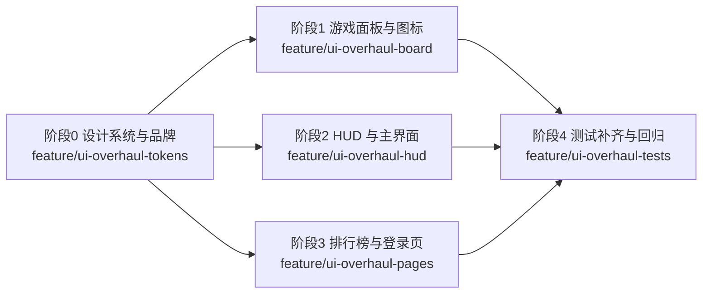

# 界面优化：扫雷主题网站整体重设计 - 实现方案

**版本**: v1.0
**创建日期**: 2026-08-12
**需求总分支**: `feat/ui-overhaul`（需求总 PR: https://github.com/Deliay/minefield-online/pull/8）

## 1. 概述

### 1.1 依据文档

| 文档 | 路径 |
|------|------|
| 产品需求文档（PRD v1.1） | [docs/product/draft/02-界面优化.md](../../product/draft/02-界面优化.md) |
| 技术提案 | [docs/engineering/proposals/20260812-ui-overhaul-proposal.md](../proposals/20260812-ui-overhaul-proposal.md) |
| 前端工程规范 | [docs/engineering/frontend-rules.md](../frontend-rules.md) |
| 工程公共规范 | [docs/engineering/common-rules.md](../common-rules.md) |

### 1.2 目标

以「扫雷」为主题、现代设计语言（现代暗色扁平 × 轻玻璃拟态）对 `apps/game-web` 进行整体视觉重设计：建立统一设计令牌，重绘游戏格子/图标，重设计 HUD、排行榜、登录页与站点品牌信息，覆盖 PRD 功能点 1-7。纯前端改造，交互逻辑与数据协议零改动。

### 1.3 范围

- **做**: 设计系统令牌、游戏格子/图标重绘、HUD/排行榜/登录页重设计、favicon 与站点标题/meta、组件测试更新与 E2E 回归
- **不做**: 后端 `servers/game-api`、契约 `contracts/`、新增 npm 依赖/UI 库、改变交互逻辑与数据结构

### 1.4 工程约束（来自 AGENTS.md 与工程规范）

- TDD 优先：先写测试再实现（common-rules.md）
- 分支命名 `feature/<feature-name>`，提交规范 `type(scope): message`
- 前端组件测试覆盖率 >= 70%，`npm run build` 与 `npm run lint` 必须通过
- 现有 `Leaderboard.test.tsx`、`Login.test.tsx`、`socket.test.ts` 保持通过或同步更新后通过
- E2E 回归通过：reveal/flag/drag、登录、改名、互踢（tests/e2e，经 Aspire 启动服务）
- 技术栈：React 19 + Vite + TS + react-konva/Konva，组件 PascalCase、服务 camelCase
- 测试运行：`cd infra/local-dev && aspire start` → `aspire describe game-web` 取 URL → `E2E_WEB_URL=... npx playwright test`

## 2. 实施总览

- 阶段 0（设计令牌）先行，作为后续所有阶段的一致基础
- 阶段 1/2/3 均依赖阶段 0，彼此文件不重叠可并行
- 每阶段一个 `feature/` 子分支，PR 合入需求总分支 `feat/ui-overhaul`

## 3. 阶段任务分解

### 阶段 0：设计系统与品牌基础（feature/ui-overhaul-tokens）

| # | 任务 | 涉及文件 |
|---|------|---------|
| 0.1 | 新增 `src/theme.ts`：设计令牌单一来源——色板（bg/cell/accent/number.1-8/text）、字体栈、圆角、阴影、blur、动效时长与缓动；同时集中维护地雷/旗帜的 SVG path data 常量（供 Konva.Path） | `src/theme.ts`（新增） |
| 0.2 | 新增主题令牌自检测试：令牌对象 key 完整性、number 色板 1-8 齐全（为「无游离硬编码色值」提供基线） | `src/theme.test.ts`（新增） |
| 0.3 | `src/index.css`：由 `theme.ts` 派生全局 CSS 变量（镜像通道）、全站深空蓝黑渐变背景、现代无衬线字体栈、`tabular-nums`、玻璃面板工具类（`backdrop-filter` 及不可用时半透明实底回退） | `src/index.css` |
| 0.4 | `index.html`：`<title>` 改为「MINE FIELD - 联机扫雷」，新增 `<meta name="description">`，favicon 引用切到 `/mine.svg` | `index.html` |
| 0.5 | 新增 `public/mine.svg`（现代几何地雷主题图标，渐变配色）；评估并替换/删除当前默认占位 `public/favicon.svg` 与无用 `public/icons.svg` | `public/mine.svg`（新增）、`public/favicon.svg`、`public/icons.svg` |

**验收**: `theme.ts` 与 `index.css` 令牌一一对应；主题令牌测试通过；`npm run build`、`npm run lint` 通过；favicon 与标题生效。

### 阶段 1：游戏面板格与图标重绘（feature/ui-overhaul-board）

| # | 任务 | 涉及文件 |
|---|------|---------|
| 1.1 | `Cell.tsx` 重绘已揭开格子：圆角 `Rect`（`cell.sunken` 深色底）+ 内缩细描边（`cell.sunkenEdge`），呈扁平内凹质感 | `src/components/Cell.tsx` |
| 1.2 | 地雷图标：`Konva.Path` 绘制几何化雷体（珊瑚红 `accent.danger` + 深色描边），替换 `isMine` 的纯色填充；旗帜图标：`Konva.Path` 绘制三角旗面 + 旗杆，替换 emoji `🚩`（`type === 'flag'` 分支从 `Text` 改为矢量） | `src/components/Cell.tsx` |
| 1.3 | 数字 1-8：采用 `theme.ts` 现代高对比色板、加粗、tabular-nums，与格子形成高对比 | `src/components/Cell.tsx` |
| 1.4 | 揭示过渡：状态变更时叠加 120ms 轻微缩放/淡入 `Tween`，不阻塞输入 | `src/components/Cell.tsx` |
| 1.5 | `PointerRect` 升级为「悬浮瓷砖」悬停态：圆角 + 内渐变 + `cell.edge` 高亮描边 + 轻微放大上浮（覆盖当前 `rgba(128,128,128,0.5)` 半透明填充），满足 PRD「悬停上浮 + 高亮边框」 | `src/components/Cell.tsx` |
| 1.6 | `GridLine` 颜色收敛到主题令牌并弱化（低于格子对比度） | `src/components/Cell.tsx` |
| 1.7 | 性能保持：沿用现有 `cache()` + `perfectDrawEnabled=false`；仅渲染已操作格子 + 悬停单格，不因视觉重设计全量渲染 1200×640 网格（详见决策 D-1） | `src/components/Cell.tsx`、`src/App.tsx` |

**验收**: 已揭开格子内凹、地雷/旗帜为矢量图标（无 emoji）、数字色板统一；`reveal/flag/chord` 交互与反馈不劣化（< 100ms）；棋盘拖动/快速标雷帧率不劣化。

### 阶段 2：HUD 与主界面整合（feature/ui-overhaul-hud）

| # | 任务 | 涉及文件 |
|---|------|---------|
| 2.1 | 新增 `ScoreHud` 组件：玻璃拟态顶栏（`bg.glass` + `blur` + `shadow.card`，含 backdrop-filter 回退）——品牌标识、头像徽章（显示名首字母，`accent.primary` 渐变圆底）、显示名/用户名、分数徽章（胶囊样式 + tabular-nums，数值变化时 CSS transition 数字滚动 + 轻微辉光脉冲）、改名与登出入口 | `src/components/ScoreHud.tsx`（新增） |
| 2.2 | 改名浮层：整合并主题化现有 `NameModal.tsx`（当前为未被引用的孤儿组件）为轻量玻璃浮层，保留 ≤20 字符校验；或在其基础上改造，避免遗留死代码（详见决策 D-2） | `src/components/NameModal.tsx` |
| 2.3 | `App.tsx` 接入 `ScoreHud`，移除内联 HUD 区块；`handleSetName`、`handleLogout` 逻辑移至组件回调（交互逻辑零改动） | `src/App.tsx` |
| 2.4 | 互踢提示浮层（`kickNotice`）主题化：深空渐变遮罩 + 玻璃提示卡 + `accent.danger` 语义色 + 渐变主按钮；文案「账号已在其他位置登录」「返回登录」保持不变 | `src/App.tsx` |
| 2.5 | 主界面容器背景收敛到主题渐变；小地图面板（右下角）同步主题化（玻璃/面板令牌、当前视图框高亮） | `src/App.tsx`、`src/index.css` |

**验收**: HUD 玻璃顶栏 + 头像徽章 + 分数动画落地；改名/登出/互踢交互行为与改造前一致；组件测试 >= 70%；`npm run build` 通过。

### 阶段 3：排行榜与登录页重设计（feature/ui-overhaul-pages）

| # | 任务 | 涉及文件 |
|---|------|---------|
| 3.1 | `Leaderboard.tsx` 玻璃卡片化：半透明磨砂 + 圆角 + 分层阴影 + 主题标题条；行结构加入排名徽章（Pill 样式 #1/#2/#3）、玩家头像圆形徽章（首字母）、显示名/分数高对比排版；当前玩家行 `accent.primary→accent.secondary` 渐变高亮；`Ranking[]` 数据结构与事件订阅逻辑不变 | `src/components/Leaderboard.tsx` |
| 3.2 | `Login.tsx` 品牌页化：`bg.deep→bg.deepHi` 渐变背景 + 网格/浮雷装饰（CSS 渐变与 SVG 生成，无图片资源）+ 品牌标题与标识；玻璃表单卡片——现代输入框（聚焦 `accent.primary` 光晕描边）、`accent.primary→accent.secondary` 渐变主按钮、柔和错误提示；登录/注册切换与全部校验逻辑零改动 | `src/pages/Login.tsx`、`src/index.css` |
| 3.3 | 组件测试同步：`Leaderboard.test.tsx`、`Login.test.tsx` 断言基于现有稳定文本（`Leaderboard`、`Alice - 42`、`登录`、`去注册` 等）继续通过；若样式结构调整影响断言则同步更新 | `src/components/Leaderboard.test.tsx`、`src/pages/Login.test.tsx` |

**验收**: 排行榜/登录页呈现代玻璃品牌观感；当前玩家渐变高亮清晰；实时刷新/排序/校验/错误提示交互不变；组件测试通过。

### 阶段 4：测试补齐与回归验证（feature/ui-overhaul-tests）

| # | 任务 | 位置 |
|---|------|------|
| 4.1 | 新增 `ScoreHud.test.tsx`：玩家信息展示、分数徽章、改名浮层开关、登出回调 | `src/components/ScoreHud.test.tsx` |
| 4.2 | 全量前端测试：`npm run test`（Vitest），覆盖率 >= 70%；`npm run build`、`npm run lint` 通过 | `apps/game-web` |
| 4.3 | E2E 同步与回归：若 HUD 改名入口/登录页结构调整导致选择器变化，同步更新 `user-login.spec.ts`、`game-web.spec.ts`；回归覆盖 reveal/flag/drag、注册→登录→游戏→改名→互踢全流程 | `tests/e2e/tests/` |
| 4.4 | 按 AGENTS.md 流程验证：`infra/local-dev` 下 `aspire start` → `aspire describe game-web` 取 URL → `E2E_WEB_URL=... npx playwright test`；API 回归 `tests/api`（应零改动全绿） | - |
| 4.5 | 手工验收重点：多浏览器地雷/旗帜渲染一致；`backdrop-filter` 不可用回退可读；大棋盘帧率不劣化；小屏窗口 HUD/排行榜/小地图无遮挡 | - |

**验收**: 组件测试 + E2E 全绿；覆盖率达标；验收标准逐项核对通过。

## 4. 里程碑与子分支

| 里程碑 | 子分支 | 依赖 | 对应 PRD 功能点 |
|--------|--------|------|---------------|
| M0 设计系统与品牌 | feature/ui-overhaul-tokens | - | 功能点 1、7 |
| M1 游戏面板与图标 | feature/ui-overhaul-board | M0 | 功能点 2、3 |
| M2 HUD 与主界面 | feature/ui-overhaul-hud | M0 | 功能点 4、6（互踢浮层） |
| M3 排行榜与登录页 | feature/ui-overhaul-pages | M0 | 功能点 5、6 |
| M4 测试补齐与回归 | feature/ui-overhaul-tests | M1、M2、M3 | 成功标准全量验证 |

- 子分支 PR → `feat/ui-overhaul`，每个 PR 需 review 后合入（common-rules.md）
- 全部合入后需求总 PR #8（feat/ui-overhaul → main）进入最终评审

## 5. 关键实现决策

### D-1 未揭开瓷砖渲染策略（悬浮瓷砖 vs 仅渲染已操作格子）

PRD 要求未揭开格子呈悬浮瓷砖质感，而技术提案 §5.1 要求维持「仅渲染已操作格子」避免全量渲染 1200×640 网格。实现采用折中：已揭开格子为内凹扁平瓷砖（逐格绘制），未揭开区域保持棋盘底色基调，悬停格由升级后的 `PointerRect` 呈现完整「悬浮瓷砖」质感（圆角/渐变/高亮边框/上浮），既满足悬停反馈验收又不引入全量渲染。

### D-2 NameModal 去留

`NameModal.tsx` 当前未被任何组件引用（孤儿代码）。为避免遗留死代码并复用其 ≤20 字符校验，方案为将其改造为主题化玻璃浮层并接入 `ScoreHud` 作为改名浮层；若实现中发现与 ScoreHud 内聚性冲突，则移除 NameModal 并在 ScoreHud 内新建等价浮层，二者必居其一。

### D-3 测试选择器稳定性

组件测试与 E2E 依赖稳定文本（`登录`、`去注册`、`Leaderboard`、`Alice - 42`、`账号已在其他位置登录`、`返回登录` 等）。重设计过程中默认保持这些文本不变；仅在结构必须变化时（如 HUD 改名入口从内联表单改浮层）与测试同步更新（阶段 4）。

## 6. 风险与缓解

| 风险 | 影响 | 缓解 |
|------|------|------|
| 悬浮瓷砖与「仅渲染已操作格子」矛盾 | 全量渲染性能劣化或验收不满足 | D-1 悬停单格方案；阶段 1 验证帧率 |
| HUD/登录页结构调整破坏 E2E/组件测试选择器 | 测试失败 | D-3 保持稳定文本；阶段 4 同步更新 |
| Konva 阴影/渐变引入重绘制 | 帧率劣化 | 仅用 `shadow*` 属性 + `cache()` + `perfectDrawEnabled=false`，阶段 1 基准对比 |
| 玻璃拟态依赖 `backdrop-filter` 不被支持 | 面板不可读 | 统一回退 `bg.glassStrong` 半透明实底 |
| 孤儿组件 NameModal 未处理 | 死代码 | D-2 二选一处理 |
| 多阶段并行合入冲突 | 合并冲突 | 阶段 1/2/3 文件不重叠（Cell / ScoreHud+App / Leaderboard+Login），仍保持串行合入审查 |

## 7. 验收清单

- [ ] 设计系统令牌建立（theme.ts + index.css 双通道单一来源），全站无游离硬编码色值
- [ ] 游戏格子悬浮/内凹质感、地雷/旗帜矢量图标、数字 1-8 现代色板落地
- [ ] HUD 玻璃顶栏 + 头像徽章 + 动画分数徽章 + 改名浮层落地
- [ ] 排行榜玻璃卡片 + 当前玩家渐变高亮落地
- [ ] 登录/注册页渐变品牌页 + 玻璃表单卡片 + 互踢浮层主题化落地
- [ ] favicon、站点标题与 meta 更新
- [ ] 前端组件测试通过且覆盖率 >= 70%
- [ ] E2E 回归通过，交互行为与改造前一致
- [ ] `npm run build`、`npm run lint` 通过

## 相关文档

- [[../../product/draft/02-界面优化]] - 产品需求文档（PRD v1.1）
- [[../proposals/20260812-ui-overhaul-proposal]] - 界面优化技术提案
- [[20260810-user-login-implementation-plan]] - 用户登录实现方案（阶段拆分范式参考）
- [[../proposals/20260810-user-login-proposal]] - 用户登录技术提案
- [[../../product/draft/01-用户登录]] - 用户登录与账号体系 PRD
