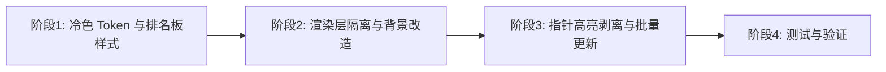

# 排名计分板风格统一与点击闪烁修复 - 实现方案

**版本**: v1.0
**创建日期**: 2026-08-19
**需求总分支**: `feat/leaderboard-style-and-flicker-fix`（基于 origin/feat/board-and-number-redesign）

## 1. 概述

### 1.1 依据文档

| 文档 | 路径 |
|------|------|
| 产品需求文档（PRD v1.0） | [docs/product/draft/04-排名计分板风格统一与点击闪烁修复.md](../../product/draft/04-排名计分板风格统一与点击闪烁修复.md) |
| 技术提案 | [docs/engineering/proposals/20260819-leaderboard-style-and-flicker-fix-proposal.md](../proposals/20260819-leaderboard-style-and-flicker-fix-proposal.md) |

### 1.2 目标

将排名计分板视觉统一到棋盘冷淡冷色风格，修复点击棋盘时的整屏闪烁问题，保证渲染稳定流畅。

### 1.3 范围

- **做**: 排名计分板冷色设计 Token 与样式改造、闪烁根因定位与渲染优化（静态层隔离、缓存、指针高亮改造）
- **不做**: 后端改动、计分/排序逻辑变更、WebSocket 契约变更、游戏核心逻辑变更

### 1.4 工程约束

- TDD 优先：先写测试再实现
- 分支命名 `feature/<feature-name>`，提交规范 `type(scope): message`
- 覆盖率：前端组件 >= 70%
- 前端：React 18 + Vite + TypeScript，组件 PascalCase、服务 camelCase
- 纯前端改动（样式 + 渲染/交互修复），后端零改动

## 2. 实施总览



- 阶段 1 与阶段 2 可并行开发
- 阶段 3 依赖阶段 2 的层隔离
- 阶段 4 为集成测试与验收

## 3. 阶段任务分解

### 阶段 1: 冷色 Token 与排名板样式

| # | 任务 | 产出 | 涉及模块 |
|---|------|------|----------|
| 1.1 | 新增 `apps/game-web/src/styles/leaderboard-tokens.ts`：定义排名板冷色配色 Token（面板背景、边框、前三名徽标、当前玩家高亮、分数条等） | `leaderboard-tokens.ts` | frontend/contracts |
| 1.2 | 更新 `LeaderboardPanel.module.css`：替换紫色/金色系为冷色 Token | `LeaderboardPanel.module.css` | frontend |
| 1.3 | 更新 `RankingCard.module.css`：前三名徽标使用冷金/冷银/冷铜渐变，当前玩家高亮使用冷蓝 | `RankingCard.module.css` | frontend |
| 1.4 | 更新 `ScoreBar.module.css`：分数条使用冷蓝渐变 | `ScoreBar.module.css` | frontend |
| 1.5 | 编写排名板冷色样式单元测试（LeaderboardPanel 渲染、RankingCard 样式类、ScoreBar 颜色） | `LeaderboardPanel.test.tsx` 扩展 | tests |

**验收**: 排名板冷色风格与棋盘一致（评审 4/5+）；组件测试覆盖率 >= 70%。

### 阶段 2: 渲染层隔离与背景改造

| # | 任务 | 产出 | 涉及模块 |
|---|------|------|----------|
| 2.1 | `App.tsx` 中 `gridLines` 改为 `useMemo`（空依赖）稳定引用，避免随点击 state 变化重建 | `App.tsx` 修改 | frontend |
| 2.2 | `App.tsx` 中 `unrevealedCellNodes` 背景层改为静态层，移除 hover/press 状态 | `App.tsx` 修改 | frontend |
| 2.3 | 涟漪、分数浮动、指针高亮统一移入独立动态效果层（`listening={false}`） | `App.tsx` 修改 | frontend |
| 2.4 | `Cell.tsx` 的 `unrevealed-bg` 移除内部 hover/press state，改为纯静态背景 | `Cell.tsx` 修改 | frontend |
| 2.5 | 静态节点统一 `.cache()`，state 变化时通过 `Layer.batchDraw()` 批量重绘 | `App.tsx` 修改 | frontend |
| 2.6 | 编写渲染优化单元测试（静态层稳定性、点击无重渲染） | `App.test.tsx` 新增 | tests |

**验收**: 点击棋盘不再出现整屏闪烁；快速连续点击无闪烁/无残影。

### 阶段 3: 指针高亮剥离与批量更新

| # | 任务 | 产出 | 涉及模块 |
|---|------|------|----------|
| 3.1 | `PointerRect` 保持独立，不再依赖全盘背景 hover/press | `Cell.tsx` 修改 | frontend |
| 3.2 | `handleClick` 中对涟漪的创建采用 React 18 自动批处理 | `App.tsx` 修改 | frontend |
| 3.3 | 涟漪、分数浮动等反馈保持轻量，仅作用于动态层 | `App.tsx` 修改 | frontend |
| 3.4 | 编写交互性能测试（连续点击、拖动、窗口调整） | `App.test.tsx` 扩展 | tests |

**验收**: 连续快速点击无闪烁/无残影；拖动棋盘、调整窗口等操作不受影响。

### 阶段 4: 测试与验证

| # | 任务 | 产出 | 涉及模块 |
|---|------|------|----------|
| 4.1 | 组件测试：LeaderboardPanel / RankingCard / ScoreBar 冷色样式验证 | `LeaderboardPanel.test.tsx` 扩展 | tests |
| 4.2 | 渲染性能测试：静态层隔离、批量更新验证 | `App.test.tsx` 扩展 | tests |
| 4.3 | 视觉验证：手动 + Playwright 截图对比排名板冷色风格 | `tests/e2e/` | tests |
| 4.4 | 交互验证：手动 + Playwright 点击棋盘无闪烁 | `tests/e2e/` | tests |
| 4.5 | 按 AGENTS.md 流程验证：`npm run build` 通过，组件测试覆盖率 >= 70% | - | - |

**验收**: 组件测试覆盖率 >= 70%；视觉与交互验证通过。

## 4. 项目结构变更

```
apps/game-web/src/
├── styles/
│   ├── leaderboard-tokens.ts        # 新增：排名板冷色 Token
│   ├── cell-styles.ts               # 现有，不变
│   └── number-colors.ts             # 现有，复用
├── components/
│   ├── LeaderboardPanel.module.css  # 修改：冷色样式
│   ├── RankingCard.module.css       # 修改：冷色样式
│   ├── ScoreBar.module.css          # 修改：冷色样式
│   ├── Cell.tsx                     # 修改：unrevealed-bg 静态化
│   └── ...
└── App.tsx                          # 修改：层隔离与批量更新
```

## 5. TDD 测试计划

### 5.1 测试类型与覆盖

| 类型 | 工具 | 覆盖范围 |
|------|------|---------|
| 组件测试 | Vitest + Testing Library | LeaderboardPanel / RankingCard / ScoreBar 冷色样式、折叠、当前玩家高亮 |
| 渲染测试 | Vitest + Testing Library | App.tsx 静态层稳定性、点击无重渲染 |
| 视觉验证 | 手动 + Playwright 截图 | 排名板冷色风格、与棋盘协调度 |
| 交互/性能验证 | 手动 + Playwright | 点击棋盘无闪烁、连续快速点击稳定 |
| E2E | Playwright | 完整流程：登录、点击、看排名板 |

### 5.2 测试用例

#### 冷色样式测试

```typescript
// LeaderboardPanel.test.tsx
describe('LeaderboardPanel', () => {
  it('renders with cold color theme', () => {
    // 验证面板背景、边框为冷灰蓝
    // 验证标题、切换图标颜色
  });
  
  it('shows cold color ranking cards', () => {
    // 验证前三名徽标冷金/冷银/冷铜渐变
    // 验证当前玩家高亮冷蓝
  });
});

// RankingCard.test.tsx
describe('RankingCard', () => {
  it('applies cold color classes for top 3', () => {
    // 验证 first/second/third 类名应用冷色渐变
  });
  
  it('highlights current player with cold blue', () => {
    // 验证 currentPlayer 类名应用冷蓝边框
  });
});

// ScoreBar.test.tsx
describe('ScoreBar', () => {
  it('renders progress bar with cold color gradient', () => {
    // 验证进度条使用冷蓝渐变
  });
});
```

#### 渲染性能测试

```typescript
// App.test.tsx
describe('App rendering performance', () => {
  it('does not re-render static layers on click', () => {
    // 模拟点击，验证静态层不重新渲染
  });
  
  it('handles rapid clicks without flicker', () => {
    // 连续快速点击，验证无闪烁
  });
});
```

## 6. 风险与缓解

| 风险 | 影响 | 缓解 |
|------|------|------|
| 冷色配色与棋盘不协调 | 视觉评分低 | 复用棋盘色系，严格对照 cell-styles.ts |
| 静态层隔离引入渲染问题 | 棋盘显示异常 | 渐进式改造，每步验证 |
| 批量更新影响交互响应 | 操作延迟 | React 18 自动批处理，无需手动合并 |
| 组件测试覆盖率不足 | 质量风险 | 先写测试再实现，确保覆盖核心逻辑 |

## 7. 验收清单

- [ ] 技术方案评审通过
- [ ] 排名板冷色风格与棋盘一致（评审 4/5+）
- [ ] 前三名冷色徽标、当前玩家冷蓝高亮实现
- [ ] 点击棋盘不再出现整屏闪烁
- [ ] 快速连续点击无闪烁/无残影
- [ ] 组件测试覆盖率 >= 70%
- [ ] 视觉与交互验证通过
- [ ] 计分/排序/折叠逻辑与行为不变

## 相关文档

- [[../proposals/20260819-leaderboard-style-and-flicker-fix-proposal]] - 技术提案
- [[../../product/draft/04-排名计分板风格统一与点击闪烁修复]] - 产品需求文档
- [[../frontend-rules]] - 前端工程规范
