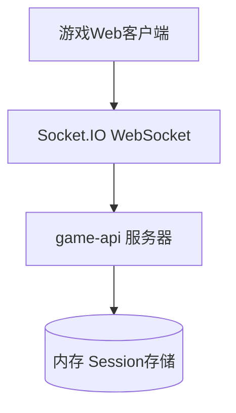
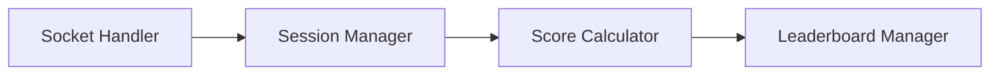
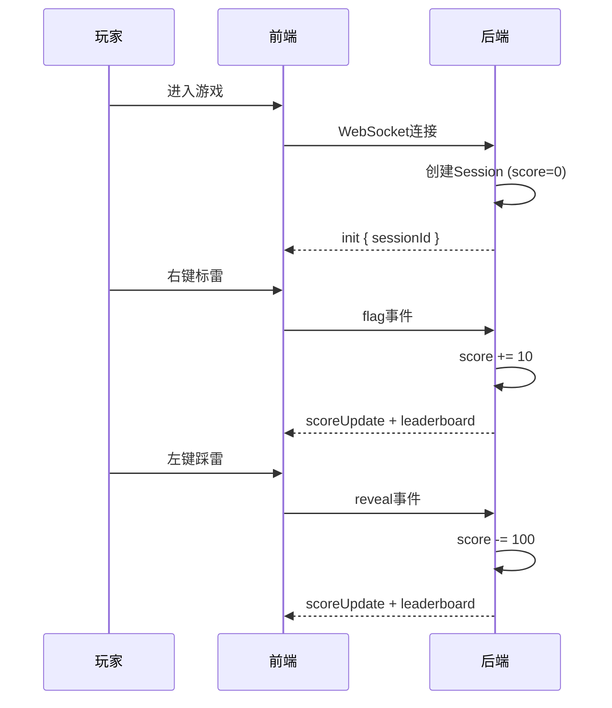

# 联机计分Board - 技术提案

本文档定义了联机计分Board功能的WebSocket事件、Session管理、分数计算规则和实时排行榜的数据模型，作为开发实现和Contract编写的依据。

## 1. 概述

### 1.1 背景

联机计分Board是扫雷游戏的社交竞技MVP功能，通过WebSocket实时同步玩家分数并展示排行榜，满足用户社交竞争需求。

### 1.2 目标

- 为每个玩家创建临时Session并计分
- 实时记录玩家操作（右键标雷+10分，左键踩雷-100分）
- 在游戏界面右上角展示实时排行榜
- 数据存于内存，服务器重启后清零

### 1.3 范围

**做**: Session管理、分数计算、实时排行榜、WebSocket通信
**不做**: 数据持久化、用户认证、好友系统

## 2. 技术架构

### 2.1 系统架构图



### 2.2 技术栈

| 层级 | 技术选型 | 说明 |
|------|---------|------|
| 前端 | React 18 + Vite + TypeScript | 现有技术栈 |
| 后端 | Node.js + Express + Socket.IO | 现有技术栈 |
| 数据存储 | 内存Map | MVP版本 |

### 2.3 模块划分



| 模块 | 职责 | 关键技术点 |
|------|------|-----------|
| Session Manager | 管理玩家Session创建和销毁 | Map<socketId, Session> |
| Score Calculator | 计算玩家分数变更 | reveal:-100, flag:+10 |
| Leaderboard Manager | 维护排行榜排序和广播 | 按分数降序，实时推送 |

## 3. API 设计

### 3.1 WebSocket 事件契约

#### 3.1.1 客户端 -> 服务端事件

| 事件名 | Payload | 说明 |
|--------|---------|------|
| `reveal` | `{ col: number; row: number }` | 左键踩雷，扣100分 |
| `flag` | `{ col: number; row: number }` | 右键标雷，加10分 |

#### 3.1.2 服务端 -> 客户端事件

| 事件名 | Payload | 说明 |
|--------|---------|------|
| `init` | `{ sessionId: string; revealed: Cell[]; flagged: Cell[] }` | 初始化游戏，返回sessionId |
| `scoreUpdate` | `{ sessionId: string; score: number }` | 分数变更通知 |
| `leaderboard` | `{ rankings: Ranking[]; currentPlayer: Ranking }` | 排行榜数据 |
| `cellRevealed` | `{ col, row, cells }` | 格子揭开了 |
| `cellFlagged` | `{ col, row, isFlagged }` | 标记状态变更 |
| `reset` | - | 游戏重置 |

### 3.2 数据模型

#### Session 数据结构

```typescript
interface Session {
  sessionId: string;    // 唯一标识（前6位可展示）
  socketId: string;     // WebSocket连接ID
  score: number;        // 当前分数，初始0
  createdAt: number;    // 创建时间戳
}
```

#### Leaderboard Entry

```typescript
interface Ranking {
  sessionId: string;    // 显示前6位
  score: number;
  isCurrentPlayer: boolean;
}
```

## 4. 数据模型

### 4.1 内存存储设计

```
sessions: Map<socketId, Session>
- key: socketId (WebSocket连接ID)
- value: Session 对象
```

**排序规则**: 分数降序，分数相同时按createdAt升序（先创建的排前面）

## 5. 技术实现方案

### 5.1 核心流程



### 5.2 关键实现点

#### 实现点 1: Session 管理

- 连接时自动创建Session，socket.id作为sessionId基础
- 断开连接时销毁Session
- SessionID使用socket.id的hash，确保足够随机

#### 实现点 2: 分数计算

- `reveal` 操作: score -= 100
- `flag` 操作: score += 10
- 分数允许为负数

#### 实现点 3: 排行榜广播

- 每次分数变更后，重新计算排行榜并广播给所有客户端
- 更新延迟 < 1秒

## 6. 技术决策

### 6.1 决策列表

| 决策 | 选项 A | 选项 B | 最终选择 | 原因 |
|------|--------|--------|---------|------|
| 数据存储 | 内存Map | Redis | 内存Map | MVP快速上线，约束要求 |

### 6.2 依赖与约束

| 类型 | 内容 | 说明 |
|------|------|------|
| 依赖 | Socket.IO | 已有WebSocket通信 |
| 依赖 | React/Vite | 现有前端技术栈 |
| 约束 | 数据不持久化 | MVP要求 |
| 约束 | 不暴露完整SessionID | 安全要求 |

## 7. 项目结构

```
servers/game-api/src/
├── index.ts          # 入口，添加Session管理和leaderboard逻辑
└── session.ts        # Session管理模块（新增）

apps/game-web/src/
├── services/
│   └── socket.ts     # 添加scoreUpdate和leaderboard事件监听
├── components/
│   └── Leaderboard.tsx  # 排行榜组件（新增）
└── App.tsx           # 集成Leaderboard
```

## 8. 测试策略

### 8.1 测试覆盖要求

- 单元测试覆盖率: >= 80%
- API 测试覆盖: scoreUpdate、leaderboard 事件

### 8.2 测试类型

| 类型 | 工具 | 覆盖范围 |
|------|------|---------|
| 单元测试 | Vitest | Session管理、分数计算 |
| API 测试 | Supertest | WebSocket事件 |
| E2E 测试 | Playwright | 完整用户流程 |

## 9. 验收标准

- [ ] 技术方案评审通过
- [ ] Contract 评审通过
- [ ] 代码实现完成
- [ ] 单元测试覆盖达标
- [ ] API 测试通过
- [ ] E2E 测试通过

## 相关文档

- [[../product/reviewed/联机计分Board]] - 产品需求文档
- [[../apps/game-web/AGENTS]] - game-web 技术栈
- [[../servers/game-api/AGENTS]] - game-api 技术栈
- [[../../contracts/websocket]] - WebSocket 事件契约