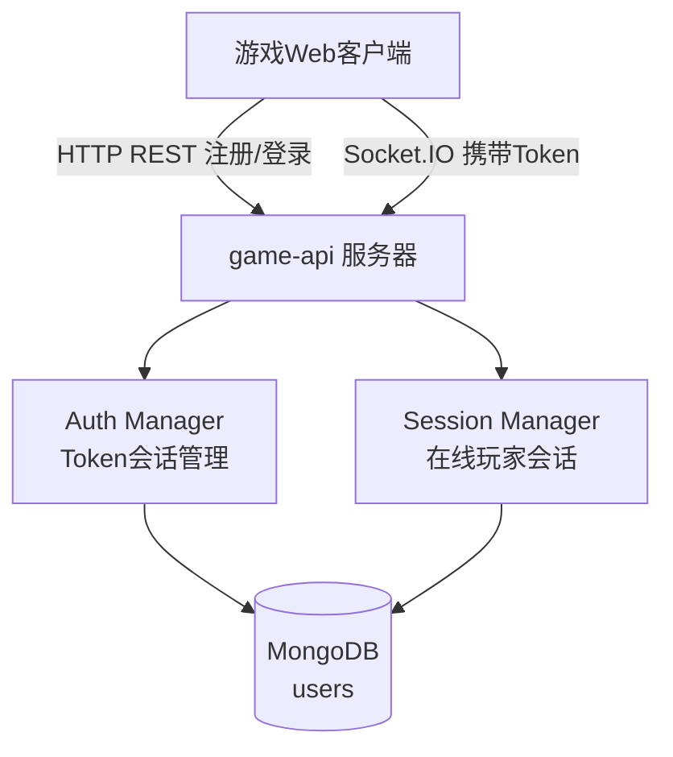
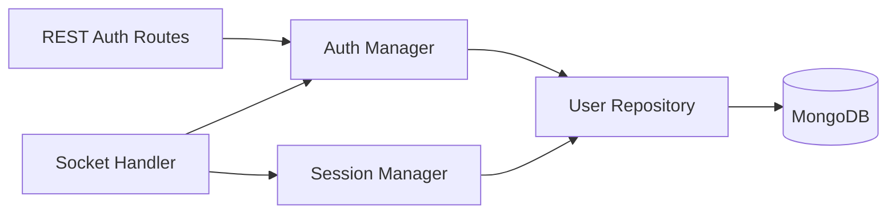
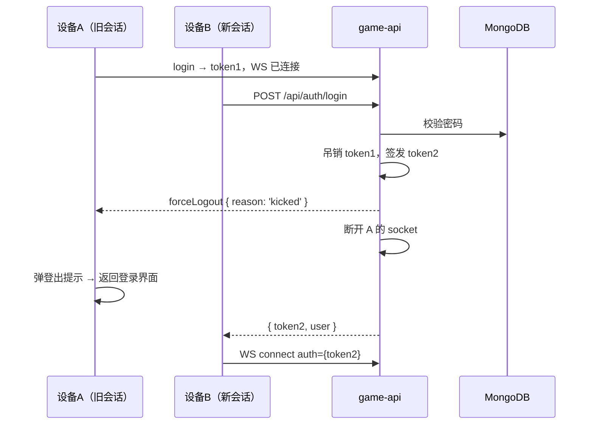
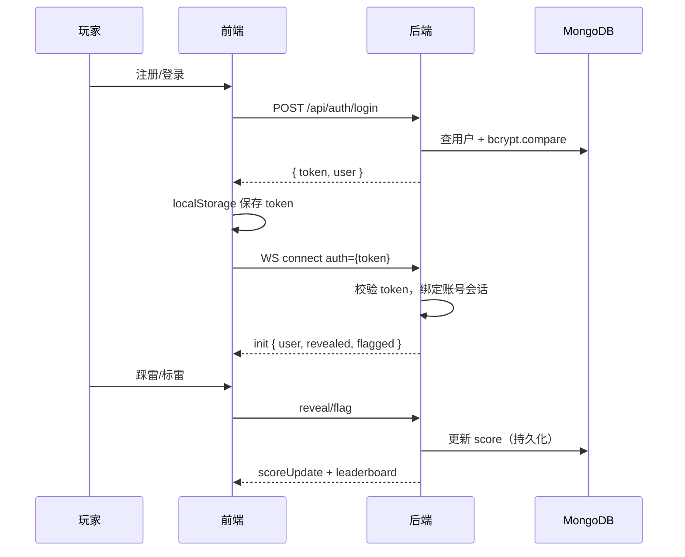

# 用户登录与账号体系 - 技术提案

本文档定义用户登录功能的认证流程、MongoDB 数据模型、分数持久化方案与单会话互踢机制，作为开发实现和 Contract 编写的依据。

## 1. 概述

### 1.1 背景

现有联机计分Board基于内存 Session，分数随服务器重启丢失，玩家无稳定身份。本期引入 MongoDB 持久化用户账号与分数，并支持改名与单会话互踢。

### 1.2 目标

- 用户名+密码注册/登录，密码哈希存储
- 登录会话(Token)认证 WebSocket 连接，刷新页面保持登录态
- 分数实时持久化到 MongoDB，服务器重启不丢失
- 同一账号仅一个活跃会话，新登录踢出旧会话并通知客户端

### 1.3 范围

**做**: 注册、登录、登出、Token 会话管理、分数持久化、改名持久化、单会话互踢
**不做**: 第三方登录、找回密码、邮箱验证、游客模式

## 2. 技术架构

### 2.1 系统架构图



### 2.2 技术栈

| 层级 | 技术选型 | 说明 |
|------|---------|------|
| 前端 | React 18 + Vite + TypeScript | 现有技术栈 |
| 后端 | Node.js + Express 5 + Socket.IO 4 | 现有技术栈 |
| 持久化 | MongoDB + Mongoose | 新增 |
| 密码哈希 | bcryptjs | 新增依赖 |
| Token | crypto.randomUUID / randomBytes | Node 内置，无新依赖 |

### 2.3 模块划分



| 模块 | 职责 | 关键技术点 |
|------|------|-----------|
| Auth Manager | 注册/登录校验、Token 签发与吊销、单会话互踢 | Map<token, username>，每账号仅一个有效 token |
| User Repository | 用户与分数的 MongoDB 读写 | Mongoose Model，分数原子更新 |
| Session Manager | 在线会话与账号绑定、分数变更入口 | token → user 映射替代匿名 sessionId |
| Auth Routes | REST 注册/登录/登出端点 | Express Router |

## 3. API 设计

### 3.1 REST 端点（新增）

| 方法 | 路径 | Body | 响应 | 说明 |
|------|------|------|------|------|
| POST | `/api/auth/register` | `{ username, password }` | `{ token, user }` / `409` | 注册并自动登录 |
| POST | `/api/auth/login` | `{ username, password }` | `{ token, user }` / `401` | 登录，踢出旧会话 |
| POST | `/api/auth/logout` | Header `Authorization: Bearer <token>` | `204` | 主动登出，吊销 token |

**user 对象**: `{ username: string; displayName: string; score: number }`

**校验规则**:
- username: 3-20 字符，字母数字下划线，唯一（大小写不敏感存储，展示保留原样）
- password: 最少 6 字符，bcrypt(10) 哈希存储
- 登录失败统一返回 `401 { error: '用户名或密码错误' }`，不区分用户不存在/密码错误

### 3.2 WebSocket 变更

#### 连接认证

- 客户端连接时在 `auth` 握手字段携带 `{ token }`
- 无效/已吊销 token → 服务端 `disconnect`，客户端跳转登录界面
- 未携带 token → 拒绝连接（本期强制登录，无游客模式）

#### 事件变更与新增

| 事件 | 方向 | Payload | 说明 |
|------|------|---------|------|
| `init` | S→C | 增加 `user: { username, displayName, score }` | sessionId 语义改为账号标识 |
| `setName` | C→S | `{ name: string }` | 已有事件，改为持久化 displayName（max 20 字符） |
| `forceLogout` | S→C | `{ reason: 'kicked' }` | 新增：账号在他处登录，旧会话被踢出 |
| `scoreUpdate` / `leaderboard` | S→C | 不变 | 分数变更触发持久化，Ranking 中标识改为 username/displayName |

#### 单会话互踢时序



## 4. 数据模型

### 4.1 MongoDB 集合

#### users

```typescript
interface User {
  username: string;        // 唯一索引（lowercase 存储比对）
  displayName: string;     // 排行榜展示名，默认 = username
  passwordHash: string;    // bcrypt(10)
  score: number;           // 持久化分数，默认 0
  createdAt: Date;
  updatedAt: Date;
}
```

- 唯一索引: `username`（collation: strength 2，大小写不敏感唯一）
- 分数更新使用 `$inc` 原子操作或读取后写入，避免并发覆盖

### 4.2 内存会话（服务端）

```
tokens: Map<token, username>           // 有效 token → 账号
activeSessions: Map<username, socketId> // 账号 → 当前活跃连接
```

- token 仅存内存：服务器重启后所有 token 失效，玩家需重新登录（分数已在 MongoDB，可接受）
- 新登录时：`tokens` 删除旧 token、`activeSessions` 替换 socketId，并向旧 socket 发送 `forceLogout`

## 5. 技术实现方案

### 5.1 核心流程



### 5.2 关键实现点

#### 实现点 1: 认证与 Token

- 登录成功签发 `crypto.randomBytes(32).toString('hex')` 作为 token
- Socket.IO `io.use()` 中间件校验 `handshake.auth.token`
- 前端 token 存 `localStorage`，刷新页面用 token 重连；连接被拒则清除并回登录页

#### 实现点 2: 分数持久化

- `updateScore` 由内存改为先更新 MongoDB（`findOneAndUpdate` + `$inc`），成功后广播
- 写库失败时本次分数变更不广播，日志告警（保证内存与库不分裂）

#### 实现点 3: 单会话互踢

- `login` 时若 `activeSessions` 已有该账号：
  1. 向旧 socket emit `forceLogout { reason: 'kicked' }`
  2. `socket.disconnect(true)`
  3. 删除旧 token，替换 `activeSessions` 记录
- 前端收到 `forceLogout`：清除本地 token → 展示"账号已在其他位置登录"提示 → 跳转登录界面

#### 实现点 4: 改名持久化

- `setName` 校验登录态与长度（≤20），写库 `displayName` 后广播 `leaderboard`
- 排行榜展示优先级：`displayName`（匿名兜底逻辑移除，本期强制登录）

## 6. 技术决策

### 6.1 决策列表

| 决策 | 选项 A | 选项 B | 最终选择 | 原因 |
|------|--------|--------|---------|------|
| ODM | Mongoose | 原生 driver | Mongoose | schema 校验、索引声明集中，团队上手快 |
| 密码哈希 | bcryptjs | argon2 | bcryptjs | 纯 JS 无原生编译，6位+密码强度下安全裕量足够 |
| 会话凭证 | 随机 Token(内存) | JWT | 随机 Token | 互踢需要即时吊销，JWT 吊销需额外黑名单，内存 token 更简单 |
| 登录接口 | REST | WebSocket 事件 | REST | 认证与游戏通道分离，便于后续接第三方登录 |
| Token 存储 | localStorage | Cookie | localStorage | Socket.IO auth 握手读取方便；本期无跨子域需求 |

### 6.2 依赖与约束

| 类型 | 内容 | 说明 |
|------|------|------|
| 依赖 | MongoDB 实例 | 本地开发用 docker（infra/local-dev 增加 mongo 服务） |
| 依赖 | mongoose、bcryptjs | game-api 新增依赖 |
| 约束 | 密码不明文存储/传输 | bcrypt 哈希；传输层生产环境需 HTTPS（部署侧负责） |
| 约束 | 服务器重启 token 全失效 | 可接受：分数已持久化，重新登录即可 |

## 7. 项目结构

```
servers/game-api/src/
├── index.ts              # 挂载 auth router，WS 认证中间件
├── auth.ts               # Auth Manager：注册/登录/token/互踢（新增）
├── db.ts                 # Mongoose 连接与 User Model（新增）
├── session.ts            # Session Manager：改为账号绑定，分数走持久化
└── minefield.ts          # 不变

apps/game-web/src/
├── pages/
│   └── Login.tsx         # 登录/注册界面（新增）
├── services/
│   ├── api.ts            # REST 登录/注册/登出（新增）
│   └── socket.ts         # auth 握手携带 token，监听 forceLogout
├── components/
│   └── Leaderboard.tsx   # 展示 displayName
└── App.tsx               # 未登录跳转 Login；改名入口

infra/local-dev/
└── docker-compose.yml    # 新增 mongo 服务
```

## 8. 测试策略

### 8.1 测试覆盖要求

- 单元测试覆盖率: 后端 >= 80%，前端组件 >= 70%
- API 测试覆盖: register / login / logout / 互踢 / 分数持久化

### 8.2 测试类型

| 类型 | 工具 | 覆盖范围 |
|------|------|---------|
| 单元测试 | Vitest | Auth Manager 校验逻辑、互踢状态机、分数持久化 |
| API 测试 | Vitest + mongodb-memory-server | REST 端点、WS 认证、forceLogout |
| E2E 测试 | Playwright | 注册→登录→游戏→改名→他端登录互踢全流程 |

## 9. 验收标准

- [ ] 技术方案评审通过
- [ ] Contract 评审通过（更新 contracts/websocket.md 与新增 REST 契约）
- [ ] 代码实现完成
- [ ] 单元测试覆盖达标
- [ ] API 测试通过（含互踢与持久化场景）
- [ ] E2E 测试通过

## 相关文档

- [[../product/draft/01-用户登录]] - 产品需求文档
- [[20260421-online-scoring-board-proposal]] - 联机计分Board技术提案
- [[../../contracts/websocket]] - WebSocket 事件契约（本期需更新）
