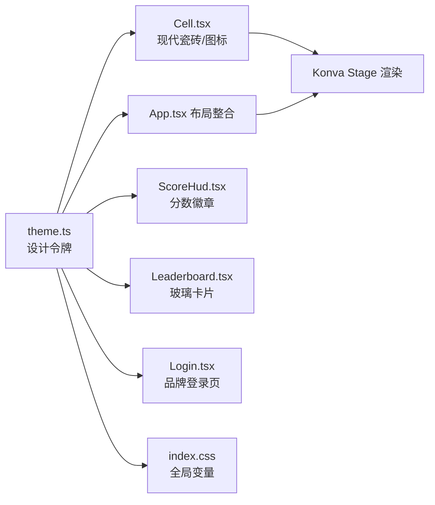

# 界面优化：扫雷主题网站整体重设计 - 技术提案

本文档定义「扫雷」主题界面重设计的技术方案：设计系统令牌、Konva 格子/图标渲染方案、HUD/排行榜/登录页改造路径与测试策略，作为开发实现的依据。本次为纯前端改造，后端与 WebSocket 契约零改动。

## 1. 概述

### 1.1 背景

现有网站功能完整（联机计分、用户登录、排行榜、小地图导航）但视觉为通用暗色风格，与「扫雷」主题割裂：格子扁平灰暗、游戏元素使用 emoji、控件为浏览器默认样式、无品牌图标。需以「扫雷」为核心主题、**现代设计语言**进行整体视觉重设计，建立统一设计系统。

### 1.2 目标

- 建立扫雷主题现代设计系统（色板/字体/间距/阴影/动效），全站统一引用
- 重绘游戏格子为现代悬浮瓷砖（圆角 + 柔和阴影 + 微妙渐变），地雷/旗帜改为现代几何矢量图标
- 重设计 HUD（玻璃顶栏 + 动画分数徽章）、排行榜、登录页、站点品牌信息
- 纯前端改造，不改变交互行为与数据协议

### 1.3 范围

**做**: 设计系统令牌、游戏格子/图标重绘、HUD/排行榜/登录页重设计、favicon 与站点标题、组件测试更新
**不做**: 后端改动、契约改动、引入新依赖/UI 库、改变游戏交互逻辑与数据结构

## 2. 技术架构

### 2.1 系统架构图

本次改造全部位于 `apps/game-web`，前后端边界不变：`socketService`、`authApi` 的接口与数据结构不变。

### 2.2 技术栈

| 层级 | 技术选型 | 说明 |
|------|---------|------|
| 框架 | React 19 + Vite + TypeScript | 现有技术栈 |
| 画布 | react-konva 19 / Konva 10 | 现有棋盘渲染 |
| 样式 | CSS 变量 + 内联样式（设计令牌双通道） | 现有内联样式为主，新增全局 CSS 变量层 |
| 图标 | Konva Path（SVG path data） | 替代 emoji，跨平台一致 |
| 字体 | 系统现代无衬线栈 + `font-variant-numeric: tabular-nums` | 不引入外部字体资源，数字等宽对齐 |

### 2.3 设计令牌双通道

Konva（Canvas）无法读取 CSS 变量，因此设计令牌同时以 **TypeScript 常量**（供 Konva fill/stroke 与内联样式）与 **CSS 变量**（供 DOM 元素/全局基调）两种形态暴露，二者来源单一（`src/theme.ts`），避免色值漂移。

## 3. 设计方案

### 3.1 设计令牌（theme.ts）

**风格基调**: 「现代暗色扁平 × 轻玻璃拟态」，以深空蓝黑为底、电光青蓝渐变为强调，保留扫雷的数字/地雷/旗帜基因。

| 令牌 | 值 | 用途 |
|------|-----|------|
| `bg.deep` | `#0a0e17` | 全站主背景底色（深空蓝黑） |
| `bg.deepHi` | `#111826` | 主背景渐变高光端 |
| `bg.glass` | `rgba(255,255,255,0.06)` | 玻璃面板底色 |
| `bg.glassStrong` | `rgba(20,28,40,0.82)` | 玻璃面板（含 blur 回退） |
| `bg.panel` | `#161e2c` | 实底面板（blur 不可用回退） |
| `cell.base` | `#1d2636` | 未揭开格子底色 |
| `cell.baseHi` | `#252f42` | 未揭开格子内渐变高光端 |
| `cell.edge` | `rgba(255,255,255,0.10)` | 未揭开格子描边/悬停边框 |
| `cell.sunken` | `#0f141f` | 已揭开格子底色 |
| `cell.sunkenEdge` | `rgba(255,255,255,0.06)` | 已揭开格子细描边 |
| `accent.primary` | `#22d3ee` | 电光青（主强调/聚焦） |
| `accent.secondary` | `#3b82f6` | 电光蓝（渐变次端/链接） |
| `accent.ok` | `#34d399` | 青绿（成功/当前玩家/分数） |
| `accent.danger` | `#f87171` | 珊瑚红（危险/地雷/错误） |
| `number.1..8` | 现代高对比色板 | 数字 1-8（青蓝/青绿/珊瑚红/紫/琥珀/青/粉/灰） |
| `text.primary` | `#e8edf4` | 主文字 |
| `text.muted` | `#8b97a9` | 次级文字 |
| `font.sans` | `system-ui, -apple-system, 'Segoe UI', Roboto, sans-serif` | 现代无衬线正文 |
| `radius` | 8/12/16px | 圆角阶梯（控件/卡片/大容器） |
| `shadow.card` | `0 8px 24px rgba(0,0,0,0.35)` | 卡片分层阴影 |
| `shadow.lift` | `0 10px 28px rgba(0,0,0,0.45)` | 悬浮/上浮阴影 |
| `blur` | `blur(14px)` | 玻璃磨砂 |
| `motion.fast` | 150ms `cubic-bezier(.2,.8,.2,1)` | 悬停/按压反馈 |
| `motion.normal` | 300ms 同上 | 面板显隐/过渡 |

### 3.2 游戏格子视觉方案（Cell.tsx）

现代悬浮瓷砖通过**Konva 基础形状叠加**实现（不引入图片资源）：

- **未揭开格子**: 圆角 `Rect`（`cell.base`→`cell.baseHi` 线性渐变）+ 外层柔和投影（同尺寸放大半透明 `Rect` 或 Konva `shadow*` 属性）+ 细描边（`cell.edge`），形成悬浮质感；悬停时由 PointerRect 覆盖高亮边框并轻微放大
- **已揭开格子**: 圆角 `Rect`（`cell.sunken`）+ 内缩细描边（`cell.sunkenEdge`），扁平内凹观感，与未揭开形成强对比
- **揭示过渡**: 状态变更时叠加 120ms 的轻微缩放/淡入 `Tween`，不阻塞输入
- **指针高亮** `PointerRect`: 主题强调色描边 + 半透明填充，配合悬停轻微上浮
- **网格线** `GridLine`: 颜色收敛到主题令牌，弱化可见性（低于格子对比度）

### 3.3 游戏元素图标（Konva Path）

emoji（🚩）在跨平台渲染不一致，改用 `Konva.Path` 绘制现代几何扁平图标：

| 元素 | 方案 | 样式 |
|------|------|------|
| 地雷 | SVG path（几何化圆形雷体 + 引信 + 四向触角） | `accent.danger` 珊瑚红 + 深色描边，扁平无阴影 |
| 旗帜 | SVG path（几何三角旗面 + 旗杆） | 珊瑚红旗面 + 银灰旗杆 |
| 数字 1-8 | `Text` + 现代色板 | 加粗、tabular-nums、与格子对比度高 |

图标以 `Konva.Path` 配合 `cache()` 绘制，保持现有渲染性能特征（仅渲染已操作格子）。

### 3.4 HUD 与分数徽章（ScoreHud.tsx 新增）

- 顶部信息栏抽取为 `ScoreHud` 组件，整合：品牌标识、当前玩家（圆形头像徽章 + 显示名/用户名）、分数徽章、改名/登出入口
- **头像徽章**: 圆形容器展示显示名首字母（`accent.primary` 渐变底）
- **分数徽章**: 现代胶囊样式，数字使用 tabular-nums；分数变化时做平滑滚动/过渡动画（短时数字位移 + 轻微辉光脉冲，CSS transition 实现）
- **改名入口**: 点击弹出轻量浮层（现代玻璃卡），保留 ≤20 字符校验逻辑
- 面板为玻璃拟态（`bg.glass` + `blur` + `shadow.card`），替代当前 `rgba(0,0,0,0.8)` 内联面板；`backdrop-filter` 不可用时回退 `bg.glassStrong`

### 3.5 排行榜重设计（Leaderboard.tsx）

- 面板改为玻璃卡片：半透明磨砂 + 圆角 + 分层阴影，顶部主题标题条
- 行结构：排名徽章（Pill 样式 `#1/#2/#3`）、玩家头像圆形徽章（首字母）、显示名、分数高对比排版
- 当前玩家行使用 `accent.primary→accent.secondary` 渐变高亮
- 数据结构（Ranking[]）与事件订阅逻辑不变

### 3.6 登录/注册页重设计（Login.tsx）

- 背景为 `bg.deep→bg.deepHi` 渐变叠加网格/浮雷装饰（CSS 渐变与 SVG 装饰生成，无图片资源），顶部品牌标题与标识
- 表单置于居中玻璃卡片：现代输入框（聚焦时 `accent.primary` 光晕描边）、`accent.primary→accent.secondary` 渐变主按钮、柔和错误提示
- 互踢提示浮层（App.tsx 内 `kickNotice`）样式同步主题化
- 校验逻辑（密码一致性、长度限制、错误提示文案）零改动

### 3.7 品牌与站点信息

- 新增 `public/mine.svg`（现代几何地雷主题图标，渐变配色），替换 `index.html` 中 favicon 引用
- `index.html`: `<title>` 改为「MINE FIELD - 联机扫雷」，增加 `<meta name="description">`
- 删除/替换 `public/favicon.svg`（当前为默认占位图标）与 `public/icons.svg`（如无用）

## 4. 文件变更清单

| 文件 | 变更 | 说明 |
|------|------|------|
| `src/theme.ts` | 新增 | 设计令牌单一来源 |
| `src/components/Cell.tsx` | 改造 | 现代瓷砖格子 + Konva Path 地雷/旗帜图标 + 现代色板 |
| `src/components/ScoreHud.tsx` | 新增 | 玻璃顶栏 + 头像徽章 + 分数徽章 + 改名浮层 |
| `src/components/Leaderboard.tsx` | 改造 | 玻璃卡片面板样式（结构不变） |
| `src/pages/Login.tsx` | 改造 | 渐变品牌页 + 玻璃卡片（逻辑不变） |
| `src/App.tsx` | 改造 | 接入 ScoreHud、互踢浮层主题化、布局整合 |
| `src/index.css` | 改造 | 全局 CSS 变量、字体、背景基调 |
| `index.html` | 改造 | 标题/meta/favicon 引用 |
| `public/mine.svg` | 新增 | 现代地雷主题 favicon |
| `src/components/Leaderboard.test.tsx`、`src/pages/Login.test.tsx` | 同步更新 | 适配样式结构调整（如有断言变化） |

## 5. 关键实现点

### 5.1 悬浮瓷砖渲染性能

- 阴影与渐变全部由 Konva 基础形状属性（`shadow*`、线性渐变 fill）实现，配合现有 `cache()` 与 `perfectDrawEnabled=false`
- 维持「仅渲染已操作格子」策略，不因视觉重设计全量渲染 1200×640 网格
- 图标 `Konva.Path` 静态化后缓存，避免每帧重绘

### 5.2 地雷/旗帜 SVG path

- 在 `theme.ts`（或独立 `assets.ts`）集中维护 path data 常量，组件引用，保证一致性
- 图标尺寸随 `cellSize` 缩放，保持垂直水平居中

### 5.3 分数动画

- 采用 CSS transition 实现数字滚动/辉光脉冲，避免引入动画库
- 动效位于交互热路径之外（分数徽章/浮层），不阻塞渲染

### 5.4 玻璃拟态回退

- `backdrop-filter` 非兼容环境回退到半透明实底 `bg.glassStrong`，保证可读性
- 装饰元素（网格/浮雷）由渐变与 SVG 生成，不依赖图片资源

### 5.5 主题一致性

- 所有新增/改造样式一律从 `theme.ts` 取令牌，禁止散落硬编码色值
- 建立快速自查：全站 grep 无游离 `#` 色值（theme.ts 与 index.css 除外）

## 6. 技术决策

### 6.1 决策列表

| 决策 | 选项 A | 选项 B | 最终选择 | 原因 |
|------|--------|--------|---------|------|
| 设计方向 | 现代扁平 + 轻玻璃拟态 | 复古拟物（bevel/LED） | 现代扁平 + 轻玻璃拟态 | 产品评审要求现代设计；玻璃拟态现代且能保留扫雷格子/图标基因 |
| 图标实现 | Konva.Path 矢量绘制 | 保留 emoji | Konva.Path | 跨平台渲染一致、风格统一、可主题化 |
| 格子实现 | Konva 形状叠加（渐变+阴影） | 外部图片/雪碧 | 形状叠加 | 零资源加载、随 cellSize 自适应、沿用现有渲染模型 |
| 样式体系 | TS 令牌双通道（CSS 变量 + 常量） | 仅 CSS 变量 | 双通道 | Konva 不读 CSS 变量，需 TS 常量；CSS 变量服务 DOM，来源单一 |
| 字体方案 | 外部 Web 字体 | 系统无衬线栈 | 系统栈 | 零加载开销，数字用 tabular-nums 对齐 |
| 改造范围 | 全站重设计 | 仅棋盘 | 全站 | 需求要求网站整体重设计，且一致性要求全站收敛 |

### 6.2 依赖与约束

| 类型 | 内容 | 说明 |
|------|------|------|
| 依赖 | 无新增 npm 依赖 | 图标/主题/动效全部自研 |
| 约束 | 后端与契约零改动 | 不触碰 servers/game-api 与 contracts/ |
| 约束 | 交互逻辑零改动 | reveal/flag/chord、改名、登出、互踢、小地图行为不变 |
| 约束 | 测试必须保持通过 | 组件测试 >= 70%，E2E 游戏流程回归通过 |

## 7. 测试策略

### 7.1 测试覆盖要求

- 前端组件测试覆盖率保持 >= 70%（现有要求）
- 现有 `Leaderboard.test.tsx`、`Login.test.tsx`、`socket.test.ts` 需继续通过

### 7.2 测试类型

| 类型 | 工具 | 覆盖范围 |
|------|------|---------|
| 组件测试 | Vitest + Testing Library | 改造后 Login（渲染/校验文案）、Leaderboard（标题/玩家展示）渲染正确；ScoreHud 展示玩家信息与分数 |
| 单元测试 | Vitest | 主题令牌存在性与 key 完整性（可选） |
| E2E 回归 | Playwright | reveal/flag/drag、登录、改名、互踢全流程不受视觉改造影响 |

### 7.3 手工验收重点

- 各主流浏览器下地雷/旗帜图标渲染一致（无 emoji 差异）
- `backdrop-filter` 不可用时玻璃面板回退正常、可读
- 大棋盘拖动/快速标雷帧率不劣化
- 小屏窗口下 HUD/排行榜/小地图无遮挡

## 8. 验收标准

- [ ] 技术方案评审通过
- [ ] 设计系统令牌建立，全站样式统一收敛（无游离硬编码色值）
- [ ] 游戏格子现代悬浮瓷砖、地雷/旗帜现代矢量图标、数字现代色板落地
- [ ] HUD（玻璃顶栏 + 分数徽章）、排行榜、登录页、互踢浮层重设计完成
- [ ] favicon 与站点标题/描述更新
- [ ] 组件测试通过且覆盖率 >= 70%
- [ ] E2E 回归通过，交互行为与改造前一致

## 相关文档

- [[../../product/draft/02-界面优化]] - 产品需求文档
- [[20260421-online-scoring-board-proposal]] - 联机计分Board技术提案
- [[20260810-user-login-proposal]] - 用户登录技术提案
- [[../../product/draft/01-用户登录]] - 用户登录与账号体系 PRD
