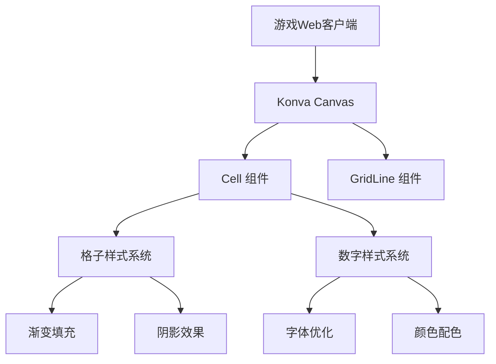
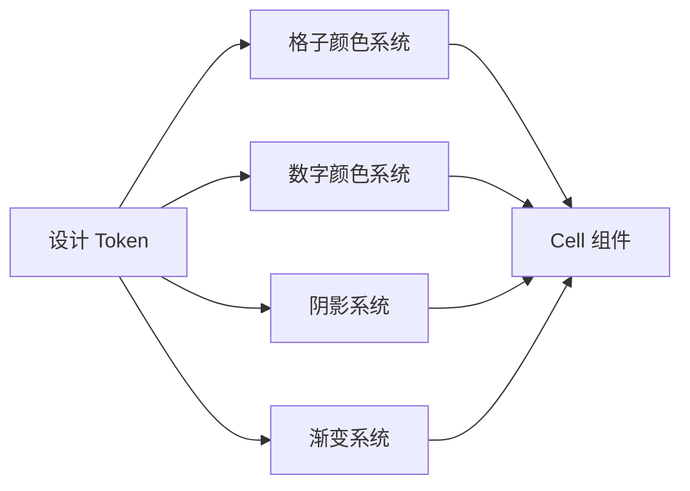
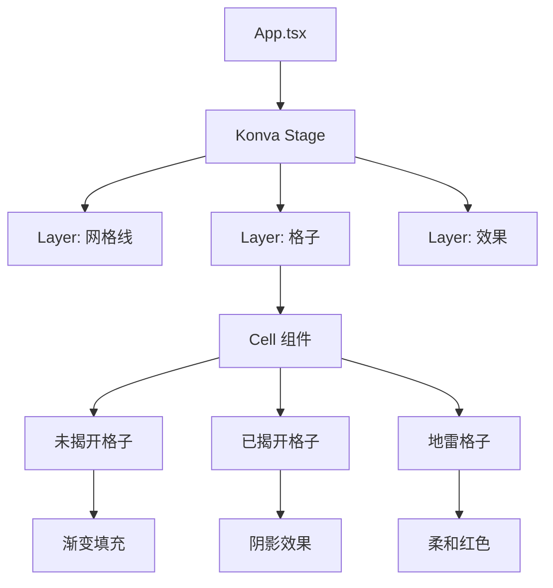
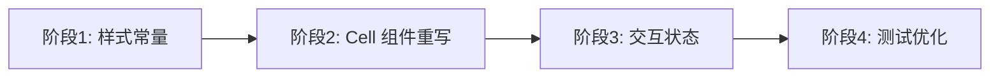

# 棋盘与数字优化 - 技术提案

本文档定义棋盘和数字视觉升级的技术方案：格子样式现代化、数字显示优化、地雷格子调整，作为开发实现的依据。

## 1. 概述

### 1.1 背景

现有游戏棋盘采用纯色填充（普通格子 `#ccc`，地雷格子 `#ff0000`），数字使用简单的颜色映射（1-8 对应不同颜色）。整体视觉风格较为基础，缺乏现代感和视觉层次。需要在不改变游戏核心逻辑的前提下，对棋盘和数字进行全面视觉升级。

### 1.2 目标

- 棋盘格子升级：渐变效果、阴影层次、边框优化、交互状态
- 数字显示优化：现代字体、颜色配色、阴影发光、大小比例
- 地雷格子调整：柔和警示色、视觉层次、图标优化

### 1.3 范围

**做**: Canvas 层棋盘渲染优化、数字样式升级、格子交互状态
**不做**: 后端改动、游戏逻辑变更、新功能开发、移动端适配

## 2. 技术架构

### 2.1 系统架构



### 2.2 技术栈

| 层级 | 技术选型 | 说明 |
|------|---------|------|
| 框架 | React 18 + Vite + TypeScript | 现有，不变 |
| Canvas | react-konva | 现有，不变 |
| 渲染 | Konva.Shape | 现有，扩展渐变和阴影 |
| 字体 | Inter + Noto Sans SC | Google Fonts 引入 |

### 2.3 设计系统



| 设计 Token | 变量名 | 值 | 说明 |
|-----------|--------|-----|------|
| 格子基础色 | `cell-base` | `#2d3748` → `#4a5568` | 深色渐变 |
| 格子边框色 | `cell-border` | `#1a202c` | 深色边框 |
| 已揭开背景 | `cell-revealed` | `#e2e8f0` | 浅灰色 |
| 地雷背景 | `cell-mine` | `#fc8181` | 柔和红色 |
| 数字1 | `num-1` | `#3182ce` | 蓝色 |
| 数字2 | `num-2` | `#38a169` | 绿色 |
| 数字3 | `num-3` | `#e53e3e` | 红色 |
| 数字4 | `num-4` | `#805ad5` | 紫色 |
| 数字5 | `num-5` | `#dd6b20` | 橙色 |
| 数字6 | `num-6` | `#319795` | 青色 |
| 数字7 | `num-7` | `#2d3748` | 深灰 |
| 数字8 | `num-8` | `#718096` | 灰色 |

## 3. 组件设计

### 3.1 组件层次



### 3.2 核心组件

#### 组件 1: Cell - 未揭开状态

```typescript
// 未揭开格子：渐变填充 + 边框 + 微妙阴影
const unrevaledCell = (
  <Rect
    x={x}
    y={y}
    width={cellSize}
    height={cellSize}
    fillLinearGradientStartPoint={{ x: 0, y: 0 }}
    fillLinearGradientEndPoint={{ x: cellSize, y: cellSize }}
    fillLinearGradientColorStops={[0, '#4a5568', 1, '#2d3748']}
    stroke="#1a202c"
    strokeWidth={1}
    shadowColor="rgba(0, 0, 0, 0.3)"
    shadowBlur={2}
    shadowOffset={{ x: 1, y: 1 }}
    cornerRadius={2}
  />
)
```

#### 组件 2: Cell - 已揭开状态

```typescript
// 已揭开格子：浅色背景 + 内阴影 + 边框
const revealedCell = (
  <Group>
    <Rect
      x={x}
      y={y}
      width={cellSize}
      height={cellSize}
      fill="#e2e8f0"
      stroke="#cbd5e0"
      strokeWidth={1}
      shadowColor="rgba(0, 0, 0, 0.1)"
      shadowBlur={1}
      shadowOffset={{ x: 1, y: 1 }}
    />
    {number > 0 && <NumberText number={number} x={x} y={y} size={cellSize} />}
  </Group>
)
```

#### 组件 3: Cell - 地雷状态

```typescript
// 地雷格子：柔和红色 + 图案
const mineCell = (
  <Group>
    <Rect
      x={x}
      y={y}
      width={cellSize}
      height={cellSize}
      fillLinearGradientStartPoint={{ x: 0, y: 0 }}
      fillLinearGradientEndPoint={{ x: cellSize, y: cellSize }}
      fillLinearGradientColorStops={[0, '#fc8181', 1, '#f56565']}
      stroke="#e53e3e"
      strokeWidth={1}
    />
    <Text
      x={x}
      y={y}
      width={cellSize}
      height={cellSize}
      text="💣"
      fontSize={20}
      align="center"
      verticalAlign="middle"
    />
  </Group>
)
```

#### 组件 4: NumberText - 数字显示

```typescript
// 数字文本：现代字体 + 阴影 + 颜色
const numberText = (
  <Text
    x={x}
    y={y}
    width={cellSize}
    height={cellSize}
    text={String(number)}
    fontSize={22}
    fontFamily="Inter, sans-serif"
    fontStyle="bold"
    fill={numberColors[number]}
    align="center"
    verticalAlign="middle"
    shadowColor="rgba(0, 0, 0, 0.2)"
    shadowBlur={1}
    shadowOffset={{ x: 0, y: 1 }}
  />
)
```

### 3.3 颜色系统

```typescript
// 数字颜色配色方案（专业配色）
const numberColors: Record<number, string> = {
  1: '#3182ce', // 蓝色 - 清晰
  2: '#38a169', // 绿色 - 自然
  3: '#e53e3e', // 红色 - 警示
  4: '#805ad5', // 紫色 - 神秘
  5: '#dd6b20', // 橙色 - 活力
  6: '#319795', // 青色 - 清新
  7: '#2d3748', // 深灰 - 稳重
  8: '#718096', // 灰色 - 中性
}
```

### 3.4 交互状态

```typescript
// 格子悬停效果
const hoverEffect = {
  fill: '#5a6577', // 稍亮的颜色
  shadowBlur: 4,   // 更明显的阴影
}

// 格子按下效果
const pressEffect = {
  fill: '#3d4a5c', // 稍暗的颜色
  shadowBlur: 1,   // 减少阴影
  shadowOffset: { x: 0, y: 0 }, // 阴影居中
}
```

## 4. 样式架构

### 4.1 文件结构

```
apps/game-web/src/
├── components/
│   ├── Cell.tsx              # 重写：格子组件
│   ├── Cell.module.css       # 新增：格子样式（如果需要）
│   └── ...
├── styles/
│   ├── cell-styles.ts        # 新增：格子样式常量
│   └── number-colors.ts      # 新增：数字颜色常量
└── ...
```

### 4.2 样式常量

```typescript
// cell-styles.ts
export const CELL_STYLES = {
  unrevealed: {
    fillGradient: ['#4a5568', '#2d3748'],
    stroke: '#1a202c',
    shadow: { color: 'rgba(0, 0, 0, 0.3)', blur: 2, offset: { x: 1, y: 1 } },
    cornerRadius: 2,
  },
  revealed: {
    fill: '#e2e8f0',
    stroke: '#cbd5e0',
    shadow: { color: 'rgba(0, 0, 0, 0.1)', blur: 1, offset: { x: 1, y: 1 } },
  },
  mine: {
    fillGradient: ['#fc8181', '#f56565'],
    stroke: '#e53e3e',
    icon: '💣',
  },
  hover: {
    fill: '#5a6577',
    shadowBlur: 4,
  },
  press: {
    fill: '#3d4a5c',
    shadowBlur: 1,
    shadowOffset: { x: 0, y: 0 },
  },
}
```

## 5. 技术实现方案

### 5.1 实现顺序



### 5.2 关键实现点

#### 实现点 1: 样式常量定义

- 创建 `cell-styles.ts` 定义所有格子样式
- 创建 `number-colors.ts` 定义数字颜色
- 统一管理设计 Token

#### 实现点 2: Cell 组件重写

- 修改 `Cell.tsx` 使用新的样式系统
- 为未揭开格子添加渐变填充
- 为已揭开格子添加阴影效果
- 为地雷格子使用柔和红色

#### 实现点 3: 数字样式优化

- 使用 Inter 字体提升可读性
- 优化数字颜色配色
- 添加微妙的阴影效果

#### 实现点 4: 交互状态集成

- 在 App.tsx 中添加格子悬停状态
- 在 App.tsx 中添加格子按下状态
- 优化点击反馈效果

### 5.3 项目结构变更

```
apps/game-web/src/
├── styles/                    # 新增：样式基础设施
│   ├── cell-styles.ts
│   └── number-colors.ts
├── components/
│   ├── Cell.tsx               # 重写：格子组件
│   └── ...
└── ...
```

## 6. 技术决策

### 6.1 决策列表

| 决策 | 选项 A | 选项 B | 最终选择 | 原因 |
|------|--------|--------|---------|------|
| 渐变方案 | Canvas渐变 | CSS渐变 | Canvas渐变 | Canvas 原生支持，性能好 |
| 字体方案 | 系统字体 | Google Fonts | Google Fonts | 现代感更强，Inter 字体 |
| 阴影方案 | Canvas阴影 | CSS阴影 | Canvas阴影 | Canvas 原生支持，性能好 |
| 颜色方案 | 保留原色 | 专业配色 | 专业配色 | 辨识度更高，视觉舒适 |
| 地雷方案 | 纯红色 | 柔和红色 | 柔和红色 | 视觉冲击降低，更舒适 |

### 6.2 依赖与约束

| 类型 | 内容 | 说明 |
|------|------|------|
| 依赖 | 现有游戏逻辑 | 不改变 reveal/flag/chord 等核心逻辑 |
| 依赖 | 现有 WebSocket API | 不改变事件契约 |
| 约束 | 无新 npm 依赖 | 纯 Canvas + 现有能力 |
| 约束 | 后端零改动 | 纯前端视觉优化 |

## 7. 测试策略

### 7.1 测试覆盖要求

- 组件测试覆盖率 >= 70%
- 视觉回归测试：关键组件截图对比

### 7.2 测试类型

| 类型 | 工具 | 覆盖范围 |
|------|------|---------|
| 组件测试 | Vitest + Testing Library | Cell 组件渲染、数字显示 |
| 视觉测试 | Playwright 截图对比 | 棋盘整体、格子状态、数字显示 |
| E2E 测试 | Playwright | 完整游戏流程（揭开、标记、地雷） |

## 8. 验收标准

- [ ] 技术方案评审通过
- [ ] 设计 Token 定义评审通过
- [ ] 代码实现完成
- [ ] 组件测试覆盖率 >= 70%
- [ ] 视觉回归测试通过
- [ ] E2E 测试通过
- [ ] 性能测试：棋盘渲染帧率 >= 60fps
- [ ] 无障碍测试：数字对比度、键盘导航

## 相关文档

- [[../product/draft/03-棋盘与数字优化]] - 产品需求文档
- [[../apps/game-web/AGENTS]] - game-web 技术栈
- [[../../contracts/websocket]] - WebSocket 事件契约（不变）
