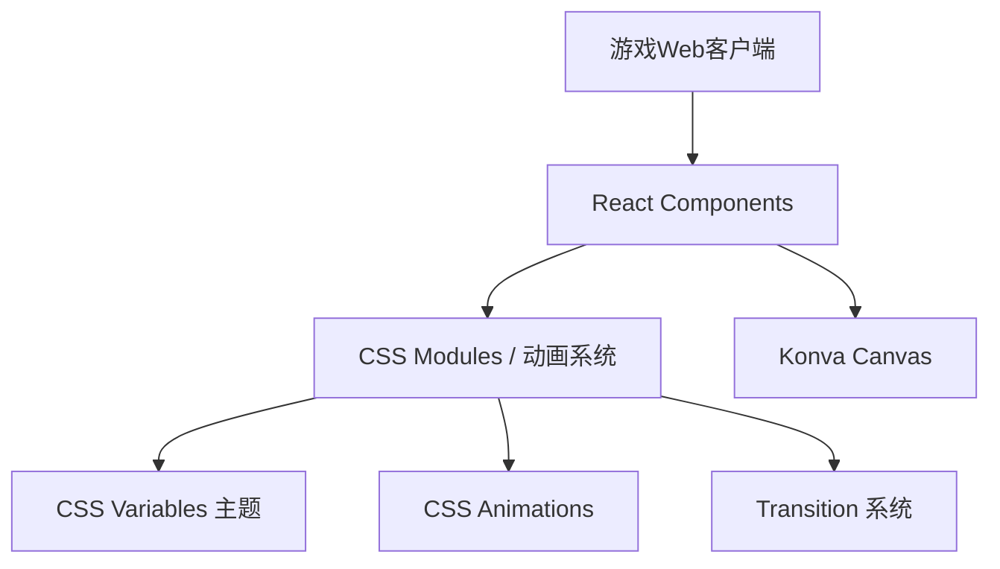
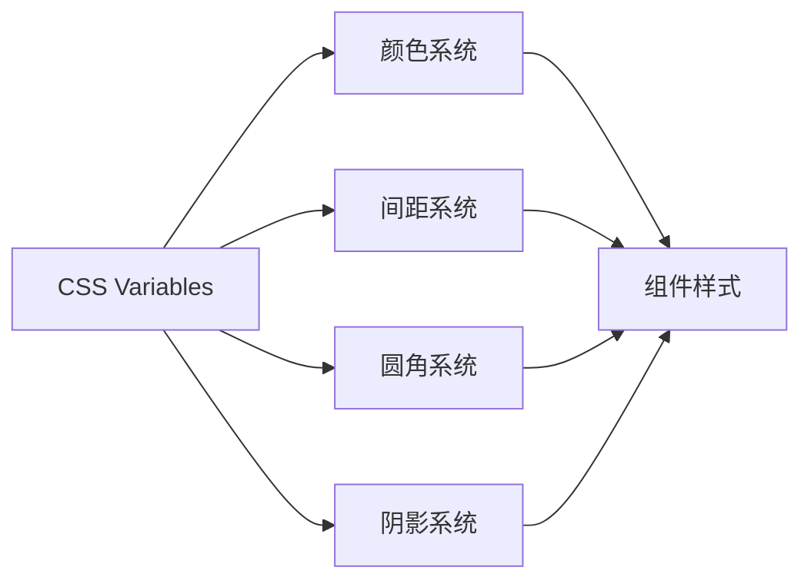
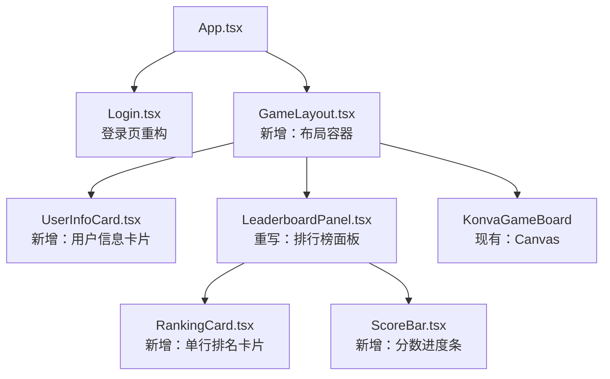
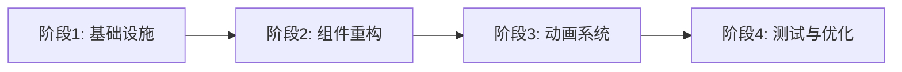

# 界面重构与优化 - 技术提案

本文档定义界面重构的技术方案：视觉现代化、交互动效系统、排行榜重设计，作为开发实现的依据。

## 1. 概述

### 1.1 背景

现有游戏界面采用纯黑底 + 等宽字体 + 内联样式的极简风格，缺乏现代感和交互反馈。排行榜为简单文字列表，信息层次不清。需要在不改变游戏核心逻辑和后端 API 的前提下，对前端界面进行全面升级。

### 1.2 目标

- 整体视觉升级：渐变背景、圆角卡片、阴影层次、统一色彩系统、现代字体
- 交互反馈增强：涟漪动画、分数浮动、按钮状态、面板过渡
- 排行榜重设计：卡片式布局、排名徽章、分数进度条、折叠功能

### 1.3 范围

**做**: 前端 UI 重构、CSS 动画系统、排行榜组件重写、登录页优化
**不做**: 后端改动、游戏逻辑变更、新功能开发、移动端适配

## 2. 技术架构

### 2.1 系统架构



### 2.2 技术栈

| 层级 | 技术选型 | 说明 |
|------|---------|------|
| 框架 | React 18 + Vite + TypeScript | 现有，不变 |
| 样式 | CSS Modules + CSS Variables | 新增：主题系统 |
| 动画 | CSS Animations + React 状态 | 轻量级，无新依赖 |
| Canvas | react-konva | 现有，不变 |
| 字体 | Inter + Noto Sans SC | Google Fonts 引入 |

### 2.3 设计系统



| 设计 Token | 变量名 | 值 | 说明 |
|-----------|--------|-----|------|
| 主色 | `--color-primary` | `#6366f1` | Indigo，用于强调 |
| 辅色 | `--color-secondary` | `#22c55e` | Green，用于分数正向 |
| 危险色 | `--color-danger` | `#ef4444` | Red，用于扣分 |
| 背景色 | `--color-bg` | `#0f172a` → `#1e293b` | 深色渐变 |
| 卡片色 | `--color-card` | `#1e293b` | 卡片背景 |
| 文本色 | `--color-text` | `#f8fafc` | 主文本 |
| 次文本 | `--color-text-muted` | `#94a3b8` | 次要文本 |
| 圆角 | `--radius-sm/md/lg` | `6px/10px/16px` | 三级圆角 |
| 阴影 | `--shadow-sm/md/lg` | `0 1px 3px / 0 4px 12px / 0 8px 24px` | 三级阴影 |

## 3. 组件设计

### 3.1 组件层次



### 3.2 核心组件

#### 组件 1: GameLayout（新增）

```typescript
interface GameLayoutProps {
  user: User | null;
  children: React.ReactNode;
}
```

- 负责整体布局：渐变背景、用户信息卡片（左上）、排行榜面板（右上）
- 管理面板折叠状态
- 提供 CSS Variables 主题注入

#### 组件 2: UserInfoCard（新增）

```typescript
interface UserInfoCardProps {
  user: User;
  onSetName: (name: string) => void;
  onLogout: () => void;
}
```

- 圆角卡片，展示用户名、分数、改名输入、登出按钮
- 分数变化时有脉冲动画
- 改名输入内联展示，不再单独表单

#### 组件 3: LeaderboardPanel（重写）

```typescript
interface LeaderboardPanelProps {
  rankings: Ranking[];
  currentUsername: string;
}
```

- 可折叠面板，标题栏含折叠按钮
- 排名列表使用 RankingCard 组件
- 更新时有排序过渡动画（CSS Transition + FLIP 技术）

#### 组件 4: RankingCard（新增）

```typescript
interface RankingCardProps {
  rank: number;
  ranking: Ranking;
  isCurrentPlayer: boolean;
}
```

- 独立卡片样式，当前玩家用主色边框高亮
- 前三名显示金银铜徽章
- 使用 ScoreBar 展示分数

#### 组件 5: ScoreBar（新增）

```typescript
interface ScoreBarProps {
  score: number;
  maxScore: number;
  delta?: number;
}
```

- 进度条样式，分数相对于最高分的比例
- 正分绿色，负分红色
- 分数变化时有宽度过渡动画

### 3.3 动画系统

#### 动画 1: 涟漪效果（Canvas 层）

```typescript
// 在 App.tsx 的 Konva Stage 中
// 点击格子时创建涟漪 Ring 动画
const ripple = new Konva.Ring({
  innerRadius: 0,
  outerRadius: 0,
  fill: 'rgba(99, 102, 241, 0.3)',
});
// Tween: outerRadius 0 → CELL_SIZE, opacity 1 → 0, duration 0.4s
```

#### 动画 2: 分数浮动（已有，优化）

- 现有 scorePopups 逻辑保留，优化视觉效果
- 字体加大、颜色使用主题色、添加阴影

#### 动画 3: 面板过渡

```css
.leaderboard-panel {
  transition: transform 0.3s ease, opacity 0.3s ease;
}
.leaderboard-panel.collapsed {
  transform: translateY(-100%);
  opacity: 0;
}
```

#### 动画 4: 排名排序（FLIP）

```typescript
// 排行榜更新时使用 FLIP 技术
// 1. First: 记录旧位置
// 2. Last: 应用新排序
// 3. Invert: 计算差值并反向偏移
// 4. Play: 移除偏移，触发 transition
```

#### 动画 5: 减弱动画支持

```css
@media (prefers-reduced-motion: reduce) {
  * {
    animation-duration: 0.01ms !important;
    transition-duration: 0.01ms !important;
  }
}
```

## 4. 样式架构

### 4.1 文件结构

```
apps/game-web/src/
├── styles/
│   ├── variables.css          # CSS Variables 主题定义
│   ├── global.css             # 全局样式、字体引入
│   └── animations.css         # 通用动画 keyframes
├── components/
│   ├── GameLayout.module.css  # 布局样式
│   ├── UserInfoCard.module.css
│   ├── LeaderboardPanel.module.css
│   ├── RankingCard.module.css
│   └── ScoreBar.module.css
└── index.css                  # 重写：引入 variables + global
```

### 4.2 CSS Modules 使用

- 每个组件配套 `.module.css` 文件
- 避免全局样式污染
- 使用 CSS Variables 实现主题一致性

## 5. 技术实现方案

### 5.1 实现顺序



### 5.2 关键实现点

#### 实现点 1: CSS 主题系统

- 创建 `variables.css` 定义所有设计 Token
- 在 `index.css` 引入并设置全局样式
- 所有组件使用 CSS Variables 而非硬编码颜色

#### 实现点 2: 组件重构

- 拆分 App.tsx 中的内联样式到 CSS Modules
- 新增 GameLayout、UserInfoCard、RankingCard、ScoreBar 组件
- 重写 Leaderboard 为 LeaderboardPanel

#### 实现点 3: 动画集成

- Canvas 涟漪效果在 App.tsx 的 handleClick 中触发
- CSS 过渡动画在各组件 CSS Modules 中定义
- FLIP 排序在 LeaderboardPanel 的 useEffect 中实现

#### 实现点 4: 登录页优化

- Login.tsx 添加背景渐变和装饰元素
- 表单卡片样式与游戏内一致
- 错误提示改为 toast 样式

### 5.3 项目结构变更

```
apps/game-web/src/
├── styles/                    # 新增：样式基础设施
│   ├── variables.css
│   ├── global.css
│   └── animations.css
├── components/
│   ├── GameLayout.tsx         # 新增：布局容器
│   ├── GameLayout.module.css
│   ├── UserInfoCard.tsx       # 新增：用户信息卡片
│   ├── UserInfoCard.module.css
│   ├── LeaderboardPanel.tsx   # 重写：排行榜面板
│   ├── LeaderboardPanel.module.css
│   ├── RankingCard.tsx        # 新增：排名卡片
│   ├── RankingCard.module.css
│   ├── ScoreBar.tsx           # 新增：分数进度条
│   ├── ScoreBar.module.css
│   ├── Leaderboard.tsx        # 删除：被 LeaderboardPanel 替代
│   └── Cell.tsx               # 不变
├── pages/
│   └── Login.tsx              # 重写：登录页样式
├── App.tsx                    # 简化：提取布局到 GameLayout
└── index.css                  # 重写：引入主题系统
```

## 6. 技术决策

### 6.1 决策列表

| 决策 | 选项 A | 选项 B | 最终选择 | 原因 |
|------|--------|--------|---------|------|
| 样案方案 | CSS Modules | Tailwind CSS | CSS Modules | 无新依赖，项目已有 CSS 基础 |
| 动画方案 | Framer Motion | CSS Animations | CSS Animations | 轻量级，无新依赖，性能好 |
| 字体方案 | 系统字体 | Google Fonts | Google Fonts | 现代感更强，Inter + Noto Sans SC |
| 布局方案 | CSS Grid | Flexbox | Flexbox | 兼容性更好，现有代码已是 Flexbox |
| 主题方案 | SASS 变量 | CSS Variables | CSS Variables | 浏览器原生支持，无需编译 |

### 6.2 依赖与约束

| 类型 | 内容 | 说明 |
|------|------|------|
| 依赖 | 现有游戏逻辑 | 不改变 reveal/flag/chord 等核心逻辑 |
| 依赖 | 现有 WebSocket API | 不改变事件契约 |
| 约束 | 无新 npm 依赖 | 纯 CSS + 现有 React 能力 |
| 约束 | 后端零改动 | 纯前端重构 |

## 7. 测试策略

### 7.1 测试覆盖要求

- 组件测试覆盖率 >= 70%
- 视觉回归测试：关键组件截图对比

### 7.2 测试类型

| 类型 | 工具 | 覆盖范围 |
|------|------|---------|
| 组件测试 | Vitest + Testing Library | Login 校验、Leaderboard 展示、RankingCard 渲染 |
| 视觉测试 | Playwright 截图对比 | 登录页、游戏主界面、排行榜面板 |
| E2E 测试 | Playwright | 完整用户流程（登录→游戏→排行榜交互） |

## 8. 验收标准

- [ ] 技术方案评审通过
- [ ] 设计 Token 定义评审通过
- [ ] 代码实现完成
- [ ] 组件测试覆盖率 >= 70%
- [ ] 视觉回归测试通过
- [ ] E2E 测试通过
- [ ] 性能测试：动画帧率 >= 60fps
- [ ] 无障碍测试：键盘导航、色彩对比度

## 相关文档

- [[../product/draft/02-界面重构优化]] - 产品需求文档
- [[../apps/game-web/AGENTS]] - game-web 技术栈
- [[../../contracts/websocket]] - WebSocket 事件契约（不变）
