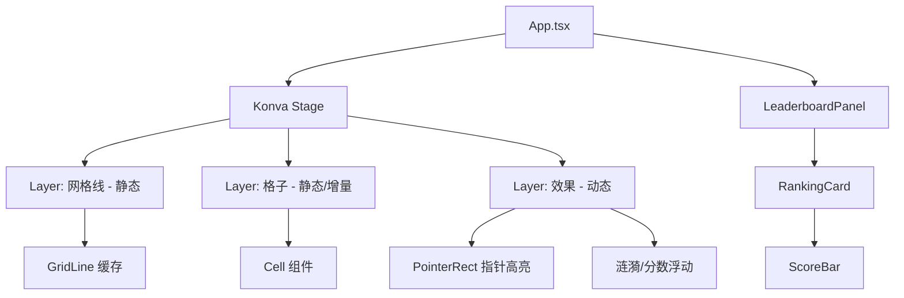
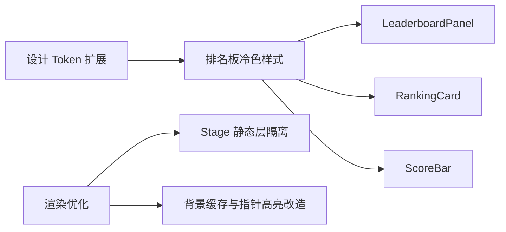
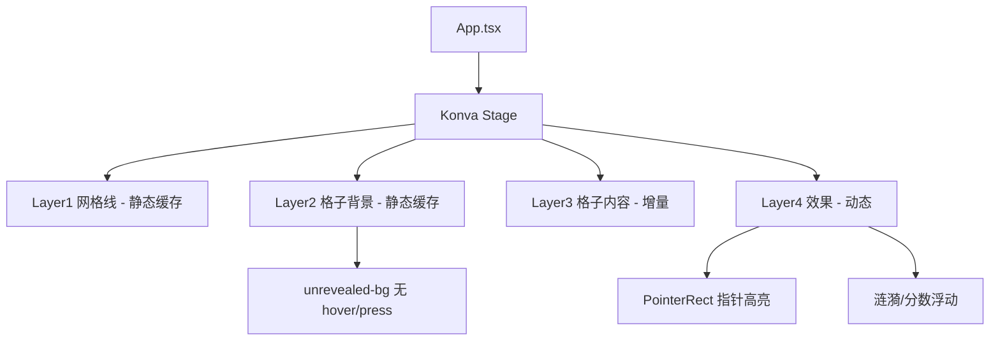
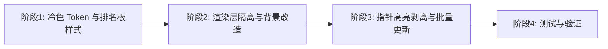

# 排名计分板风格统一与点击闪烁修复 - 技术提案

**功能名称**: 排名计分板风格统一与点击闪烁修复
**关联 PRD**: [04-排名计分板风格统一与点击闪烁修复](../../product/draft/04-排名计分板风格统一与点击闪烁修复.md)
**技术提案版本**: v1.0
**创建日期**: 2026-08-19
**作者**: Engineering Team
**feat-branch**: `feat/leaderboard-style-and-flicker-fix`

## 1. 概述

### 1.1 背景

棋盘与数字已升级为冷淡（cold/minimalist）冷色风格：未揭开格子冷灰蓝渐变（`#3a4556`→`#2d3748`）、边框 `#1e2a3a`、已揭开格子冷灰白 `#e8ecf0`、数字低饱和冷色调（`number-colors.ts`）、地雷冷灰蓝。但右侧排名计分板仍使用通用紫色主题（品牌紫 `#6366f1`、金银铜渐变徽标 `#ffd700` 等），与棋盘风格割裂。同时存在点击棋盘时整体画面闪烁的问题。

### 1.2 目标

- 将排名计分板（LeaderboardPanel / RankingCard / ScoreBar）视觉统一到棋盘冷淡冷色风格
- 定位并修复点击棋盘时的整屏闪烁，保证渲染稳定流畅
- 不改变计分、排序、折叠、当前玩家标识、排名变更动画等逻辑

### 1.3 范围

**做**: 排名计分板冷色设计 Token 与样式改造、闪烁根因定位与渲染优化（静态层隔离、缓存、指针高亮改造）
**不做**: 后端改动、计分/排序逻辑变更、WebSocket 契约变更、游戏核心逻辑变更

## 2. 技术架构

### 2.1 系统架构



### 2.2 技术栈

| 层级 | 技术选型 | 说明 |
|------|---------|------|
| 框架 | React 18 + Vite + TypeScript | 现有，不变 |
| 渲染 | react-konva / Konva | 现有，做层隔离与缓存优化 |
| 样式 | CSS Modules + CSS 变量 | 现有，新增冷色 Token |
| 动画 | Konva.Tween + CSS | 现有，配合减弱模式 |

### 2.3 模块划分



| 模块 | 职责 | 关键技术点 |
|------|------|-----------|
| 冷色设计 Token | 定义排名板冷色配色 | 复用棋盘色系，新增 leaderboard token |
| 排名板冷色样式 | LeaderboardPanel/RankingCard/ScoreBar 改造 | CSS Modules 替换紫色/金色系 |
| 渲染优化 | 定位并修复点击闪烁 | 静态层隔离、节点缓存、指针高亮独立 |

## 3. 样式设计 - 冷淡冷色风格

### 3.1 冷色 Token 扩展

复用棋盘已采用的冷色基调（`cell-styles.ts` / `number-colors.ts`），为排名板新增统一 Token：

```typescript
// styles/leaderboard-tokens.ts（新增）
export const LEADERBOARD_TOKENS = {
  panelBg: 'rgba(30, 41, 59, 0.95)',     // 与 --bg-card 一致，冷灰蓝
  border: '#334155',                     // 冷色边框
  rankBadge: {
    first:  ['#c9a86a', '#b8955f'],      // 冷金
    second: ['#cbd5e1', '#94a3b8'],      // 冷银
    third:  ['#b08062', '#9c6f50'],      // 冷铜
    default: '#3a4556',                  // 冷灰蓝
  },
  currentPlayer: '#5c7a99',              // 冷蓝，替代品牌紫
  numberColors,                          // 复用棋盘数字冷色
}
```

### 3.2 排名板改造映射

| 元素 | 现值 | 冷色目标值 | 位置 |
|------|------|-----------|------|
| 前三名徽标 | 金 `#ffd700` / 银 `#c0c0c0` / 铜 `#cd7f32` | 冷金/冷银/冷铜 | `RankingCard.module.css` |
| 当前玩家高亮 | 品牌紫 `#6366f1` | 冷蓝 `#5c7a99` | `RankingCard.module.css` |
| 排名序号底色 | `--bg-tertiary`（通用） | 冷灰蓝 `#3a4556` | `RankingCard.module.css` |
| 面板背景/边框/阴影 | `--bg-card` / `--border-primary` | 保持一致（已是冷灰蓝基色） | `LeaderboardPanel.module.css` |
| 分数条 | 通用主题色 | 冷蓝渐变 | `ScoreBar.module.css` |

## 4. 闪烁问题分析与修复方案

### 4.1 根因分析

点击棋盘格子时，整体画面闪烁的触发链路：

1. `handleClick`（`App.tsx`）触发 `setRipples` 新增涟漪 Ring，且可能触发 `socketService.reveal/chord`，经 `onCellRevealed` 更新 `revealedCells`。
2. `onScoreUpdate` 触发 `setScorePopups` 新增浮动分数 Text。
3. 以上任一 React state 变化都会让 `<Stage>` 整体重渲染（`App.tsx` 中三层 Layer 全部重建）。
4. 其中 `unrevealed-bg` 单元格（`Cell.tsx`）是一个覆盖**整个棋盘**的巨大 Rect（`COLS*CELL_SIZE = 48000` × `ROWS*CELL_SIZE = 25600`），且带 hover/press 内部状态（`setIsHovered` / `setIsPressed`）。`onMouseDown/onMouseUp` 会切换其填充与 `shadowBlur`，导致该超大节点在点击瞬间被重绘。
5. Konva 对包含巨大阴影（`shadowBlur`）的节点重绘时需重新渲染整幅画布，产生可见的整屏闪烁/闪白。

**结论**: 闪烁主要来自「整个 Stage 随 React state 整体重渲染 + 覆盖全盘的背景 Rect 在 hover/press 时带阴影重绘」。优化方向是**隔离静态层、缓存静态节点、将指针高亮从全盘背景中剥离**。

### 4.2 修复措施

#### 措施 1: 静态层与动态层隔离（`App.tsx`）

- 网格线层（`gridLines`）与背景层（`unrevealed-bg`）改为**静态、只构建一次**，通过 `useMemo`（空依赖）稳定引用，避免随点击 state 变化重建。
- 涟漪、分数浮动、指针高亮统一放到独立的动态效果层（`listening={false}`），该层独立重绘，不波及静态层。
- 静态节点统一 `.cache()`（已有），并在 state 变化时通过 `Layer.batchDraw()` 批量重绘而非逐节点同步重绘。

#### 措施 2: 指针高亮从全盘背景剥离（`Cell.tsx` / `App.tsx`）

- `unrevealed-bg` 不再绑定 hover/press 状态（去掉其 `setIsHovered`/`setIsPressed` 交互），改为纯静态背景，消除点击瞬间的全盘带阴影重绘。
- 指针高亮交给独立的 `PointerRect`（已有）在动态效果层渲染，避免大节点状态切换。
- 若仍需格子级悬停反馈，仅对当前指针所在单个单元格绘制高亮，而非整张背景。

#### 措施 3: 批量 state 更新与轻量反馈

- `handleClick` 中对涟漪的创建采用批量/合并更新（React 18 自动批处理），避免同一事件产生多次全量渲染。
- 涟漪、分数浮动等反馈保持轻量，放入独立动态层，不影响静态棋盘。

### 4.3 修复后的渲染结构



## 5. 技术实现方案

### 5.1 实现顺序



### 5.2 关键实现点

#### 实现点 1: 冷色 Token 与排名板样式

- 新增 `apps/game-web/src/styles/leaderboard-tokens.ts`
- 更新 `LeaderboardPanel.module.css`、`RankingCard.module.css`、`ScoreBar.module.css`，将金色/紫色系替换为冷色 Token
- 前三名徽标使用冷金/冷银/冷铜渐变，当前玩家高亮使用冷蓝

#### 实现点 2: 静态层与动态层隔离

- `App.tsx` 中 `gridLines` 与 `unrevealedCellNodes` 使用空依赖 `useMemo`，稳定引用
- 涟漪、分数浮动、指针高亮统一移入动态效果层

#### 实现点 3: 背景 hover/press 剥离

- `Cell.tsx` 的 `unrevealed-bg` 移除内部 hover/press state，改为静态缓存 Rect
- 指针高亮交由独立 `PointerRect` 呈现

#### 实现点 4: 批量更新与轻量反馈

- `handleClick` 与 socket 处理中合并 state 更新
- 涟漪/分数浮动保持轻量，仅作用于动态层

### 5.3 项目结构变更

```
apps/game-web/src/
├── styles/
│   ├── leaderboard-tokens.ts        # 新增：排名板冷色 Token
│   ├── cell-styles.ts               # 现有，不变
│   └── number-colors.ts             # 现有，复用
├── components/
│   ├── LeaderboardPanel.module.css  # 修改：冷色样式
│   ├── RankingCard.module.css       # 修改：冷色样式
│   ├── ScoreBar.module.css          # 修改：冷色样式
│   ├── Cell.tsx                     # 修改：unrevealed-bg 静态化
│   └── ...
└── App.tsx                          # 修改：层隔离与批量更新
```

## 6. 技术决策

### 6.1 决策列表

| 决策 | 选项 A | 选项 B | 最终选择 | 原因 |
|------|--------|--------|---------|------|
| 闪烁修复方向 | 全盘静态层隔离+背景静态化 | 仅降低阴影 | 层隔离+背景静态化 | 从根本上避免点击时全盘带阴影重绘 |
| 指针高亮实现 | 全盘背景 hover/press | 独立 PointerRect | 独立 PointerRect | 避免超大节点状态切换重绘 |
| 冷色 Token 来源 | 新建独立 Token | 复用全局 CSS 变量 | 新建独立 Token | 与棋盘色系统一且可控 |
| 徽标配色 | 保留金银铜 | 冷金/冷银/冷铜 | 冷金/冷银/冷铜 | 保留排位语义同时匹配冷色 |

### 6.2 依赖与约束

| 类型 | 内容 | 说明 |
|------|------|------|
| 依赖 | 棋盘冷淡冷色风格 | 复用 cell-styles / number-colors |
| 依赖 | 现有排名计分逻辑 | 不改变排序/计分/折叠 |
| 约束 | 后端零改动 | 纯前端样式与渲染优化 |
| 约束 | 无新增重型依赖 | 仅 Konva/CSS 现有能力 |

## 7. 测试策略

### 7.1 测试覆盖要求

- 组件测试覆盖率 >= 70%（`LeaderboardPanel.test.tsx` 已有，扩展冷色样式用例）
- 渲染闪烁为视觉/性能问题，增加针对性验证

### 7.2 测试类型

| 类型 | 工具 | 覆盖范围 |
|------|------|---------|
| 组件测试 | Vitest + Testing Library | LeaderboardPanel / RankingCard 渲染、折叠、当前玩家高亮 |
| 视觉验证 | 手动 + Playwright 截图 | 排名板冷色风格、与棋盘协调度 |
| 交互/性能验证 | 手动 + Playwright | 点击棋盘无闪烁、连续快速点击稳定 |
| E2E | Playwright | 完整流程：登录、点击、看排名板 |

## 8. 验收标准

- [ ] 技术方案评审通过
- [ ] 排名板冷色风格与棋盘一致（评审 4/5+）
- [ ] 前三名冷色徽标、当前玩家冷蓝高亮实现
- [ ] 点击棋盘不再出现整屏闪烁
- [ ] 快速连续点击无闪烁/无残影
- [ ] 组件测试覆盖率 >= 70%
- [ ] 视觉与交互验证通过
- [ ] 计分/排序/折叠逻辑与行为不变

## 9. 相关文档

- [PRD: 排名计分板风格统一与点击闪烁修复](../../product/draft/04-排名计分板风格统一与点击闪烁修复.md)
- [棋盘与数字优化技术提案](./20260818-board-number-redesign-proposal.md)
- [棋盘与数字优化 PRD](../product/draft/03-棋盘与数字优化.md)
- [联机计分 Board PRD](../../docs/product/reviewed/联机计分Board.md)
- [前端工程规范](../engineering/frontend-rules.md)
