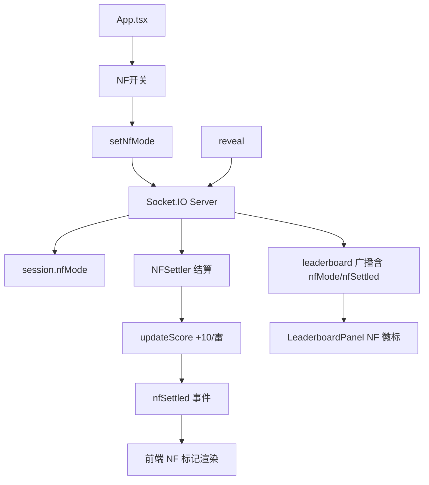
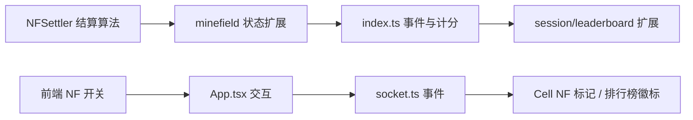

# NF 模式与 NF 结算计分 - 技术提案

**功能名称**: NF 模式与 NF 结算计分
**关联 PRD**: [05-NF模式与NF结算计分](../../product/draft/05-NF模式与NF结算计分.md)
**技术提案版本**: v1.0
**创建日期**: 2026-08-22
**作者**: Engineering Team
**feat-branch**: `feat/nf-mode-scoring`

## 1. 概述

### 1.1 背景

当前联机扫雷（`servers/game-api` + `apps/game-web`）采用经典玩法：`reveal`/`chord` 翻开格子，`flag` 标记地雷。计分规则：标记对雷 +10、标记错（非雷）-20、踩雷 -100、翻开数字不加分。该玩法依赖 flag，缺少对纯推理的奖励。

需求引入 **NF 模式（No Flag）**：用户开启后不再支持 flag，积分榜标记其为 NF 模式；计分改为「翻开数字时自动结算周围连续且 8 面无未翻开格子的雷，按雷数量计分并打特殊 NF 标记」。

### 1.2 目标

- 后端新增 NF 结算算法与计分、NF 模式状态与排行榜标识
- 前端新增 NF 开关、NF 模式下禁用 flag、NF 结算标记渲染与排行榜 NF 徽标
- 经典模式（flag）计分与行为保持不变

### 1.3 范围

**做**: NF 模式开关、NF 结算算法、NF 计分、排行榜 NF 标识、NF 结算的棋盘渲染标记
**不做**: 经典模式 flag 逻辑变更、共享棋盘生成规则变更、新的重型依赖、后端其他玩法改造

## 2. 技术架构

### 2.1 系统架构



### 2.2 技术栈

| 层级 | 技术选型 | 说明 |
|------|---------|------|
| 后端 | Node.js + Express + Socket.IO + MongoDB | 现有，`game-api` |
| 前端 | React 18 + Vite + TypeScript + react-konva | 现有，`game-web` |
| 结算算法 | TypeScript 纯函数 + 单元测试 | 新增 `NFSettler`，TDD |

### 2.3 模块划分



| 模块 | 职责 | 关键技术点 |
|------|------|-----------|
| NFSettler | 计算可结算雷簇 | BFS 连续雷簇 + 8 面全翻开判定 |
| minefield 扩展 | 记录已结算雷 | 新增 `settled: Set<number>` |
| index.ts | NF 事件与计分 | `setNfMode`、`reveal` 后结算 |
| session/leaderboard | NF 状态与标识 | Ranking 新增 `nfMode`/`nfSettled` |
| 前端交互 | NF 开关 + 禁用 flag | 切换即禁用 flag 事件 |
| 前端渲染 | NF 结算标记 + 徽标 | Cell NF 样式、排行榜徽标 |

## 3. NF 结算算法设计

### 3.1 判定规则

翻开数字格子 `(col,row)` 后，对周围 8 邻域执行结算：

1. 收集 8 邻域中「未结算的雷」（`isMine && !settled`）作为种子。
2. 对每个种子雷，用 **8 连通** BFS 收集其连续雷簇 `cluster`。
3. 簇可结算判定：对簇中**每一个雷**，其 8 邻域中所有**非雷格子**都必须是「已翻开」（`revealed`）。若存在任一未翻开的非雷邻格，则该簇**不可结算**，跳过。
4. 可结算则：将该簇所有雷标记为 `settled`，计分 `cluster.size × NF_PER_MINE_SCORE`，累计 NF 结算雷数。

> 边缘处理：棋盘越界视为无格子，不阻塞结算（等价于已翻开）。

### 3.2 伪代码

```typescript
// servers/game-api/src/nfSettler.ts
const NF_PER_MINE_SCORE = 10;

export function findSettleableCluster(
  board: BoardCells, revealed: Set<number>, settled: Set<number>,
  seedCol: number, seedRow: number
): Array<{ col: number; row: number }> | null {
  const cluster = collectMineCluster(board, seedCol, seedRow); // 8连通雷簇
  for (const mine of cluster) {
    for (const n of neighbors8(mine)) {
      if (outOfBounds(n)) continue;      // 边缘视为已翻开
      if (board[n].isMine) continue;     // 雷本身不阻塞
      if (!revealed.has(key(n))) return null; // 存在未翻开非雷邻格 => 不可结算
    }
  }
  return cluster;
}
```

### 3.3 计分与标记

- 计分: 每结算一个雷 `+NF_PER_MINE_SCORE`（+10），与经典模式「标记对雷 +10」保持一致语义。
- NF 标记: 已结算雷写入 `settled`，前端以特殊样式渲染；同时累计 `nfSettled` 供排行榜/展示使用。
- 防重复: `settled` 集合保证同一雷只结算一次；重复翻开不重复计分。

## 4. 后端实现方案

### 4.1 minefield 状态扩展（`minefield.ts`）

```typescript
export class Minefield {
  private settled: Set<number> = new Set();
  isSettled(col: number, row: number): boolean { ... }
  markSettled(col: number, row: number): void { ... }
  // 暴露棋盘/翻开/雷信息供 NFSettler 使用
}
```

### 4.2 session / leaderboard 扩展（`session.ts`）

```typescript
export interface Session {
  username; displayName; socketId; score; createdAt;
  nfMode: boolean;
  nfSettled: number;
}
export interface Ranking {
  username; displayName; score; isCurrentPlayer;
  nfMode: boolean;
  nfSettled: number;
}
```

### 4.3 index.ts 事件与计分

新增 socket 事件与处理：

| 事件 | 方向 | 载荷 | 行为 |
|------|------|------|------|
| `setNfMode` | client→server | `{ enabled: boolean }` | 更新 `session.nfMode`，广播 leaderboard |
| `nfSettled` | server→client | `{ col, row, mines, delta }` | 结算后通知前端渲染标记 |
| `reveal` | 已存在 | `{ col, row }` | NF 模式下翻开数字后执行结算 |

`reveal` 处理（NF 模式分支）：

```typescript
socket.on('reveal', async (data) => {
  // ... 原有 reveal 逻辑 ...
  if (session.nfMode) {
    const cluster = settleAround(session, col, row); // 对 8 邻域结算
    if (cluster && cluster.length > 0) {
      const delta = cluster.length * NF_PER_MINE_SCORE;
      session.nfSettled += cluster.length;
      const updated = await updateScore(socket.id, delta);
      socket.emit('nfSettled', { col, row, mines: cluster, delta });
      broadcastLeaderboard();
    }
  }
});
```

`flag` 处理：当 `session.nfMode` 为 true 时直接忽略（返回空/禁用），且前端隐藏入口。

`chord` 处理：NF 模式下 chord 本身依赖 flag 计数，需在 NF 模式下禁用或按新规则调整（默认禁用，见 6.2 决策）。

### 4.4 init 载荷扩展

`init` 事件的 `user` 与 `revealed` 追加：`nfMode`、`nfSettled`、已结算雷列表（`settled`），供前端首屏还原。

## 5. 前端实现方案

### 5.1 socket.ts 事件扩展

- 新增类型：`Ranking.nfMode`、`Ranking.nfSettled`、`NfSettledEvent`、`InitEvent` 扩展。
- 新增方法：`setNfMode(enabled: boolean)`、`onNfSettled(cb)`。

### 5.2 App.tsx 交互

- 新增 `nfMode` 状态与 NF 开关 UI（如 `NfModeToggle`）。
- 开启后隐藏/禁用 flag 按钮，`handleClick` 不再触发 `flag`，仅 `reveal`/`chord`。
- `onNfSettled` 将结算的雷写入 `settledCells` 渲染 NF 标记。
- 将 `nfMode` 传入 `LeaderboardPanel`。

### 5.3 Cell.tsx NF 标记

- 新增 `type='nf'`（或 `nfSettled` 属性）渲染已结算雷的特殊样式（区别于普通 flag 样式）。

### 5.4 LeaderboardPanel / RankingCard NF 徽标

- `RankingCard` 在 `ranking.nfMode` 为 true 时展示「NF」徽标。

### 5.5 项目结构变更

```
servers/game-api/src/
├── nfSettler.ts            # 新增：NF 结算算法（纯函数，可单测）
├── minefield.ts            # 修改：settled 状态
├── session.ts              # 修改：nfMode/nfSettled
├── index.ts                # 修改：setNfMode/nfSettled 事件
└── __tests__/nfSettler.test.ts  # 新增

apps/game-web/src/
├── services/socket.ts      # 修改：事件与类型
├── App.tsx                 # 修改：NF 开关 + 结算标记 + 禁用 flag
├── components/NfModeToggle.tsx    # 新增
├── components/Cell.tsx     # 修改：NF 标记渲染
├── components/RankingCard.tsx     # 修改：NF 徽标
└── components/LeaderboardPanel.tsx# 修改：透传 nfMode
```

## 6. 技术决策

### 6.1 决策列表

| 决策 | 选项 A | 选项 B | 最终选择 | 原因 |
|------|--------|--------|---------|------|
| NF 结算计算位置 | 后端权威结算 | 前端结算后上报 | 后端权威结算 | 计分与标记以服务端为准，防作弊、单点一致 |
| 每雷分值 | +10（对齐 flag 对雷） | 自定义 | +10 | 语义一致、参数化便于后续调整 |
| 结算触发时机 | 每次翻开后结算 8 邻域 | 全盘扫描 | 翻开数字后结算 8 邻域 | 符合需求「翻开数字时结算周围区域」，复杂度低 |
| chord 在 NF 模式 | 禁用 | 保留 | 禁用 | chord 依赖 flag 计数，NF 无 flag 语义 |

### 6.2 依赖与约束

| 类型 | 内容 | 说明 |
|------|------|------|
| 依赖 | 现有 reveal/chord/flag 事件流 | 复用并扩展 |
| 依赖 | 现有排行榜广播 | 扩展 Ranking 字段 |
| 约束 | 经典模式不变 | flag 玩法与计分原样保留 |
| 约束 | 共享棋盘不变 | NF 只影响开启者自身计分 |
| 约束 | 事件向后兼容 | 新增字段/事件不破坏旧客户端 |

## 7. 测试策略

### 7.1 测试覆盖要求

- 后端 `NFSettler` 纯函数覆盖率 >= 90%
- 后端 `minefield.ts`、`session.ts`、`index.ts` 事件处理覆盖提升
- 前端组件覆盖率 >= 70%

### 7.2 测试类型

| 类型 | 工具 | 覆盖范围 |
|------|------|---------|
| 单元测试 | Vitest | NFSettler 结算判定、边界/边缘、防重复 |
| 后端事件测试 | Vitest + Socket.IO | setNfMode、NF 下 reveal 结算与计分、flag 禁用 |
| 前端组件测试 | Vitest + Testing Library | NF 开关、禁用 flag、NF 徽标 |
| E2E | Playwright | 开启 NF → 翻开数字 → 结算 → 看排行榜 NF 标识 |

### 7.3 NFSettler 关键用例

- 单雷 8 面全翻开 → 可结算（size=1）
- 两个相邻雷、簇周围全翻开 → 可结算（size=2）
- 某雷 8 面存在未翻开非雷格 → 不可结算
- 簇边缘触及棋盘边界 → 视为已翻开，可结算
- 已结算雷再次触发 → 不重复计分
- NF 模式 flag 事件被忽略

## 8. 验收标准

- [ ] 技术方案评审通过
- [ ] NF 开关可开启/关闭，开启后 flag 入口禁用
- [ ] 积分榜对 NF 用户显示「NF 模式」标识
- [ ] 翻开数字时，连续且 8 面无未翻开格子的雷被结算，按雷数 +10/雷计分
- [ ] 某雷 8 面仍有未翻开格子时不计分
- [ ] 已结算雷不重复计分，并带 NF 标记
- [ ] 经典模式 flag 玩法与计分保持不变
- [ ] 后端 NFSettler 覆盖率 >= 90%，前端组件覆盖率 >= 70%

## 9. 相关文档

- [PRD: NF模式与NF结算计分](../../product/draft/05-NF模式与NF结算计分.md)
- [联机计分 Board PRD](../reviewed/联机计分Board.md)
- [后端工程规范](../engineering/backend-rules.md)
- [前端工程规范](../engineering/frontend-rules.md)