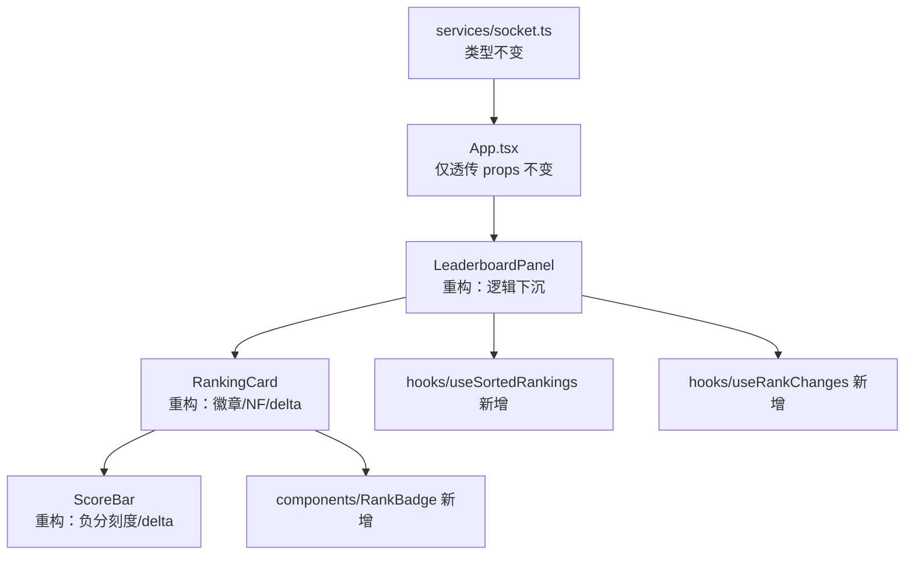
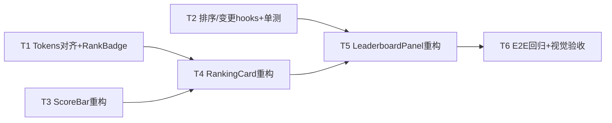

# 计分板重构与重新设计 - 技术方案

**功能名称**: 计分板（Leaderboard）重构与重新设计
**上游需求**: 需要重构计分板 / 重新设计计分板
**技术方案版本**: v1.0
**创建日期**: 2026-08-24
**作者**: Engineering Team
**feat-branch**: `feat/scoreboard-redesign`

## 1. 概述

### 1.1 背景

当前计分板由 `LeaderboardPanel` → `RankingCard` → `ScoreBar` 三层组件组成，随 NF 模式、冷色风格改造等多轮迭代后存在以下问题：

| 问题 | 现状证据 | 影响 |
|------|---------|------|
| 逻辑与视图耦合 | `LeaderboardPanel.tsx` 内嵌排序 + 排名变更检测（Map + setTimeout）+ 渲染，`detectRankChanges` 依赖每次渲染重建的 `sortedRankings`，useEffect 每轮渲染都会执行 | 难以测试、多余重渲染 |
| 排序逻辑重复且不稳定 | 后端已按「分数降序 + createdAt 升序」排序广播，前端又按纯分数重排（`[...rankings].sort((a,b) => b.score - a.score)`），丢失 tie-break 语义且未 memo | 同分排名抖动 |
| 视觉细节不统一 | 前三名使用 emoji 🥇🥈🥉（跨平台渲染不一致）；NF 徽标为暖红渐变（`#ff6b6b`），与冷色棋盘风格冲突；颜色硬编码散落在各 CSS Module | 品质感下降 |
| Token 死代码 | `styles/leaderboard-tokens.ts` 定义后无任何引用 | 维护误导 |
| 分数可视化语义缺陷 | ScoreBar 以「第一名分数」为满刻度归一化：榜首恒为 100%，负分一律贴 0；`delta` prop 已定义但 RankingCard 从未传入 | 信息表达失真 |

### 1.2 目标

- 重构计分板组件结构：排序/变更检测等逻辑下沉为可独立测试的 hooks，视图组件保持纯粹展示
- 重新设计计分板视觉：统一冷色 Token、去除 emoji 徽章、修正 NF 徽标配色、改进分数条语义（支持负分与 delta 展示）
- 保持数据契约不变：`leaderboard` WebSocket 事件、`Ranking` 类型零改动

### 1.3 范围

**做**: LeaderboardPanel/RankingCard/ScoreBar 组件重构、新增 hooks 与 RankBadge、CSS Token 化、单测迁移与补充
**不做**: 后端任何改动、WebSocket 契约变更、计分规则变更、折叠/展开交互行为变更、新 UI 库引入

## 2. 功能影响分析



| 影响面 | 说明 |
|--------|------|
| 受影响文件 | `apps/game-web/src/components/{LeaderboardPanel,RankingCard,ScoreBar}.tsx` 及对应 `.module.css` |
| 新增文件 | `src/hooks/useSortedRankings.ts`、`src/hooks/useRankChanges.ts`、`src/components/RankBadge.tsx`（含 `.module.css`）、对应测试 |
| 不受影响 | App.tsx 数据流与 props、socket service、Konva 棋盘渲染、登录页、UserInfoCard、NfModeToggle |
| 行为兼容性 | 折叠/展开、当前玩家高亮、排名变更动画、空态文案等既有交互全部保留 |
| 回归风险 | 低——纯前端展示层改动，E2E `multiplayer-leaderboard.spec.ts` 兜底 |

## 3. 变更点

### 3.1 后端变更点

**零改动。** `leaderboard` 事件继续按现有契约（分数降序、createdAt 升序 tie-break）全量广播。

### 3.2 前端变更点

#### 3.2.1 新增 `hooks/useSortedRankings.ts`

- 输入 `rankings: Ranking[]`，输出 memo 化的稳定排序列表
- 直接信任服务端顺序（契约已保证），仅在本地兜底排序时补齐 `(b.score - a.score) || (aCreatedAt - bCreatedAt)` 语义，消除同分抖动
- 返回值用 `useMemo` 以序列化后的签名为依赖，避免每轮渲染重建数组导致下游 useEffect 失控

#### 3.2.2 新增 `hooks/useRankChanges.ts`

- 输入排序列表，输出 `Record<username, boolean>` 的变更高亮标记
- 用 `useRef` 保存上一轮名次快照，`setTimeout(300ms)` 自动清除，unmount 时统一清理（沿用现有行为）
- 将现 `LeaderboardPanel` 内 ~40 行副作用逻辑变为纯 hook，可单独单测

#### 3.2.3 新增 `components/RankBadge.tsx`

- 替代 emoji 奖牌：前三名渲染冷色调渐变圆形徽章（冷金 `#c9a86a→#b8955f` / 冷银 `#cbd5e1→#94a3b8` / 冷铜 `#b08062→#9c6f50`），第 4 名起显示普通名次数字
- 复用并激活 `leaderboard-tokens.ts` 中已定义的 `rankBadge` token（消除死代码）

#### 3.2.4 重构 `ScoreBar`

- 归一化策略改为 **min-max 相对刻度**：`(score - minScore) / (maxScore - minScore)`，单人或极差为 0 时退化为中性条，修复「榜首恒满格、负分恒贴底」的失真
- 零分位置在负分区间的进度条上以细刻度线标注，直观区分正负分
- 接通 `delta` prop：RankingCard 传入该玩家相对上一次 leaderboard 快照的分数变化，复用现有正/负 delta 样式与 pulse 动画
- CSS 颜色全部替换为 `var(--*)` 变量或从 tokens 映射，删除硬编码十六进制

#### 3.2.5 重构 `RankingCard`

- emoji 奖牌移除，改用 `RankBadge`
- NF 徽标改冷色系强调（如 `#7ba3c9` 描边样式），不再使用暖红渐变
- 通过 `usePrevious` 思路计算并向 ScoreBar 传递 `delta`

#### 3.2.6 重构 `LeaderboardPanel`

- 移除内联排序与变更检测，接入两个 hooks；列表项用 `React.memo(RankingCard)` 减少无关重渲染
- 结构/类名/折叠行为对外保持不变

## 4. 数据模型变更

**无。** 前端消费的 `Ranking`/`LeaderboardEvent` 类型与后端 MongoDB schema 均不变。仅在组件内部引入视图模型：

```typescript
interface RankingViewModel extends Ranking {
  rank: number;
  rankChanged: boolean;
  scoreDelta?: number;
}
```

## 5. 测试策略

| 层级 | 工具 | 覆盖内容 |
|------|------|---------|
| Hook 单测 | Vitest + `renderHook` | useSortedRankings 稳定性与 tie-break 兜底；useRankChanges 变更触发、300ms 自动清除、卸载清理定时器 |
| 组件单测 | Vitest + Testing Library | 迁移现有 `LeaderboardPanel.test.tsx`/`RankingCard.test.tsx`/`ScoreBar.test.tsx` 并扩展：RankBadge 三名样式、ScoreBar min-max 刻度与零分线、负分/maxScore=0 边界、NF 冷色徽标、delta 正负展示、memo 行为 |
| 覆盖率门槛 | vitest --coverage | 前端 ≥70%（common-rules.md 要求） |
| E2E 回归 | Playwright `multiplayer-leaderboard.spec.ts` | 双人连接分数变化、排名互换动画、当前玩家高亮、折叠展开 |
| 手工验收 | dev server | 冷色视觉一致性走查（对照棋盘风格）、prefers-reduced-motion |

## 6. 实现计划

### 6.1 任务分解与依赖关系



| # | 任务 | 内容 | 依赖 | 预估 |
|---|------|------|------|------|
| T1 | 设计基座 | 对齐 `leaderboard-tokens.ts` 与 CSS 变量，删除死代码引用问题；新建 RankBadge 组件 + 单测 | — | 0.5d |
| T2 | 逻辑下沉 | `useSortedRankings`、`useRankChanges` hooks + 单测 | — | 0.5d |
| T3 | ScoreBar 重构 | min-max 刻度、零分线、delta 接入 + 单测更新 | T1 | 1d |
| T4 | RankingCard 重构 | RankBadge/NF 徽标/delta 传递 + 单测更新 | T1, T3 | 0.5d |
| T5 | LeaderboardPanel 重构 | 接入 hooks、memo 化列表 + 单测迁移 | T2, T4 | 0.5d |
| T6 | 回归验证 | 全量单测、覆盖率检查、E2E 回归、视觉走查 | T5 | 0.5d |

### 6.2 预计工作量

合计约 **3.5 人日**（TDD 流程，测试工作量已含在各任务内）。

里程碑：T1–T2 可并行先行（1 天）→ T3–T5 串行推进（2 天）→ T6 收尾（0.5 天）。

## 7. 相关文档

- [WebSocket 契约](../../../contracts/websocket.md)（本次零改动）
- [前端工程规范](../../engineering/frontend-rules.md)
- [通用工程规范](../../engineering/common-rules.md)
- [排名计分板风格统一 PRD](../draft/04-排名计分板风格统一与点击闪烁修复.md)（前序迭代背景）
