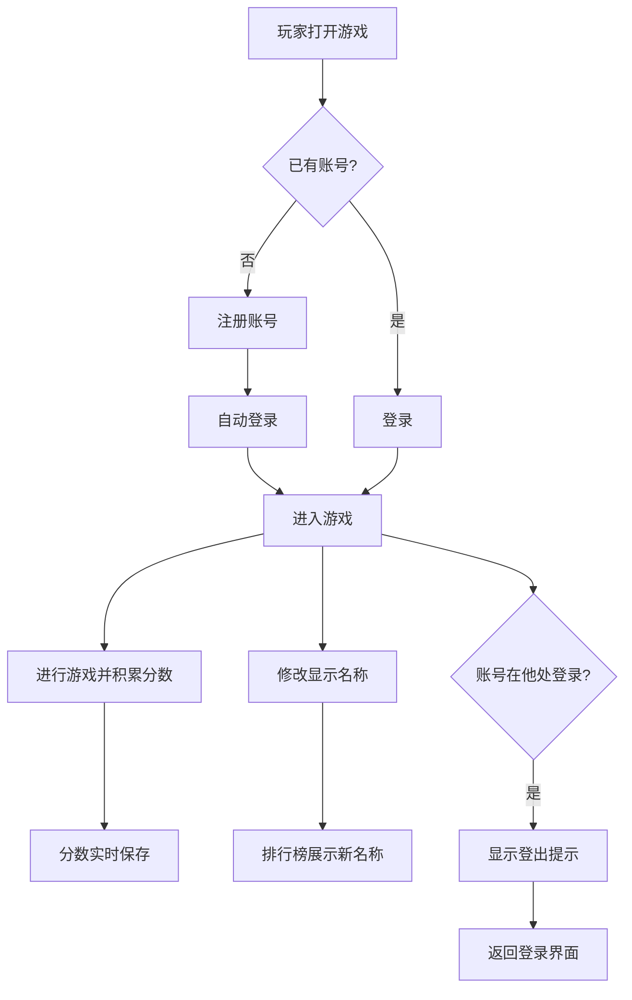
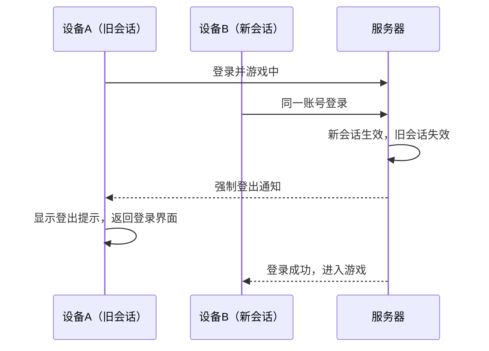

# 用户登录与账号体系

**功能名称**: 用户登录与账号体系
**PRD 版本**: v1.0
**创建日期**: 2026-08-10
**作者**: Product Team

## 背景与目标

### 1.1 背景

当前联机计分Board使用临时Session标识玩家，分数仅存在于服务器内存中：服务器重启后所有分数清零，玩家刷新页面后虽然能恢复Session，但无法跨设备、跨浏览器延续自己的身份与分数。玩家也没有稳定的身份标识，排行榜上展示的是难以辨认的SessionID片段。为建立长期的玩家身份体系、保留玩家的游戏成果，需要引入用户注册与登录功能，并将分数持久化。

### 1.2 目标

- 玩家可以注册账号并登录，获得稳定的身份标识
- 玩家的分数与账号绑定并持久保存，不再因服务器重启而丢失
- 玩家可以修改自己的显示名称，排行榜展示改名后的名称
- 同一账号同一时间只允许一个在线会话，防止多端分数混乱

### 1.3 成功标准

- 功能上线后7日内，注册用户数达到活跃玩家的50%
- 已登录玩家的7日留存率较匿名玩家提升20%
- 服务器重启后已登录玩家分数恢复成功率100%
- 单账号互踢场景下，被踢会话100%收到登出提示并返回登录界面

## 用户分析

### 2.1 目标用户

- 18-30岁的年轻游戏玩家
- 希望长期积累分数、在排行榜上建立名声的竞技型玩家
- 在多台设备（公司/家里/手机）上游玩的中重度玩家

### 2.2 用户场景

| 场景 | 用户角色 | 目标 | 痛点 |
|------|---------|------|------|
| 新玩家首次进入 | 新手玩家 | 快速注册账号开始游戏 | 分数无法保存，没有动力持续玩 |
| 老玩家回归 | 竞技型玩家 | 登录后看到自己历史分数和排名 | 服务器重启后分数清零 |
| 更换设备游玩 | 中重度玩家 | 在新设备上登录继续游戏 | 换设备后身份和分数丢失 |
| 账号被他人登录 | 账号持有者 | 及时了解账号在其他地方被登录 | 不知道自己的会话已被顶替 |

## 功能需求

### 3.1 功能概述

为游戏引入用户账号体系：玩家注册账号并登录后进入游戏，分数与账号绑定并持久保存；玩家可随时修改显示名称；同一账号仅允许一个在线会话，新会话登录时会将旧会话踢出并提示。

### 3.2 功能列表

#### 功能点 1: 用户注册
- **描述**: 玩家通过用户名和密码注册新账号，用户名唯一，注册成功后自动登录进入游戏
- **用户价值**: 获得稳定身份，分数可以长期积累
- **验收标准**:
  - [ ] 用户名唯一，重复注册时给出明确提示
  - [ ] 注册成功后自动登录并进入游戏
  - [ ] 用户名与密码有基本格式校验（如长度限制），不合法时给出提示

#### 功能点 2: 用户登录
- **描述**: 已注册玩家通过用户名和密码登录，登录后进入游戏并恢复其历史分数
- **用户价值**: 跨设备、跨浏览器延续游戏成果
- **验收标准**:
  - [ ] 用户名或密码错误时给出明确提示
  - [ ] 登录成功后展示该账号的历史分数
  - [ ] 登录状态在页面刷新后保持，无需重新登录

#### 功能点 3: 分数持久化
- **描述**: 已登录玩家的分数变更实时保存，服务器重启后分数不丢失
- **用户价值**: 游戏成果长期有效，排行榜竞争有持续性
- **验收标准**:
  - [ ] 每次分数变更后分数被持久保存
  - [ ] 服务器重启后，玩家重新登录可看到重启前的分数
  - [ ] 排行榜展示已登录玩家的持久化分数

#### 功能点 4: 修改显示名称
- **描述**: 已登录玩家可以修改自己的显示名称，排行榜实时展示新名称
- **用户价值**: 玩家可以塑造自己在排行榜上的形象
- **验收标准**:
  - [ ] 改名后排行榜实时更新为新名称
  - [ ] 显示名称在重新登录后保持
  - [ ] 名称有长度限制（不超过20个字符）

#### 功能点 5: 单会话互踢
- **描述**: 同一账号仅允许一个在线会话；当账号在新位置登录时，旧会话被强制登出：旧会话界面显示登出提示，并自动返回登录界面
- **用户价值**: 防止同一账号多端同时操作导致分数混乱，同时让被踢用户知晓原因
- **验收标准**:
  - [ ] 新会话登录成功后，旧会话立即失效
  - [ ] 旧会话界面弹出"账号已在其他位置登录"的登出提示
  - [ ] 旧会话自动返回登录界面
  - [ ] 旧会话失效后无法再产生分数变更

### 3.3 用户操作流程

单会话互踢流程：

### 3.4 页面/界面描述

| 页面 | 描述 | 关键元素 |
|------|------|---------|
| 登录界面 | 玩家进入游戏前首先看到的界面 | 用户名输入框、密码输入框、登录按钮、注册入口、错误提示 |
| 注册界面 | 新玩家创建账号 | 用户名输入框、密码输入框、确认密码输入框、注册按钮、返回登录入口 |
| 游戏主界面 | 登录后进入的扫雷游戏界面 | 游戏网格、右上角排行榜、当前玩家信息（显示名称、分数）、改名入口 |
| 登出提示 | 旧会话被踢出时展示 | "账号已在其他位置登录"提示文案、确认后返回登录界面 |

### 3.5 异常与边界情况

| 情况 | 预期行为 |
|------|---------|
| 注册时用户名已存在 | 提示"用户名已被占用"，注册失败 |
| 登录密码错误 | 提示"用户名或密码错误"，不明确指出哪一项错误 |
| 网络断开导致会话中断 | 网络恢复后如登录状态仍有效则自动重连恢复游戏 |
| 同一账号快速在两端交替登录 | 始终以最新登录的会话为准，旧会话依次被踢出 |
| 改名时名称为空或超长 | 拒绝修改并给出提示，保留原名称 |
| 未登录状态直接访问游戏 | 自动跳转到登录界面 |
| 服务器重启 | 已保存的账号与分数不丢失，玩家重新登录后恢复 |

## 四、非功能需求

### 4.1 性能要求

- 登录/注册请求响应时间 < 2秒
- 分数保存不影响游戏操作的实时性
- 排行榜更新延迟保持 < 1秒

### 4.2 安全性要求

- 密码不得以明文形式存储或传输
- 登录凭证不可被猜测，应具备足够随机性
- 错误提示不得泄露用户名是否已注册（登录场景）

### 4.3 兼容性要求

- 适配当前游戏Web端所有分辨率
- 登录状态在主流浏览器（Chrome/Firefox/Safari/Edge）下保持一致行为

## 五、依赖与约束

### 5.1 依赖

- 已有联机计分Board功能（分数计算、排行榜展示）
- 游戏Web端与服务器之间的实时通信通道

### 5.2 约束

- 本期仅支持用户名+密码注册登录，不支持第三方账号（如微信、Google）登录
- 本期不支持找回密码、邮箱验证
- 排行榜仅展示已登录账号的持久化分数与显示名称

## 六、相关文档

- [[../reviewed/联机计分Board]] - 联机计分Board PRD
- [用户登录技术提案](../../engineering/proposals/20260810-user-login-proposal.md)
