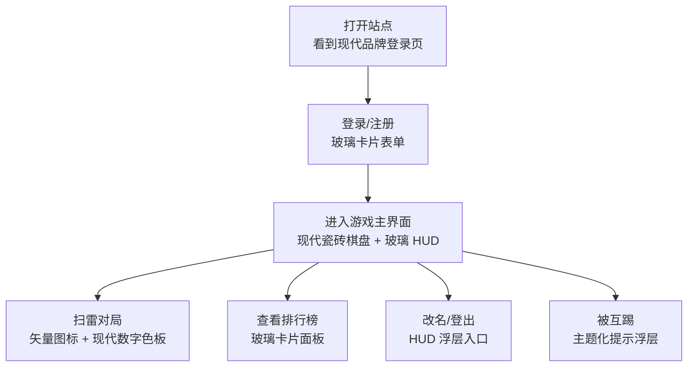

# 界面优化：扫雷主题网站整体重设计

**功能名称**: 界面优化（扫雷主题重设计）
**PRD 版本**: v1.1
**创建日期**: 2026-08-12
**作者**: Product Team

## 背景与目标

### 1.1 背景

当前网站已具备完整的游戏能力（联机计分、用户登录、排行榜、小地图导航），但视觉上仍停留在通用暗色「开发中」风格：黑底白字的登录页、扁平单调的游戏格子、与游戏毫无关联的默认浏览器控件、沿用默认图标的站点图标。整体体验与「扫雷」这一经典游戏主题严重割裂，缺乏品牌辨识度与沉浸感。

以「扫雷」为核心主题、采用**现代设计语言**对网站进行整体重新设计，可建立统一且富有质感的视觉体系，提升玩家第一印象与持续游玩的意愿。

### 1.2 目标

- 建立一套以「扫雷」为主题、风格现代的设计系统（色板、字体、图标、控件、动效）
- 对登录页、游戏主界面、排行榜、信息浮层等全站页面进行整体视觉重设计
- 用现代扁平 + 轻玻璃拟态的设计语言承载扫雷的视觉基因（格子、地雷、旗帜、数字），形成统一品牌符号
- 视觉改造不破坏现有游戏交互与联机/账号功能

### 1.3 成功标准

- 功能上线后 7 日内，页面平均停留时长较改造前提升 15%
- 功能上线后 7 日内，登录/注册页转化率较改造前提升 10%
- 设计系统覆盖全站所有页面，不存在仍使用浏览器默认样式的页面元素
- 视觉改造后现有功能回归测试（登录、联机计分、排行榜、小地图、互踢）全部通过

## 用户分析

### 2.1 目标用户

- 18-30 岁的年轻游戏玩家，偏好现代、精致、有质感的界面
- 在排行榜上竞争、追求沉浸体验的竞技型玩家
- 首次访问网站、尚未注册的新访客（登录页是其第一印象）

### 2.2 用户场景

| 场景 | 用户角色 | 目标 | 痛点 |
|------|---------|------|------|
| 首次访问登录页 | 新访客 | 快速理解这是一个扫雷游戏并注册 | 登录页像通用后台系统，看不出游戏主题，缺乏吸引力 |
| 进行对局 | 竞技型玩家 | 沉浸式地扫雷并积累分数 | 格子扁平灰暗，数字/旗帜辨识度低，界面无质感 |
| 查看排名 | 社交型玩家 | 直观看到自己与对手的分数差距 | 排行榜风格普通，与游戏主题无关 |
| 多设备使用 | 中重度玩家 | 一眼识别站点品牌 | 站点图标是默认占位图，无品牌记忆 |

## 功能需求

### 3.1 功能概述

以「扫雷」为主题、现代设计语言为表达方式对网站进行整体视觉重设计：建立统一设计系统与主题令牌，重绘游戏格子（现代扁平瓷砖，柔和阴影 + 微妙渐变 + 圆角），重绘游戏元素图标（现代几何矢量地雷/旗帜、现代高对比数字色板），重设计顶部 HUD（玻璃拟态顶栏 + 头像徽章 + 动画分数徽章）、排行榜（玻璃卡片）、登录/注册页（渐变品牌页），并更新站点品牌信息（图标、标题、元信息）。交互逻辑与数据结构保持不变。

### 3.2 功能列表

#### 功能点 1: 扫雷主题现代设计系统
- **描述**: 建立覆盖全站的现代设计系统，以「现代暗色 × 扫雷基因」为核心风格：深空蓝黑渐变主背景、电光青蓝渐变的强调色、珊瑚红（危险/地雷）与青绿（成功/当前玩家）语义色、现代无衬线字体（数字使用等宽数字对齐 tabular-nums）、圆角阶梯、轻玻璃拟态面板、柔和分层阴影与精致微动效（150-300ms），并统一所有页面控件的视觉样式
- **用户价值**: 全站视觉一致、现代精致，形成品牌辨识度
- **验收标准**:
  - [ ] 全站所有页面均引用统一设计系统令牌，无硬编码游离色值
  - [ ] 登录页、游戏主界面、排行榜、信息浮层风格统一，视觉基调一致
  - [ ] 按钮、输入框、弹窗等控件不再使用浏览器默认样式

#### 功能点 2: 游戏面板格子系统重设计
- **描述**: 游戏格子改为现代扁平风格：未揭开格子为圆角瓷砖，采用柔和阴影 + 微妙内渐变形成悬浮质感，悬停时轻微上浮并显示高亮边框；已揭开格子为扁平内凹色块（深色底 + 细描边），与未揭开形成清晰对比；揭示时带有轻微缩放/淡入过渡
- **用户价值**: 现代精致的界面质感，悬浮与内凹帮助玩家一眼区分已揭开与未揭开区域
- **验收标准**:
  - [ ] 未揭开格子呈现代悬浮瓷砖质感（圆角、柔和阴影、渐变），已揭开格子呈扁平内凹质感
  - [ ] 鼠标悬停时格子有轻微上浮 + 高亮边框反馈
  - [ ] 视觉改造不影响格子点击/右键标雷/拖动等交互

#### 功能点 3: 游戏元素图标重设计
- **描述**: 地雷、旗帜等游戏元素由 emoji 改为现代几何扁平矢量图标（Konva 路径绘制），数字 1-8 使用现代高对比色板并加粗展示，保证跨平台渲染一致
- **用户价值**: 图标辨识度高、风格现代统一，跨操作系统渲染不出现 emoji 差异
- **验收标准**:
  - [ ] 已揭示的地雷显示统一的现代矢量地雷图标，不再依赖 emoji
  - [ ] 已标记的格子显示现代矢量旗帜图标
  - [ ] 数字 1-8 采用现代高对比色板，样式统一、可读性强

#### 功能点 4: 顶部 HUD 重设计
- **描述**: 顶部信息栏重设计为现代玻璃拟态顶栏：左侧品牌标识与当前玩家（圆形头像徽章展示显示名首字母 + 显示名/用户名）、中央/右侧分数徽章（数字滚动动画展示当前分数）、改名与登出入口整合进统一面板；改名入口点击后弹出轻量浮层
- **用户价值**: 分数、身份、操作入口一目了然，玻璃质感强化沉浸感
- **验收标准**:
  - [ ] 当前分数以现代分数徽章展示，数值变化有平滑滚动/过渡动画
  - [ ] 玩家信息以头像徽章 + 显示名展示，改名、登出入口整合进统一 HUD
  - [ ] 改名与登出交互逻辑与原有一致（≤20 字符校验、登出回登录页）

#### 功能点 5: 排行榜重设计
- **描述**: 排行榜面板改为现代玻璃卡片：半透明磨砂背景、圆角、排名徽章（Pill 样式）、玩家头像圆形徽章、显示名与分数高对比排版，当前玩家以渐变高亮标识
- **用户价值**: 排行榜成为页面视觉焦点，激发竞争欲望
- **验收标准**:
  - [ ] 排行榜面板整体为现代玻璃卡片风格，非通用暗色卡片
  - [ ] 当前玩家在排行榜中有清晰的渐变高亮
  - [ ] 实时刷新、排序等交互逻辑保持不变

#### 功能点 6: 登录/注册页重设计
- **描述**: 登录/注册页重设计为现代品牌页：深空渐变背景叠加网格/浮雷装饰元素、品牌标题与标识、居中的玻璃拟态表单卡片（现代输入框带聚焦光晕、渐变主按钮、柔和错误提示）；互踢登出提示浮层同步主题化
- **用户价值**: 第一眼即传达「扫雷游戏」的现代品牌形象，提升注册转化
- **验收标准**:
  - [ ] 登录/注册页具有明显的现代扫雷主题视觉（渐变背景、品牌元素、玻璃卡片）
  - [ ] 表单输入框、按钮、错误提示样式统一为设计系统风格（含聚焦态）
  - [ ] 「账号已在其他位置登录」提示浮层与主题一致

#### 功能点 7: 品牌与站点信息
- **描述**: 更新站点图标为现代几何地雷主题 SVG（favicon），更新页面标题与 meta 描述为扫雷品牌文案
- **用户价值**: 浏览器标签页与收藏夹中一眼识别品牌
- **验收标准**:
  - [ ] favicon 替换为现代地雷主题图标
  - [ ] 页面标题与描述体现扫雷游戏品牌

### 3.3 用户操作流程

视觉改造不改变操作流程，仅更换视觉呈现。关键流程如下：

### 3.4 页面/界面描述

| 页面 | 描述 | 关键元素 |
|------|------|---------|
| 登录/注册页 | 现代扫雷品牌页，是玩家第一印象 | 深空渐变背景、网格/浮雷装饰、品牌标题、玻璃卡片表单（用户名/密码/确认密码/按钮/错误提示）、登录/注册切换 |
| 游戏主界面 | 重设计后的扫雷对局界面 | 现代悬浮瓷砖棋盘、顶部玻璃 HUD（头像徽章/分数徽章/改名/登出）、右上角玻璃排行榜、右下角主题化小地图 |
| 互踢提示浮层 | 账号在他处登录时的登出提示 | 主题化遮罩与玻璃提示卡、「返回登录」按钮 |
| 站点品牌 | 浏览器标签/收藏夹展示 | 现代地雷主题 favicon、扫雷品牌标题与描述 |

**游戏格子视觉规范**:
- 未揭开格子：现代悬浮瓷砖，圆角、柔和分层阴影、微妙内渐变，悬停上浮
- 已揭开格子：扁平内凹色块，深色底 + 细描边，与未揭开形成对比
- 地雷：现代几何扁平矢量图标，珊瑚红色系
- 旗帜：现代几何扁平矢量图标，红色旗帜
- 数字 1-8：现代高对比色板，加粗展示

### 3.5 异常与边界情况

| 情况 | 预期行为 |
|------|---------|
| 低性能设备上大量格子渲染 | 阴影/渐变保持轻量绘制（Konva 形状与 cache 实现），动效可感知但不卡顿，帧率不低于改造前 |
| 色觉障碍用户辨识数字颜色 | 数字色板保持高对比，数字文本始终存在，不以颜色为唯一传达手段 |
| 小屏/窄窗口布局 | HUD、排行榜保持现有自适应能力，不因视觉重设计导致遮挡或溢出 |
| emoji 字体差异（各平台） | 关键游戏元素（地雷/旗帜）由矢量绘制替代，不依赖系统 emoji |
| 快速连续操作产生大量分数浮层 | 浮层动效不阻塞渲染，交互实时性不下降 |
| 浏览器禁用 backdrop-filter（玻璃拟态） | 面板回退为半透明深色实底，布局与可读性不受影响 |

## 四、非功能需求

### 4.1 性能要求

- 视觉改造后游戏画面交互响应不劣化（reveal/flag 反馈 < 100ms）
- 大棋盘（1200×640）渲染保持轻量：仅渲染已操作格子，阴影/渐变不引入额外重型绘制
- 页面首屏可交互时间不因主题资源（字体/图标）明显增加

### 4.2 无障碍与兼容性要求

- 关键信息（分数、雷数）不以颜色作为唯一传达手段（数字文本始终存在）
- 主题化控件保持可聚焦、可键盘操作，与原有一致，聚焦态有明显视觉反馈
- 兼容当前支持的全部主流浏览器（Chrome/Firefox/Safari/Edge）与所有分辨率
- 图标使用 SVG 路径绘制，保证跨平台渲染一致

### 4.3 一致性要求

- 全站色板、字体、控件样式统一收敛到设计系统令牌
- 本次改造不得改变既有交互行为与数据结构（分数计算、互踢、改名等逻辑零改动）

## 五、依赖与约束

### 5.1 依赖

- 既有联机计分、用户登录/账号体系功能（改造的对象与载体）
- 游戏 Web 端渲染技术栈（React + Konva，见相关文档）

### 5.2 约束

- 本次为纯前端视觉改造：不修改后端与 WebSocket 契约
- 不引入新的 UI 组件库或新依赖（避免过度工程化，图标/主题自研）
- 现有组件测试与 E2E 测试需保持通过或同步更新后通过
- 视觉基调为**现代暗色扁平 + 轻玻璃拟态**，不使用复古拟物（3D 立体 bevel、LED 数码管）与明亮高饱和通用风格

## 六、相关文档

- [界面优化技术提案](../../engineering/proposals/20260812-ui-overhaul-proposal.md)
- [[../reviewed/联机计分Board]] - 联机计分Board PRD（游戏主界面既有功能）
- [[01-用户登录]] - 用户登录与账号体系 PRD（登录页/HUD 既有功能）
