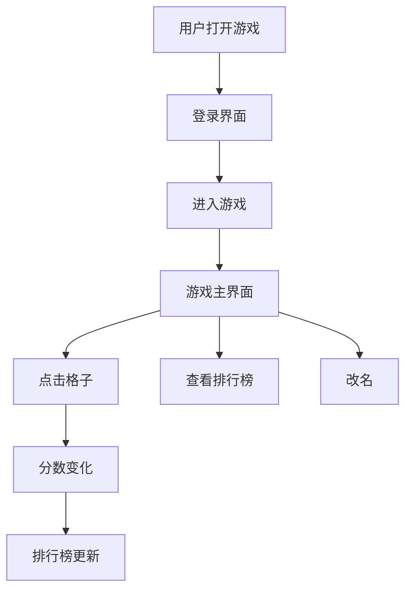

# 界面重构与优化

**功能名称**: 界面重构与优化
**PRD 版本**: v1.0
**创建日期**: 2026-08-18
**作者**: Product Team

## 背景与目标

### 1.1 背景

当前游戏界面视觉效果较为陈旧，缺乏现代感和交互反馈。排行榜面板仅为简单的文字列表，没有视觉层次和动态效果。登录页面样式单一，缺少品牌感。用户在长时间游戏过程中容易产生视觉疲劳，且操作缺乏即时反馈，降低了游戏体验的沉浸感。

### 1.2 目标

- 将界面升级为现代化设计语言，提升整体视觉品质
- 增强交互反馈，让玩家操作有明确的视觉/动效响应
- 重新设计排行榜面板，使其更具视觉吸引力和信息层次

### 1.3 成功标准

- 界面视觉评分（内部评审）达到 4/5 分以上
- 用户平均游戏时长提升 10%（交互感增强带来沉浸感）
- 排行榜面板点击/查看率提升 25%

## 用户分析

### 2.1 目标用户

- 18-30 岁的年轻游戏玩家，对界面品质有较高期待
- 希望获得流畅、有反馈感的游戏体验
- 在排行榜上竞争的竞技型玩家

### 2.2 用户场景

| 场景 | 用户角色 | 目标 | 痛点 |
|------|---------|------|------|
| 首次打开游戏 | 新用户 | 快速被界面吸引并开始游戏 | 界面简陋，缺乏第一印象 |
| 长时间游戏 | 老用户 | 持续获得操作反馈 | 视觉疲劳，操作无反馈感 |
| 查看排行榜 | 竞技型玩家 | 快速了解自己的排名 | 排行榜信息层次不清 |
| 改名操作 | 已登录用户 | 修改显示名称 | 改名入口不够直观 |

## 功能需求

### 3.1 功能概述

对游戏前端界面进行全面重构，包括：整体视觉风格现代化、交互反馈增强、排行榜面板重新设计，同时保持核心游戏逻辑不变。

### 3.2 功能列表

#### 功能点 1: 整体视觉现代化
- **描述**: 将游戏界面从当前的极简风格升级为具有现代感的视觉设计，提升整体品质感
- **用户价值**: 提升第一印象和持续使用的视觉舒适度
- **验收标准**:
  - [ ] 游戏背景不再是纯黑色，具有一定的视觉层次
  - [ ] 所有浮动面板（用户信息、排行榜）视觉风格统一，与背景有明显区分
  - [ ] 界面色彩搭配协调，有统一的视觉风格
  - [ ] 文字清晰可读，字体风格现代
  - [ ] 所有页面在当前分辨率下显示正常

#### 功能点 2: 交互反馈增强
- **描述**: 为玩家操作添加即时视觉反馈，让每次操作都有明确的响应感
- **用户价值**: 让每次操作都有明确的反馈感，增强游戏沉浸感
- **验收标准**:
  - [ ] 玩家点击格子时有即时的视觉响应（如点击效果、颜色变化等）
  - [ ] 分数变更时有动态提示（如浮动数字），让玩家感知到分数变化
  - [ ] 所有可点击元素有明确的交互状态（如悬停、按下状态）
  - [ ] 面板的展开/收起有过渡效果，不是突然出现或消失
  - [ ] 排行榜数据更新时有平滑的视觉过渡，不是瞬间跳变

#### 功能点 3: 排行榜重新设计
- **描述**: 重新设计排行榜面板，使其信息层次更清晰、视觉更吸引人、竞争感更强
- **用户价值**: 更直观地了解排名情况，增强竞争动力
- **验收标准**:
  - [ ] 排行榜每行信息清晰独立，易于阅读
  - [ ] 前三名有特殊的视觉标识，突出其排名地位
  - [ ] 分数有可视化的比较方式，让玩家直观感受差距
  - [ ] 当前玩家的排名有明显标识，方便快速定位自己
  - [ ] 排行榜支持折叠/展开，玩家可选择是否查看
  - [ ] 排行榜更新时有平滑的排序动画

#### 功能点 4: 登录界面优化
- **描述**: 优化登录/注册页面，提升品牌感和第一印象
- **用户价值**: 提升品牌感和第一印象
- **验收标准**:
  - [ ] 登录页展示游戏名称或品牌标识
  - [ ] 表单样式与游戏内视觉风格一致
  - [ ] 登录页有背景装饰，不是纯色背景
  - [ ] 错误提示清晰易读，样式美观

### 3.3 用户操作流程

### 3.4 页面/界面描述

| 页面 | 描述 | 关键元素 |
|------|------|---------|
| 登录界面 | 品牌感登录页 | 游戏名称、登录表单、背景装饰 |
| 游戏主界面 | 现代化游戏视图 | 游戏网格、用户信息面板、排行榜面板 |
| 排行榜面板 | 信息层次清晰的排名展示 | 排名列表、当前玩家标识、折叠控制 |

### 3.5 异常与边界情况

| 情况 | 预期行为 |
|------|---------|
| 低性能设备 | 动画效果可降级，不影响核心功能 |
| 小屏幕设备 | 排行榜自动折叠，面板自适应宽度 |
| 快速连续操作 | 动画不混乱，视觉效果正常 |
| 网络断开重连 | 界面状态恢复，动画不中断 |

## 四、非功能需求

### 4.1 性能要求

- 动画帧率保持流畅（主浏览器下无明显卡顿）
- 界面首屏加载时间不超过 2 秒
- 动画资源总大小不超过 50KB

### 4.2 兼容性要求

- 适配当前游戏 Web 端所有分辨率
- Chrome/Firefox/Safari/Edge 最新两个主要版本
- 移动端浏览器基本可用（不要求完美）

### 4.3 可访问性要求

- 所有交互元素支持键盘导航
- 色彩对比度符合 WCAG AA 标准
- 动画支持减弱模式（`prefers-reduced-motion`）

## 五、依赖与约束

### 5.1 依赖

- 现有游戏核心逻辑不变（reveal、flag、chord 等）
- 现有 WebSocket 通信协议不变
- 现有 React + Vite + TypeScript 技术栈

### 5.2 约束

- 不改变游戏玩法和计分规则
- 不改变后端 API 和 WebSocket 事件
- 不引入新的前端框架或大型 UI 库

## 六、相关文档

- [game-web 技术栈](../../apps/game-web/AGENTS.md)
- [前端工程规范](../../docs/engineering/frontend-rules.md)
- [用户登录 PRD](./01-用户登录.md)
