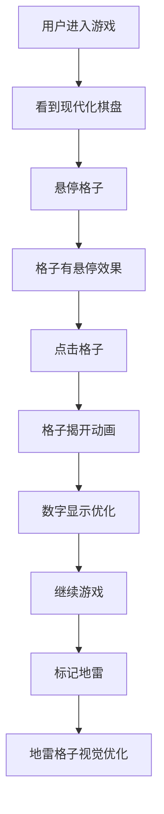

# 棋盘与数字优化

**功能名称**: 棋盘与数字优化
**PRD 版本**: v1.0
**创建日期**: 2026-08-18
**作者**: Product Team

## 背景与目标

### 1.1 背景

当前游戏棋盘采用纯色填充（普通格子 `#ccc`，地雷格子 `#ff0000`），数字使用简单的颜色映射（1-8 对应不同颜色）。整体视觉风格较为基础，缺乏现代感和视觉层次。在长时间游戏过程中，用户容易产生视觉疲劳，且棋盘的视觉吸引力不足，影响游戏体验的沉浸感。

### 1.2 目标

- 提升棋盘格子的视觉品质，增加层次感和现代感
- 优化数字显示效果，使其更清晰、更具视觉吸引力
- 保持游戏核心功能不变的前提下，显著提升视觉体验

### 1.3 成功标准

- 棋盘视觉评分（内部评审）达到 4/5 分以上
- 用户游戏时长提升 15%（视觉吸引力增强）
- 棋盘区域点击准确率提升 10%（视觉层次清晰）

## 用户分析

### 2.1 目标用户

- 18-30 岁的年轻游戏玩家，对界面品质有较高期待
- 长时间游戏的重度用户，对视觉舒适度敏感
- 追求视觉享受的休闲玩家

### 2.2 用户场景

| 场景 | 用户角色 | 目标 | 痛点 |
|------|---------|------|------|
| 长时间游戏 | 重度用户 | 持续获得舒适的视觉体验 | 视觉疲劳，棋盘单调 |
| 快速识别数字 | 所有用户 | 快速区分不同数字 | 数字颜色辨识度低 |
| 识别地雷 | 所有用户 | 快速识别危险区域 | 地雷格子视觉冲击过强 |
| 视觉享受 | 休闲玩家 | 获得美观的游戏界面 | 棋盘缺乏视觉吸引力 |

## 功能需求

### 3.1 功能概述

对游戏棋盘和数字进行视觉升级，包括：格子样式现代化、数字显示优化、地雷格子视觉调整，同时保持游戏核心逻辑不变。

### 3.2 功能列表

#### 功能点 1: 棋盘格子样式升级
- **描述**: 将棋盘格子从纯色填充升级为具有现代感的视觉设计
- **用户价值**: 提升棋盘的视觉吸引力和层次感
- **验收标准**:
  - [ ] 未揭开格子具有微妙的渐变效果，而非纯色
  - [ ] 已揭开格子具有清晰的边框和阴影层次
  - [ ] 格子之间有明显的视觉分隔，便于区分
  - [ ] 格子在不同状态下（悬停、按下）有视觉反馈
  - [ ] 整体棋盘视觉风格统一协调

#### 功能点 2: 数字显示优化
- **描述**: 优化数字的显示效果，使其更清晰、更具视觉吸引力
- **用户价值**: 更容易识别数字，减少视觉疲劳
- **验收标准**:
  - [ ] 数字字体更现代、清晰可读
  - [ ] 数字颜色经过专业配色，辨识度更高
  - [ ] 数字具有微妙的阴影或发光效果，增强可读性
  - [ ] 数字大小与格子比例协调，不显得拥挤
  - [ ] 不同数字的视觉区分度明显

#### 功能点 3: 地雷格子视觉优化
- **描述**: 优化地雷格子的视觉效果，降低视觉冲击的同时保持警示作用
- **用户价值**: 视觉体验更舒适，减少惊吓感
- **验收标准**:
  - [ ] 地雷格子不再使用刺眼的纯红色
  - [ ] 地雷格子使用更柔和的警示色
  - [ ] 地雷图标（如果有）视觉设计更现代
  - [ ] 地雷格子与普通格子有明显但舒适的区分

#### 功能点 4: 交互状态优化
- **描述**: 为棋盘格子添加丰富的交互状态效果
- **用户价值**: 每次操作都有明确的视觉反馈
- **验收标准**:
  - [ ] 格子悬停时有微妙的视觉变化
  - [ ] 格子按下时有点击反馈效果
  - [ ] 格子揭开时有平滑的过渡动画
  - [ ] 标记地雷时有明确的视觉确认

### 3.3 用户操作流程

### 3.4 页面/界面描述

| 页面 | 描述 | 关键元素 |
|------|------|---------|
| 游戏棋盘 | 现代化设计的棋盘 | 渐变格子、清晰数字、柔和地雷 |
| 格子状态 | 丰富的交互反馈 | 悬停效果、点击反馈、揭开动画 |

### 3.5 异常与边界情况

| 情况 | 预期行为 |
|------|---------|
| 低性能设备 | 动画效果可降级，不影响核心功能 |
| 小屏幕设备 | 棋盘自适应，保持视觉效果 |
| 快速连续操作 | 动画不混乱，视觉效果正常 |
| 高 DPI 屏幕 | 棋盘清晰锐利，无模糊 |

## 四、非功能需求

### 4.1 性能要求

- 棋盘渲染帧率保持流畅（60fps）
- 动画效果不影响游戏响应速度
- 视觉效果资源总大小不超过 30KB

### 4.2 兼容性要求

- 适配当前游戏 Web 端所有分辨率
- Chrome/Firefox/Safari/Edge 最新两个主要版本
- 高 DPI 屏幕显示清晰

### 4.3 可访问性要求

- 数字颜色对比度符合 WCAG AA 标准
- 交互状态支持键盘导航
- 动画支持减弱模式（`prefers-reduced-motion`）

## 五、依赖与约束

### 5.1 依赖

- 现有游戏核心逻辑不变（reveal、flag、chord 等）
- 现有 WebSocket 通信协议不变
- 现有 React + Vite + TypeScript 技术栈
- 现有 react-konva Canvas 渲染

### 5.2 约束

- 不改变游戏玩法和计分规则
- 不改变后端 API 和 WebSocket 事件
- 不引入新的前端框架或大型 UI 库
- 纯视觉优化，不改变游戏逻辑

## 六、相关文档

- [game-web 技术栈](../../apps/game-web/AGENTS.md)
- [前端工程规范](../../docs/engineering/frontend-rules.md)
- [界面重构优化 PRD](./02-界面重构优化.md)
