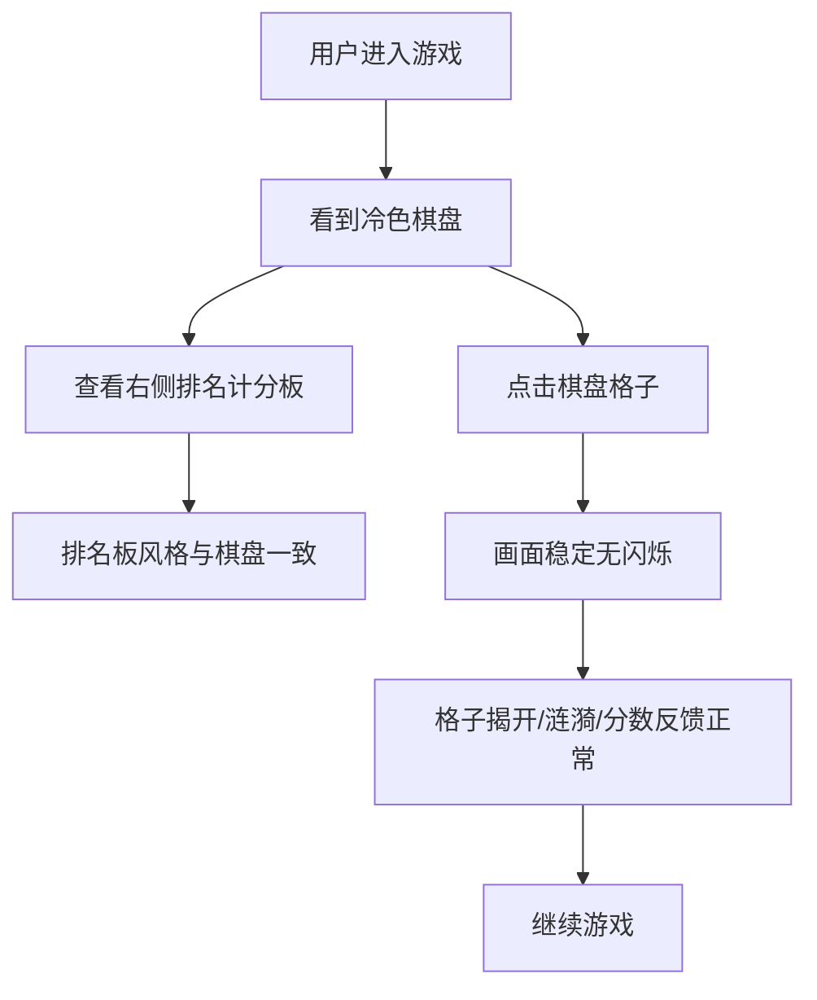

# 排名计分板风格统一与点击闪烁修复

**功能名称**: 排名计分板风格统一与点击闪烁修复
**PRD 版本**: v1.0
**创建日期**: 2026-08-19
**作者**: Product Team

## 背景与目标

### 1.1 背景

棋盘与数字已完成冷淡风格（cold/minimalist）视觉升级，未揭开格子采用冷灰蓝渐变（`#3a4556`→`#2d3748`）、数字采用低饱和度冷色调配色、地雷采用冷灰蓝警示色，整体视觉以冷色调为主，风格统一、层次清晰。

但界面右侧的游戏排名计分板（Leaderboard）仍沿用通用紫色主题：排名徽标使用金色/银色/铜色渐变（`#ffd700` 等），当前玩家高亮使用品牌紫 `#6366f1`，与棋盘的冷淡冷色风格明显不协调，视觉上像「两套界面拼在一起」，影响整体品质感。

此外，用户在游戏过程中发现：**每点击一次棋盘，整体画面会闪烁一下**，干扰游戏操作，影响沉浸感。

### 1.2 目标

- 将排名计分板视觉风格统一到棋盘冷淡冷色风格，形成一套完整一致的视觉语言
- 修复点击棋盘时整体画面闪烁的问题，保证操作流畅无干扰

### 1.3 成功标准

- 排名计分板与棋盘/数字风格一致，视觉评分（内部评审）达到 4/5 分以上
- 修复后点击棋盘不再出现整体画面闪烁，连续快速点击无抖动/闪烁
- 不改变计分、排序、折叠等现有功能与交互逻辑

## 用户分析

### 2.1 目标用户

- 已在使用冷色风格棋盘的重度玩家，对界面一致性敏感
- 长时间进行排位竞争、频繁查看排名榜的竞技型玩家
- 对操作流畅度要求较高的玩家

### 2.2 用户场景

| 场景 | 用户角色 | 目标 | 痛点 |
|------|---------|------|------|
| 边玩边看排名 | 竞技型玩家 | 排名板与棋盘视觉统一、不跳戏 | 排名板金色/紫色与冷色棋盘不协调 |
| 高频点击格子 | 重度玩家 | 连续操作无视觉干扰 | 每次点击整屏闪烁 |
| 长时间游戏 | 所有玩家 | 视觉舒适、沉浸 | 风格割裂降低品质感、闪烁影响注意力 |

## 功能需求

### 3.1 功能概述

对右侧排名计分板进行冷色风格化改造，并修复点击棋盘时的整屏闪烁问题。不改变计分、排序、折叠、当前玩家标识、排名变更动画等现有逻辑，仅做视觉统一与性能/渲染修复。

### 3.2 功能列表

#### 功能点 1: 排名计分板风格统一（冷色风格）
- **描述**: 将右侧排名计分板整体配色与样式统一到棋盘冷淡冷色风格，去除金色/紫色等不协调元素
- **用户价值**: 界面整体风格统一，提升品质感和沉浸感
- **验收标准**:
  - [ ] 排名前三名徽标使用冷色调渐变（如冷金/冷银/冷铜），与棋盘冷色风格协调，不再刺眼
  - [ ] 当前玩家高亮使用冷色系（如冷蓝）替代品牌紫 `#6366f1`
  - [ ] 排名序号、玩家名、分数条、分数等文字/图形配色统一为冷色系
  - [ ] 面板背景、边框、阴影与棋盘风格一致（冷灰蓝基调）
  - [ ] 悬停、当前玩家、排名变更等交互反馈为冷色风格
  - [ ] 折叠/展开、排序动画逻辑与现有行为一致

#### 功能点 2: 点击棋盘画面闪烁修复
- **描述**: 修复点击棋盘任意格子时整体画面闪烁的问题，保证视觉稳定
- **用户价值**: 操作流畅无干扰，提升游戏体验与专注度
- **验收标准**:
  - [ ] 点击未揭开格子进行 reveal 时，整体画面不再闪烁
  - [ ] 点击已揭开数字格子进行 chord 时，整体画面不再闪烁
  - [ ] 快速连续点击多格时无闪烁、无残影、无重影
  - [ ] 点击产生的点击涟漪/分数浮动等反馈正常显示，不影响主画面稳定
  - [ ] 拖动棋盘、调整窗口等操作不受影响

### 3.3 用户操作流程

### 3.4 页面/界面描述

| 页面 | 描述 | 关键元素 |
|------|------|---------|
| 排名计分板 | 冷色风格的排名列表 | 冷色徽标、冷色当前玩家高亮、冷色分数条、折叠控制 |
| 游戏棋盘 | 冷色棋盘（现状） | 点击无整屏闪烁、反馈流畅 |

### 3.5 异常与边界情况

| 情况 | 预期行为 |
|------|---------|
| 快速连续点击 | 不闪烁、无残影，反馈正常 |
| 高分玩家无当前玩家 | 排名板正常展示，高亮逻辑不依赖当前玩家 |
| 低性能设备 | 冷色样式与现有性能一致，闪烁修复不引入性能回退 |
| 小屏/折叠状态 | 冷色样式在折叠态下正常 |

## 四、非功能需求

### 4.1 性能要求

- 修复闪烁后点击响应不引入额外延迟（保持在现有水平）
- 排名板渲染/更新帧率保持流畅
- 不引入新的重型依赖或额外网络请求

### 4.2 兼容性要求

- 适配当前游戏 Web 端所有分辨率
- Chrome/Firefox/Safari/Edge 最新两个主要版本
- 高 DPI 屏幕显示清晰

### 4.3 可访问性要求

- 冷色配色的文字/数字对比度符合 WCAG AA 标准
- 排名板折叠等交互支持键盘操作
- 动画支持减弱模式（`prefers-reduced-motion`）

## 五、依赖与约束

### 5.1 依赖

- 棋盘冷淡冷色风格已实现（格子、数字、地雷配色）
- 现有 React + Vite + TypeScript + react-konva 技术栈
- 现有 WebSocket 实时计分/排行榜数据流

### 5.2 约束

- 不改变计分、排序、折叠、当前玩家标识等逻辑
- 不改变后端 API 与 WebSocket 事件契约
- 不引入新的前端框架或大型 UI 库
- 纯前端改动（样式 + 渲染/交互修复），后端零改动

## 六、相关文档

- [game-web 技术栈](../../apps/game-web/AGENTS.md)
- [前端工程规范](../../docs/engineering/frontend-rules.md)
- [棋盘与数字优化 PRD](./03-棋盘与数字优化.md)
- [联机计分 Board PRD](../reviewed/联机计分Board.md)
