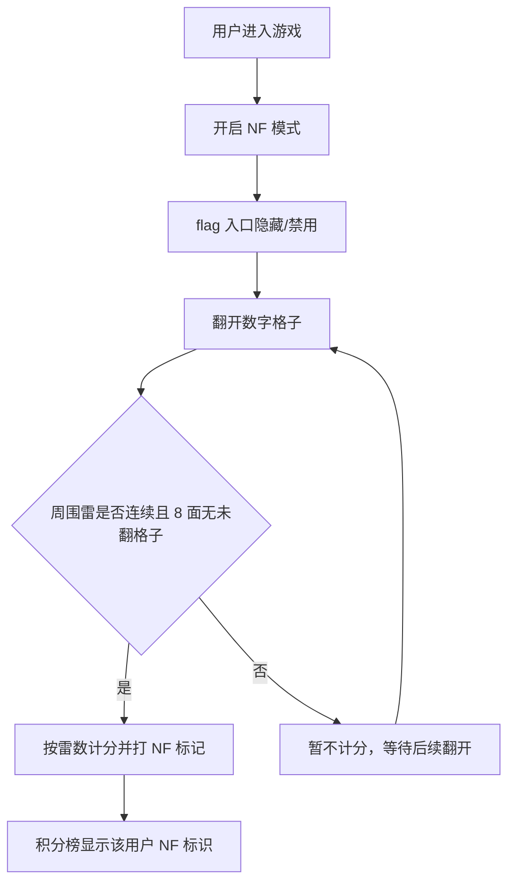

# NF模式与NF结算计分

**功能名称**: NF模式与NF结算计分
**PRD 版本**: v1.0
**创建日期**: 2026-08-22
**作者**: Product Team

## 背景与目标

### 1.1 背景

当前联机扫雷采用经典玩法：玩家通过「flag（标记地雷）」来确认雷的位置，正确标记雷加分、标记非雷减分、踩到雷扣分。经典玩法依赖 flag 操作，导致：

1. 部分玩家认为 flag 操作繁琐、降低了破局节奏，希望有一种「不插旗」的硬核模式；
2. 现有计分更偏向于「插旗准确率」与「规避踩雷」，缺少对「纯逻辑推理能力」的奖励。

因此引入 **NF 模式（No Flag 模式）**：开启后玩家不再插旗，改为通过翻开数字来自动「结算」周围已确定的雷，从而改变计分方式，形成更具硬核推理感的玩法。

### 1.2 目标

- 提供 NF 模式开关，开启后不再支持 flag 操作
- 在积分榜上标记处于 NF 模式的用户，展示其玩法标签
- 新增 NF 结算计分规则：翻开数字时，自动结算周围「连续且周围已翻开的雷」，按雷的数量计分并打上特殊 NF 标记
- 保持经典模式（flag 玩法）完全不受影响

### 1.3 成功标准

- 用户可一键开启/关闭 NF 模式，开关状态即时生效
- NF 模式下无法进行 flag 操作（插旗入口隐藏/禁用）
- 积分榜对 NF 模式用户显示明确标识
- NF 结算规则正确：雷连续且周围无未翻开的格子时按雷数计分，否则不计分
- 经典模式计分逻辑与行为与现状一致，不回归

## 用户分析

### 2.1 目标用户

- 追求硬核、希望省去插旗操作的进阶玩家
- 看重「纯推理」竞技性的排位竞争型玩家
- 对旗子操作感到繁琐的新手玩家（希望通过自动结算降低上手负担）

### 2.2 用户场景

| 场景 | 用户角色 | 目标 | 痛点 |
|------|---------|------|------|
| 硬核对局 | 进阶玩家 | 不插旗，纯靠数字推理破局 | 插旗繁琐、打断节奏 |
| 排位竞技 | 竞技型玩家 | 展示 NF 玩法标签，获得专属计分 | 缺乏对纯推理能力的奖励 |
| 新手入门 | 新手玩家 | 少记旗子、专注推理 | 不知道哪些是雷、插旗易错 |

## 功能需求

### 3.1 功能概述

新增 NF 模式开关。开启后：禁用 flag 操作；翻开数字时，对「周围区域」执行 NF 结算——若某组**连续**的雷的**周围（8 面）没有未翻开的格子**，则该组雷被结算，按雷的数量计分，并打上特殊 NF 标记；否则不计分。同时积分榜对该用户标注 NF 模式。

### 3.2 功能列表

#### 功能点 1: NF 模式开关
- **描述**: 用户可开启/关闭 NF 模式
- **用户价值**: 一键切换硬核玩法，选择适合自己的游戏风格
- **验收标准**:
  - [ ] 提供 NF 模式开关（UI 明确，可点击切换）
  - [ ] 开关状态持久化到当前会话，重连后保持
  - [ ] 开启后 flag 相关入口隐藏/禁用，无法触发 flag 事件
  - [ ] 关闭后恢复经典 flag 玩法

#### 功能点 2: 积分榜 NF 模式标识
- **描述**: 处于 NF 模式的用户，在积分榜上标注「NF 模式」
- **用户价值**: 他人可见其玩法标签，营造差异化竞技氛围
- **验收标准**:
  - [ ] 开启 NF 模式的用户在排行榜上显示 NF 标识（如徽标/角标/图标）
  - [ ] 关闭 NF 模式后标识消失
  - [ ] 排行榜实时刷新，NF 标识与其他玩家同步更新

#### 功能点 3: NF 结算计分
- **描述**: 翻开数字时，结算周围连续且完全被包围的雷，按雷数计分并打 NF 标记
- **用户价值**: 奖励纯推理定位雷的能力，形成 NF 模式专属计分
- **验收标准**:
  - [ ] 每次翻开数字，结算其周围区域
  - [ ] 一组连续雷若「周围 8 面无未翻开的格子」，则按雷数量计分（每雷 +10）
  - [ ] 该组雷被标记为 NF（计入 NF 结算雷数，用于 NF 标记展示）
  - [ ] 若某雷周围 8 面仍有未翻开的格子，则不予计分，等待后续翻开后再结算
  - [ ] 已结算的雷不再重复计分
  - [ ] NF 模式下踩到雷仍按现有规则扣分

### 3.3 用户操作流程

### 3.4 页面/界面描述

| 页面 | 描述 | 关键元素 |
|------|------|---------|
| 游戏界面 | 增加 NF 模式开关 | 开关控件、flag 入口（NF 下隐藏）、翻开动画 |
| 积分榜 | 每行玩家排名 | NF 模式标识徽标、分数、当前玩家高亮 |
| 棋盘 | 扫雷主棋盘 | 已结算雷的 NF 标记样式、数字、未翻开格子 |

### 3.5 异常与边界情况

| 情况 | 预期行为 |
|------|---------|
| 连续雷边界触及棋盘边缘 | 边缘按已包围处理（无越界格子），不影响结算 |
| 已结算的雷被再次翻开数字覆盖 | 不重复计分，NF 标记保持 |
| 玩家游戏中切换 NF 开关 | 立即生效：开则禁用 flag，关则恢复；已结算不计回 |
| 多人在线同一棋盘 | NF 结算仅影响开启者自身计分，不改变棋盘共享状态 |
| 踩雷 | 维持现有 -100 规则，NF 结算不影响踩雷判定 |

## 四、非功能需求

### 4.1 性能要求

- NF 结算每次翻开的计算复杂度低（仅扫描局部 8 邻域与连续雷簇），不造成卡顿
- 排行榜 NF 标识刷新与现有排行榜更新同频
- 不引入新的重型依赖

### 4.2 兼容性要求

- 适配当前游戏 Web 端所有分辨率
- Chrome/Firefox/Safari/Edge 最新两个主要版本

### 4.3 可访问性要求

- NF 标识与开关具备足够的颜色对比度，符合 WCAG AA
- 开关支持键盘操作

## 五、依赖与约束

### 5.1 依赖

- 现有联机计分、排行榜、flag/chord/reveal 事件流
- 现有 React + Vite + TypeScript + react-konva 前端技术栈
- 现有 Express + Socket.IO + MongoDB 后端技术栈

### 5.2 约束

- NF 模式仅影响开启者自身的 flag 能力与计分，不改变共享棋盘
- 经典模式（flag）计分与行为保持不变
- 复用现有 WebSocket 事件机制，必要时新增事件/字段需向后兼容
- 不引入新的前端框架或大型 UI 库

## 六、相关文档

- [game-web 技术栈](../../apps/game-web/AGENTS.md)
- [game-api 技术栈](../../servers/game-api/AGENTS.md)
- [前端工程规范](../../docs/engineering/frontend-rules.md)
- [后端工程规范](../../docs/engineering/backend-rules.md)
- [联机计分 Board PRD](../reviewed/联机计分Board.md)