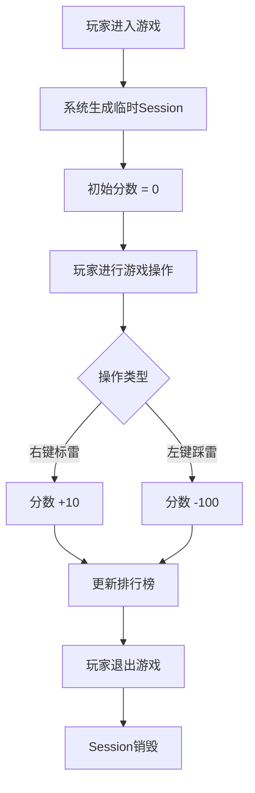

# 联机计分Board

**功能名称**: 联机计分Board
**PRD 版本**: v1.0
**创建日期**: 2026-04-21
**作者**: Product Team

## 背景与目标

### 1.1 背景

随着游戏用户规模的增长，单机版扫雷已经无法满足用户对社交竞争的需求。用户希望能够在联机对战中与好友一较高下，看到自己的排名位置，增加游戏的趣味性和粘性。当前系统缺乏玩家间的分数共享和排名展示机制，需要快速上线一个轻量级的联机计分功能作为MVP版本，验证用户对社交竞技功能的接受度。

### 1.2 目标

- 为每个进入游戏的玩家建立独立的计分Session
- 实时记录玩家操作并计算分数
- 在游戏界面展示排行榜，增加竞争乐趣
- 通过轻量级实现快速验证产品方向

### 1.3 成功标准

- 功能上线后7日内，排行榜日均UV较上线前提升20%
- 玩家平均对局时长提升15%（因为有竞争驱动）
- 排行榜面板点击率达到30%（说明用户关注自己的排名）

## 用户分析

### 2.1 目标用户

- 18-30岁的年轻游戏玩家
- 喜欢竞技和排行榜的用户
- 希望与朋友比较得分的用户

### 2.2 用户场景

| 场景 | 用户角色 | 目标 | 痛点 |
|------|---------|------|------|
| 新用户首次进入 | 新手玩家 | 快速开始游戏并了解计分规则 | 不清楚分数如何计算 |
| 老用户对战 | 竞技型玩家 | 在排行榜上获得更高排名 | 无法看到自己与别人的差距 |
| 好友组队 | 社交型玩家 | 和朋友比拼分数 | 不知道朋友的得分情况 |

## 功能需求

### 3.1 功能概述

联机计分Board是一个实时展示玩家分数的排行榜功能，玩家通过操作（左键踩雷、右键标雷）积累分数，系统实时计算并排序，在游戏界面右上角展示排名。

### 3.2 功能列表

#### 功能点 1: 临时Session生成
- **描述**: 玩家进入游戏时，系统自动为其创建一个临时Session，包含唯一SessionID和初始分数0分
- **用户价值**: 确保每个玩家有独立的计分通道，避免分数混淆
- **验收标准**:
  - [ ] 玩家进入游戏后SessionID唯一
  - [ ] 初始分数为0

#### 功能点 2: 分数记录与计算
- **描述**: 记录玩家操作并实时更新分数：右键标雷+10分，左键踩雷-100分，分数允许为负数
- **用户价值**: 准确的分数计算是排行榜公平竞争的基础
- **验收标准**:
  - [ ] 右键标雷操作加10分
  - [ ] 左键踩雷操作扣100分
  - [ ] 分数可为负数
  - [ ] 分数变更实时反映到排行榜

#### 功能点 3: 实时排行榜
- **描述**: 游戏界面右上角展示排行榜，按分数从高到低排序，列表下方单独展示当前玩家分数
- **用户价值**: 玩家可以随时看到自己的排名位置，与其他玩家竞争
- **验收标准**:
  - [ ] 排行榜位于画面右上角
  - [ ] 分数从高到低排序
  - [ ] 当前玩家分数显示在列表下方
  - [ ] 排行榜实时更新（延迟<1秒）

#### 功能点 4: 内存数据存储
- **描述**: 分数数据暂时存储在服务器内存中，服务器重启后数据丢失
- **用户价值**: 简化架构，快速上线；作为MVP版本降低开发复杂度
- **验收标准**:
  - [ ] 服务器重启后所有分数清零
  - [ ] 数据不持久化到数据库

### 3.3 用户操作流程

### 3.4 页面/界面描述

| 页面 | 描述 | 关键元素 |
|------|------|---------|
| 游戏主界面 | 扫雷游戏主界面 | 游戏网格、右上角排行榜 |

**排行榜UI元素**:
- 排名序号（#1, #2, #3...）
- 玩家标识（SessionID前6位）
- 玩家分数
- 当前玩家高亮显示

### 3.5 异常与边界情况

| 情况 | 预期行为 |
|------|---------|
| 玩家快速连续操作 | 分数实时累计更新，不丢失操作 |
| 分数为负数 | 正常显示负数，排序时负数在最下面 |
| 服务器重启 | 所有数据清零，排行榜重置 |
| 同时刻分数相同 | 按Session创建时间排序，先创建的在前面 |

## 四、非功能需求

### 4.1 性能要求

- 排行榜更新延迟 < 1秒
- 支持同时在线100人（作为MVP目标）

### 4.2 安全性要求

- SessionID足够随机，不可猜测
- 不暴露完整的SessionID给其他玩家

### 4.3 兼容性要求

- 适配当前游戏Web端所有分辨率

## 五、依赖与约束

### 5.1 依赖

- 游戏Web端已有游戏网格和操作事件系统
- WebSocket通信通道（如果当前使用）

### 5.2 约束

- MVP版本数据仅存于内存，不做持久化
- 排行榜仅展示分数，不展示玩家详细信息

## 六、相关文档

- [游戏Web端架构文档](../apps/game-web/AGENTS.md)
- [游戏API接口文档](../servers/game-api/AGENTS.md)
- [WebSocket通信协议](../contracts/websocket.md)